# Tom Build Base v2 — CLI Framework Design

This document specifies the v2 architecture for `tom_build_base`, the foundational library that powers all Tom Framework CLI tools. The v2 implementation enables unified CLI patterns, configuration-free operation, and reusable traversal logic across tools, TUIs, and scripts.

**Goals:**
- Unify CLI patterns across all Tom tools (buildkit, testkit, issuekit, d4rtgen, astgen, etc.)
- Enable configuration-free operation through comprehensive folder scanning
- Provide reusable traversal logic for CLI, TUI, REPL, and D4rt scripts
- Support declarative tool/command definitions with automatic help generation
- Allow gradual migration from v1 to v2 (separate source tree)

---

## Table of Contents

- [Tom Build Base v2 — CLI Framework Design](#tom-build-base-v2--cli-framework-design)
  - [Table of Contents](#table-of-contents)
  - [Overview](#overview)
    - [The Tool Building Challenge](#the-tool-building-challenge)
    - [Architecture Overview](#architecture-overview)
    - [Tool Types](#tool-types)
    - [Core Design Principles](#core-design-principles)
  - [Usage Scenarios](#usage-scenarios)
    - [Scenario 1: CLI Tool Invocation](#scenario-1-cli-tool-invocation)
    - [Scenario 1.5: Git Command Invocation](#scenario-15-git-command-invocation)
    - [Scenario 2: TUI Interactive Mode](#scenario-2-tui-interactive-mode)
    - [Scenario 3: D4rt Script Traversal](#scenario-3-d4rt-script-traversal)
    - [Scenario 4: REPL Tool](#scenario-4-repl-tool)
  - [Project Traversal](#project-traversal)
    - [Traversal Pipeline Overview](#traversal-pipeline-overview)
    - [Phase 1: Argument Parsing](#phase-1-argument-parsing)
    - [Phase 2: Root Resolution](#phase-2-root-resolution)
    - [Phase 3: Folder Scanning](#phase-3-folder-scanning)
    - [Phase 4: Global Filter Application](#phase-4-global-filter-application)
      - [Filter Details](#filter-details)
    - [Phase 5: Nature Detection](#phase-5-nature-detection)
    - [Phase 6: Command Execution](#phase-6-command-execution)
    - [Filter Precedence and Order](#filter-precedence-and-order)
    - [Per-Command Filtering](#per-command-filtering)
    - [Git Traversal Mode](#git-traversal-mode)
      - [Command Nature Declarations](#command-nature-declarations)
      - [Flexible Command Behavior](#flexible-command-behavior)
      - [Traversal Info Types](#traversal-info-types)
      - [Git Folder Detection](#git-folder-detection)
      - [Module Filters in Git Traversal](#module-filters-in-git-traversal)
      - [Git Traversal Order](#git-traversal-order)
      - [Command Examples](#command-examples)
  - [Folder Natures](#folder-natures)
    - [FsFolder and RunFolder](#fsfolder-and-runfolder)
    - [Nature Types](#nature-types)
    - [Detection Rules](#detection-rules)
    - [CommandContext API](#commandcontext-api)
  - [Tool and Command Definitions](#tool-and-command-definitions)
    - [ToolDefinition](#tooldefinition)
    - [CommandDefinition](#commanddefinition)
    - [OptionDefinition](#optiondefinition)
    - [Standalone Commands](#standalone-commands)
  - [Standard CLI Features](#standard-cli-features)
    - [Version and Help](#version-and-help)
    - [Standard Options](#standard-options)
    - [Positional Arguments](#positional-arguments)
    - [Project IDs](#project-ids)
    - [Test Project Modes](#test-project-modes)
  - [API for Programmatic Use](#api-for-programmatic-use)
    - [TraversalInfo Hierarchy](#traversalinfo-hierarchy)
    - [BaseTraversalInfo](#basetraversalinfo)
    - [ProjectTraversalInfo](#projecttraversalinfo)
    - [GitTraversalInfo](#gittraversalinfo)
    - [BuildBase.traverse() API](#buildbasetraverse-api)
    - [D4rt Script Integration](#d4rt-script-integration)
    - [TUI Integration](#tui-integration)
  - [Library Integration](#library-integration)
    - [Core Dependencies](#core-dependencies)
    - [Interactive Libraries](#interactive-libraries)
    - [Output and Formatting](#output-and-formatting)
    - [Shell Completion](#shell-completion)
      - [What Tab-Completion Provides](#what-tab-completion-provides)
      - [Installation](#installation)
      - [How It Works](#how-it-works)
      - [Implementation](#implementation)
  - [Migration Strategy](#migration-strategy)
    - [v2 Source Structure](#v2-source-structure)
    - [Migration Path](#migration-path)
    - [Backward Compatibility](#backward-compatibility)
  - [Implementation Phases](#implementation-phases)
    - [Phase 1: Core Infrastructure](#phase-1-core-infrastructure)
    - [Phase 2: Tool Framework](#phase-2-tool-framework)
    - [Phase 3: Proof of Concept](#phase-3-proof-of-concept)
    - [Phase 4: Multi-Command Migration](#phase-4-multi-command-migration)
    - [Phase 5: Scripting Support](#phase-5-scripting-support)
    - [Phase 6: Polish](#phase-6-polish)
  - [Summary](#summary)

---

## Overview

### The Tool Building Challenge

The Tom Framework workspace contains 50+ projects across multiple git repositories. Building tools that operate across this workspace presents several challenges:

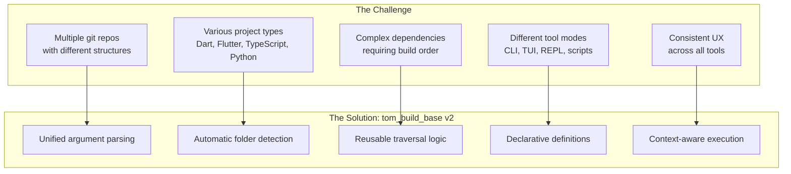

**Key insight:** The same traversal logic that a CLI tool uses should be directly callable from a TUI, a D4rt script, or any other context — without re-parsing command-line arguments.

### Architecture Overview

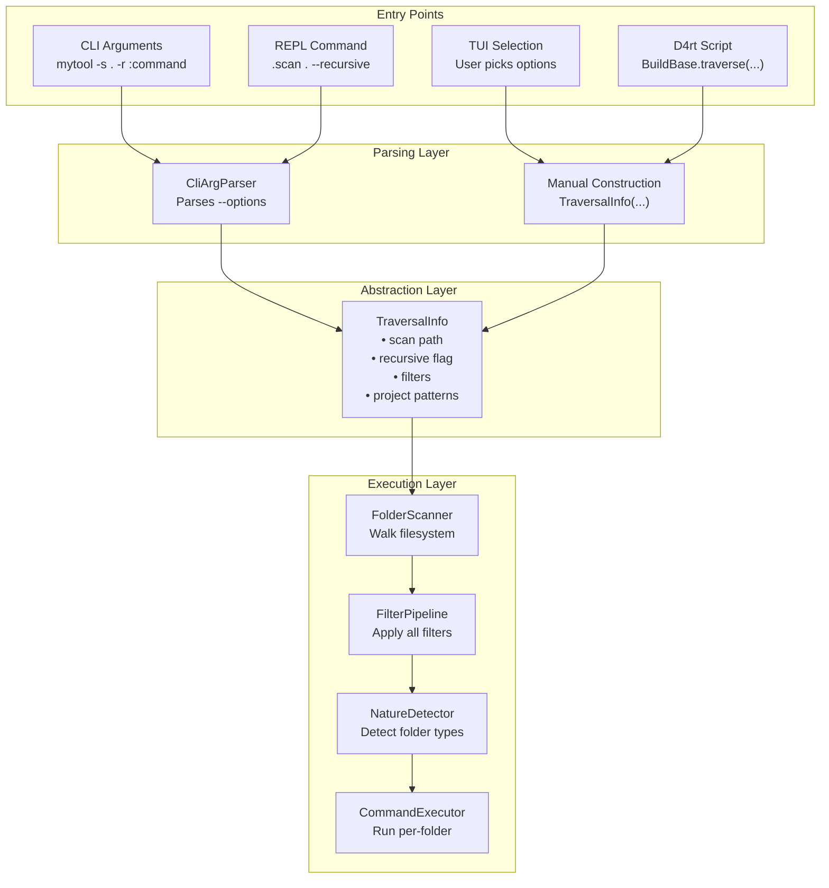

### Tool Types

tom_build_base v2 supports five distinct tool types:

| Type | Description | Examples | Key Traits |
|------|-------------|----------|------------|
| **Simple CLI** | Single-purpose tool | `versioner`, `compiler`, `astgen` | Options only, no subcommands |
| **Multi-Command** | Tool with `:command` subcommands | `buildkit`, `testkit`, `issuekit` | Command pipeline support |
| **REPL** | Interactive interpreter | `dcli`, `d4rt`, `tom` | Sessions, history, custom commands |
| **TUI** | Full-screen terminal UI | `testkit --tui` | Interactive traversal triggers |
| **Stdin/Pipe** | Batch processing | `d4rt --stdin` | Read from stdin, auto-wrap |

### Core Design Principles

1. **Configuration-free by default** — Tools detect project types, dependencies, and structure automatically through folder scanning. Configuration files override defaults but aren't required.

2. **Separation of concerns** — Argument parsing produces `TraversalInfo`; traversal consumes `TraversalInfo`. The traversal API doesn't know where its configuration came from.

3. **Declarative definitions** — Tools and commands declare their capabilities; the framework generates help, validates options, and routes execution.

4. **Flexible context** — Commands receive rich context about each folder (path, natures, metadata) and only process folders matching their requirements.

5. **Gradual adoption** — v2 coexists with v1; tools migrate one at a time.

---

## Usage Scenarios

### Scenario 1: CLI Tool Invocation

The most common scenario — user runs a tool from the command line.

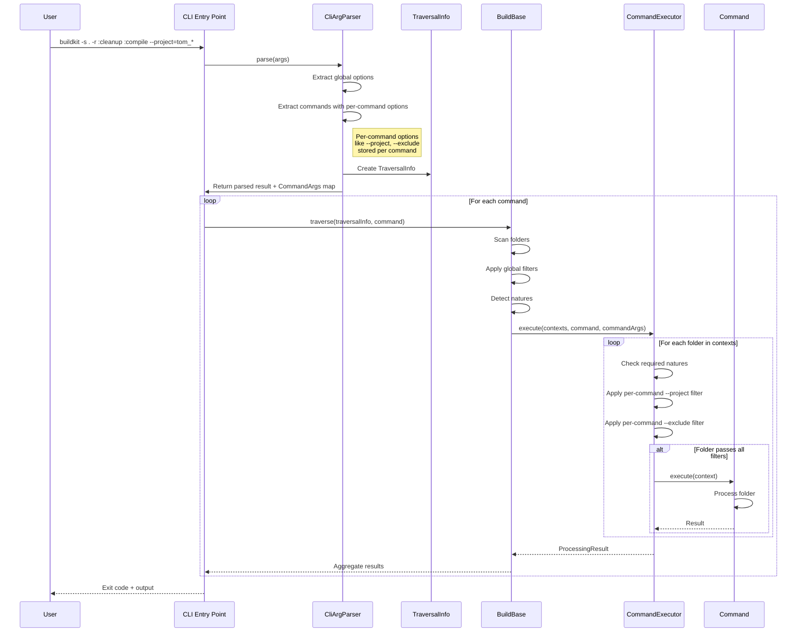

**Example invocation:**
```bash
# Run cleanup then compile on all Dart projects recursively
buildkit -s . -r :cleanup :compile

# Same but skip test projects
buildkit -s . -r --exclude="zom_*" :cleanup :compile

# Run only on specific projects using project IDs
buildkit -p BB,D4G :compile
```

### Scenario 1.5: Git Command Invocation

CLI tool invocation with commands that operate on git repositories instead of (or in addition to) project folders.

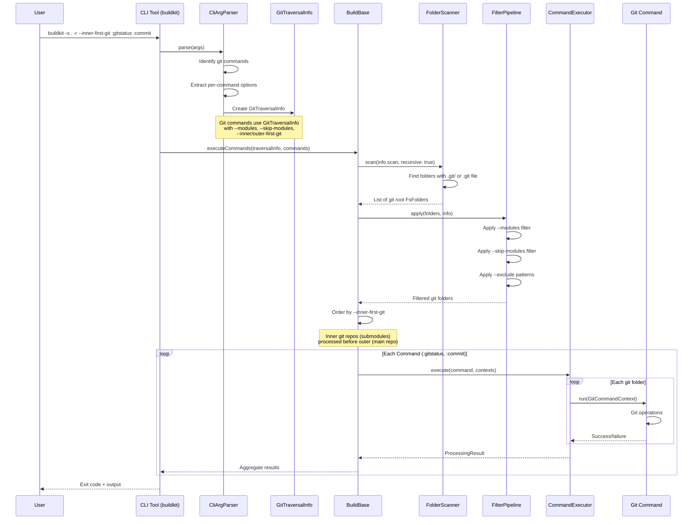

**Example invocations:**
```bash
# Check git status across all repos, processing inner (submodules) first
buildkit -s . -r --inner-first-git :gitstatus

# Commit then push all repos, processing outer repo last
buildkit -s . -r --inner-first-git :commit :push

# Only process specific git submodules
buildkit -s . -r --modules=basics,d4rt :gitstatus

# Skip certain git submodules
buildkit -s . -r --skip-modules=crypto :commit

# Mix with path exclusions
buildkit -s . -r --exclude="xternal_apps/*" --inner-first-git :gitstatus
```

**Key differences from Scenario 1:**
- Uses `GitTraversalInfo` instead of `ProjectTraversalInfo`
- Scans for `.git/` folders (or `.git` files for submodules) instead of project markers
- Uses `--modules`/`--skip-modules` instead of `--project`/`--exclude-projects`
- Requires `--inner-first-git` or `--outer-first-git` for ordering
- Commands declare `worksWithNatures: {GitFolder}` in their definition

### Scenario 2: TUI Interactive Mode

User launches TUI and interactively selects traversal options.

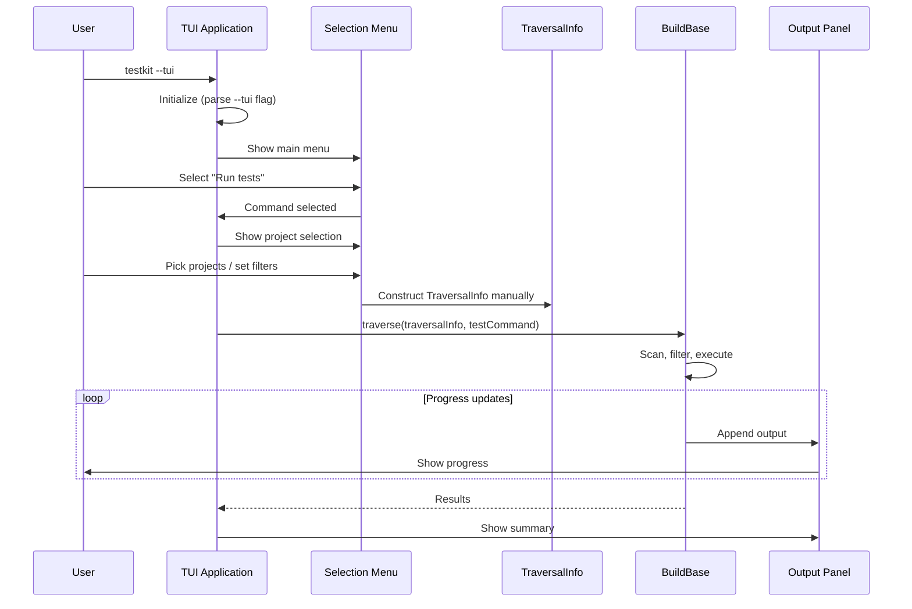

**Key difference:** TUI constructs `TraversalInfo` directly from user selections, not from command-line arguments.

```dart
// TUI constructs TraversalInfo manually
final traversalInfo = TraversalInfo(
  scan: selectedPath,
  recursive: recursiveCheckbox.isChecked,
  projectPatterns: selectedProjects,
  excludePatterns: excludedProjects,
  executionRoot: workspaceRoot,
);

await BuildBase.traverse(
  info: traversalInfo,
  run: (context) async {
    // Execute selected command
    return await testCommand.execute(context);
  },
);
```

### Scenario 3: D4rt Script Traversal

A D4rt script needs to traverse projects programmatically.

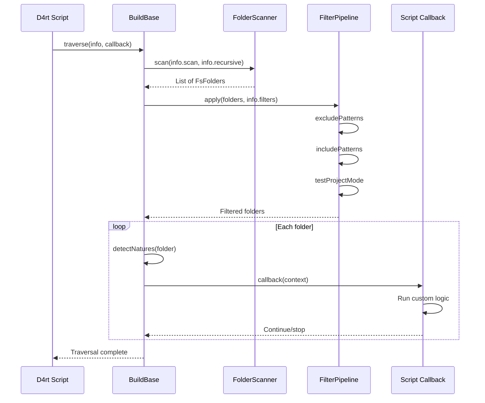

**Example D4rt script:**
```dart
// In a .d4rt script
import 'package:tom_build_base/tom_build_base_v2.dart';

void main() async {
  await BuildBase.traverse(
    info: TraversalInfo(
      scan: '.',
      recursive: true,
      includePatterns: ['tom_*'],
    ),
    run: (ctx) async {
      if (ctx.hasNature<DartProjectFolder>()) {
        print('Found Dart project: ${ctx.name}');
        // Call dcli functions, run analysis, etc.
        await shell('dart analyze', workingDirectory: ctx.path);
      }
      return true; // Continue to next folder
    },
  );
}
```

### Scenario 4: REPL Tool

REPL tools (dcli, d4rt, tom) handle arguments differently — some trigger traversal, others start the interactive session.

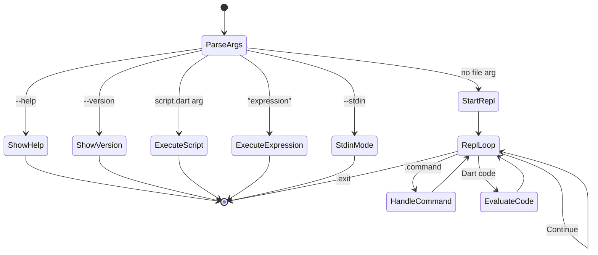

**REPL and tom_build_base integration:**

REPLs can use tom_build_base in two ways:

1. **REPL commands use traversal** — Built-in REPL commands (like `.gitstatus`, `.analyze`) can use `BuildBase.traverse()` internally to implement their functionality.

2. **D4rt scripts in REPL** — Users can run D4rt scripts from within any REPL session, and those scripts can import and use tom_build_base.

**REPL command implementation:**

```dart
class GitStatusReplCommand extends ReplCommand {
  @override String get name => 'gitstatus';
  @override String get usage => '.gitstatus [options]';

  static final definition = CommandDefinition(
    name: 'gitstatus', description: 'Show git status across repositories',
    worksWithNatures: {GitFolder}, supportsGitTraversal: true, options: [],
  );

  @override
  Future<void> execute(String argsLine) async {
    final traversalInfo = CliArgParser.parseCommandLine(argsLine, commandDefinition: definition);
    await BuildBase.traverse(
      info: traversalInfo, worksWithNatures: definition.worksWithNatures,
      run: (ctx) async {
        final git = ctx.getNature<GitFolder>();
        if (git.hasUncommittedChanges || git.hasUnpushedCommits) {
          print('${ctx.name}: ${git.currentBranch}');
          if (git.hasUncommittedChanges) print('  uncommitted changes');
          if (git.hasUnpushedCommits) print('  unpushed commits');
        }
        return true;
      },
    );
  }
}
```

**String-based argument parsing:**

For REPL use, tom_build_base provides methods that accept a command-line string directly:

```dart
// Parse command-line string into TraversalInfo, handling shell-like quoting.
static TraversalInfo parseCommandLine(String commandLine, {CommandDefinition? commandDefinition}) {
  final args = _splitCommandLine(commandLine);
  final parsed = CliArgParser.parse(args, allowedOptions: commandDefinition?.allOptions);
  if (commandDefinition?.supportsGitTraversal == true) return parsed.toGitTraversalInfo();
  return parsed.toProjectTraversalInfo();
}

// Split command line respecting quotes: '-s . -r' → ['-s', '.', '-r']
static List<String> _splitCommandLine(String line) { /* ... */ }
```

**Example REPL session:**

```
d4rt> .gitstatus -s . -r
tom_build_base: main
  uncommitted changes
tom_d4rt: main
  unpushed commits

d4rt> .analyze --project=tom_* --exclude=tom_test_*
Analyzing tom_build_base...
Analyzing tom_d4rt...
No issues found.
```

**tom_build_base also provides:**
- Argument parsing for `--help`, `--version`, stdin mode
- Session/history infrastructure
- Help text generation

---

## Project Traversal

### Traversal Pipeline Overview

Project traversal is the core operation: walking the filesystem, filtering to relevant folders, detecting what each folder is, and executing commands. This section details each phase.

```mermaid
flowchart TB
    subgraph "Phase 1: Argument Parsing"
        A1["Command-line args<br/>or manual TraversalInfo"]
        A2["Parse global options"]
        A3["Parse per-command options<br/>(--project, --exclude per :cmd)"]
        A4["Create TraversalInfo +<br/>CommandArgs map"]
    end
    
    subgraph "Phase 2: Root Resolution"
        B1["Resolve execution root"]
        B2["Find workspace boundary"]
        B3["Handle -R (bare root)"]
    end
    
    subgraph "Phase 3: Folder Scanning"
        C1["Start from scan path"]
        C2["Recursive or single level"]
        C3["Skip folders with skip marker<br/>or workspace boundary"]
        C4["Build folder tree"]
    end
    
    subgraph "Phase 4: Global Filter Application"
        D1["1. Recursion exclude<br/>(already applied during scan)"]
        D2["2. Path exclude patterns"]
        D3["3. Project name patterns"]
        D4["4. Module filter<br/>(git submodules)"]
        D5["5. Test project filter"]
    end
    
    subgraph "Phase 5: Nature Detection"
        E1["Check key files"]
        E2["Assign folder natures"]
        E3["Extract project IDs<br/>from buildkit.yaml"]
        E4["Build CommandContext"]
    end
    
    subgraph "Phase 6: Command Execution"
        F1["Filter by required natures"]
        F2["Apply per-command --project"]
        F3["Apply per-command --exclude"]
        F4["Execute command"]
        F5["Collect results"]
    end
    
    A1 --> A2 --> A3 --> A4
    A4 --> B1 --> B2 --> B3
    B3 --> C1 --> C2 --> C3 --> C4
    C4 --> D1 --> D2 --> D3 --> D4 --> D5
    D5 --> E1 --> E2 --> E3 --> E4
    E4 --> F1 --> F2 --> F3 --> F4 --> F5
```

### Phase 1: Argument Parsing

**Input:** Raw command-line arguments or programmatic construction.

**Output:** `TraversalInfo` object containing all traversal parameters.

```dart
class CliArgs {
  final String? scan;                         // -s: starting path
  final bool recursive;                       // -r: recurse into subdirs
  final bool notRecursive;                    // --not-recursive: explicit non-recursive
  final String? root;                         // -R: execution root
  final bool bareRoot;
  final List<String> excludePatterns;         // -x: exclude paths
  final List<String> excludeProjects;         // --exclude-projects
  final List<String> recursionExclude;        // --recursion-exclude
  final List<String> projectPatterns;         // -p: include projects
  final List<String> modules;                 // -m: include git submodules
  final List<String> skipModules;             // --skip-modules
  final bool buildOrder;                      // -b: dependency order
  final bool innerFirstGit;                   // -i: inner repos first
  final bool outerFirstGit;                   // -o: outer repos first
  final bool workspaceRecursion;
  final bool verbose, dryRun, listOnly, force, guide, dumpConfig;
  final String? configPath;
  final bool includeTestProjects, testProjectsOnly;
  final List<String> positionalArgs;          // Non-option args
  final Map<String, CommandArgs> commandArgs; // Per-command args
  TraversalInfo toTraversalInfo() => TraversalInfo.fromCliArgs(this);
}
```

**Positional argument handling:**

```bash
# Positional args come after options, before :commands
mytool script.dart            # positionalArgs: ['script.dart']
mytool -v "expression"        # positionalArgs: ['expression']
mytool file1.dart file2.dart  # positionalArgs: ['file1.dart', 'file2.dart']
mytool -s . :command          # positionalArgs: [] (no positional args)
```

### Phase 2: Root Resolution

Determines the workspace root for traversal.

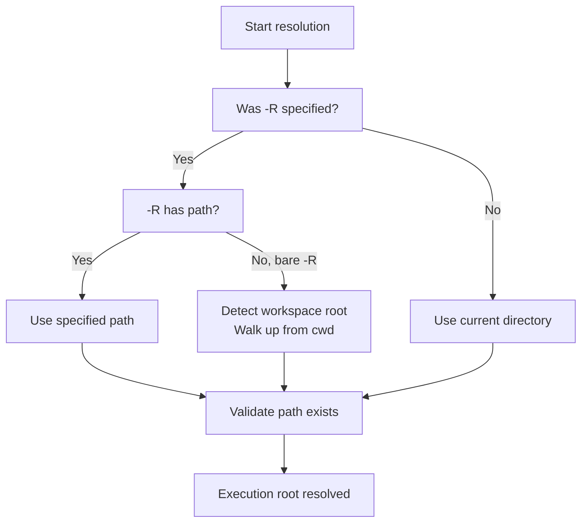

**Workspace boundary detection:**
```dart
bool isWorkspaceBoundary(String dirPath) {
  // Check for workspace marker files
  return File('$dirPath/buildkit_master.yaml').existsSync() ||
         File('$dirPath/tom_workspace.yaml').existsSync() ||
         File('$dirPath/tom.code-workspace').existsSync();
}
```

### Phase 3: Folder Scanning

Walks the filesystem to discover folders. **Skip markers are checked during scan** to avoid descending into skipped subtrees entirely.

```dart
class FolderScanner {
  Future<List<FsFolder>> scan(String root, {bool recursive = false, 
      List<String> recursionExclude = const []}) async {
    final folders = <FsFolder>[];
    await _scanDirectory(Directory(root), folders, 
        recursive: recursive, recursionExclude: recursionExclude);
    return folders;
  }

  Future<void> _scanDirectory(Directory dir, List<FsFolder> results, 
      {required bool recursive, required List<String> recursionExclude}) async {
    if (_hasSkipMarker(dir.path)) return; // Skip subtree on marker
    results.add(FsFolder(path: dir.path));
    if (!recursive) return;
    await for (final entity in dir.list()) {
      if (entity is Directory) {
        final name = p.basename(entity.path);
        if (name.startsWith('.')) continue; // Skip hidden
        if (_matchesAny(entity.path, recursionExclude)) continue;
        await _scanDirectory(entity, results, 
            recursive: recursive, recursionExclude: recursionExclude);
      }
    }
  }

  bool _hasSkipMarker(String dirPath) {
    if (File(p.join(dirPath, 'buildkit_skip.yaml')).existsSync()) return true;
    if (File(p.join(dirPath, 'buildkit_master.yaml')).existsSync() ||
        File(p.join(dirPath, 'tom_workspace.yaml')).existsSync()) return true;
    return false;
  }
}
```

**Skip markers and workspace boundaries:**

| Marker File | Behavior |
|-------------|----------|
| `buildkit_skip.yaml` | Skip this folder and all descendants |
| `buildkit_master.yaml` | Buildkit workspace root — treated as boundary |
| `tom_workspace.yaml` | Tom workspace root — treated as boundary |

**Project subfolders:** By default, the scanner continues into directories even after finding a project folder — this allows detecting nested projects. This can be prevented in two ways:

1. **`--recursion-exclude` option** — Specify patterns to prevent entering specific directories
2. **`buildkit.yaml` with `recursive: false`** — In the project's `buildkit.yaml`, set `recursive: false` to prevent the scanner from entering that project's subfolders

**Rationale:** When a folder contains a workspace marker file, it represents an independent workspace root. The scanner stops at these boundaries to avoid accidentally processing nested workspaces that should be handled separately.

### Phase 4: Global Filter Application

Filters reduce the scanned folders to those matching criteria. These are **global filters** that apply to all commands. Per-command filters are applied later in Phase 6.

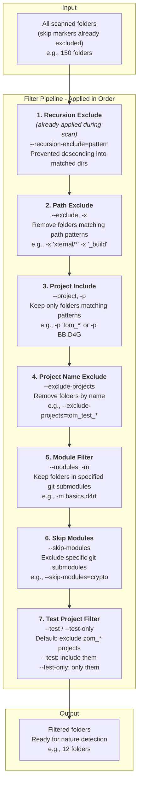

#### Filter Details

| # | Filter | Flag | When Applied | Behavior |
|---|--------|------|--------------|----------|
| 0 | Skip Markers | (automatic) | **During scan** | `buildkit_skip.yaml` skips entire subtree |
| 1 | Recursion Exclude | `--recursion-exclude` | During scan | Prevents descending into matched dirs |
| 2 | Path Exclude | `--exclude`, `-x` | After scan | Removes folders matching path patterns |
| 3 | Project Include | `--project`, `-p` | After scan | Keeps folders by project ID, name, or folder pattern |
| 4 | Project Name Exclude | `--exclude-projects` | After scan | Removes folders by project ID, name, or folder name |
| 5 | Module Filter | `--modules`, `-m` | After scan | Keeps folders by repository ID, name, or path |
| 6 | Skip Modules | `--skip-modules` | After scan | Excludes by repository ID, name, or path |
| 7 | Test Project | `--test` / `--test-only` | After scan | Controls zom_* project inclusion |

**Filter implementation:**

```dart
class FilterPipeline {
  List<FsFolder> apply(List<FsFolder> folders, TraversalInfo info) {
    var result = folders;
    if (info.excludePatterns.isNotEmpty)  // --exclude, -x
      result = result.where((f) => !_matchesAny(f.path, info.excludePatterns)).toList();
    if (info.projectPatterns.isNotEmpty)  // --project, -p
      result = result.where((f) => 
          _matchesProjectId(f, info.projectPatterns) ||    // Check project ID first
          _matchesProjectName(f, info.projectPatterns) ||  // Then project name
          _matchesAny(f.name, info.projectPatterns)        // Then folder name pattern
      ).toList();
    if (info.excludeProjects.isNotEmpty)  // --exclude-projects
      result = result.where((f) => 
          !_matchesProjectId(f, info.excludeProjects) &&
          !_matchesProjectName(f, info.excludeProjects) &&
          !_matchesAny(f.name, info.excludeProjects)
      ).toList();
    if (info.modules.isNotEmpty)          // --modules, -m
      result = _applyModulesFilter(result, info.modules);  // Supports repo ID, name, path
    if (info.skipModules.isNotEmpty)      // --skip-modules
      result = _applySkipModulesFilter(result, info.skipModules);  // Supports repo ID, name, path
    if (info.testProjectsOnly)            // --test-only
      result = result.where((f) => f.name.startsWith('zom_')).toList();
    else if (!info.includeTestProjects)   // exclude zom_* by default
      result = result.where((f) => !f.name.startsWith('zom_')).toList();
    return result;
  }
}
```

### Phase 5: Nature Detection

After filtering, each folder is analyzed to determine its "natures" — what type of project/folder it is. This phase also extracts metadata like **project IDs** from configuration files.

```dart
class NatureDetector {
  List<RunFolder> detectNatures(FsFolder folder) {
    final natures = <RunFolder>[];
    if (_isGitFolder(folder)) natures.add(GitFolder(folder));
    if (_isDartProject(folder)) natures.add(_createDartNature(folder));
    if (_isVsCodeExtension(folder)) natures.add(VsCodeExtensionFolder(folder));
    if (_isTypeScriptProject(folder)) natures.add(TypeScriptFolder(folder));
    if (_hasBuildkitYaml(folder)) natures.add(_createBuildkitNature(folder));
    if (_hasBuildYaml(folder)) natures.add(BuildRunnerFolder(folder));
    if (_hasTomProjectYaml(folder)) natures.add(TomBuildFolder(folder));
    if (_hasTomMasterYaml(folder)) natures.add(TomBuildMasterFolder(folder));
    return natures;
  }

  bool _isGitFolder(FsFolder f) => Directory(p.join(f.path, '.git')).existsSync() || File(p.join(f.path, '.git')).existsSync();
  bool _isDartProject(FsFolder f) => File(p.join(f.path, 'pubspec.yaml')).existsSync();
  bool _hasBuildkitYaml(FsFolder f) => File(p.join(f.path, 'buildkit.yaml')).existsSync();

  DartProjectFolder _createDartNature(FsFolder folder) {
    final pubspec = _loadPubspec(folder);
    if (_hasFlutterSdk(pubspec)) return FlutterProjectFolder(folder, pubspec);
    if (Directory(p.join(folder.path, 'bin')).existsSync()) return DartConsoleFolder(folder, pubspec);
    return DartPackageFolder(folder, pubspec);
  }

  BuildkitFolder _createBuildkitNature(FsFolder folder) {
    final yaml = loadYaml(File(p.join(folder.path, 'buildkit.yaml')).readAsStringSync()) as Map?;
    return BuildkitFolder(folder, config: yaml ?? {});
  }
  
  TomProjectFolder _createTomProjectNature(FsFolder folder) {
    final yaml = loadYaml(File(p.join(folder.path, 'tom_project.yaml')).readAsStringSync()) as Map?;
    return TomProjectFolder(
      folder, 
      name: yaml?['name'] as String?,
      shortId: yaml?['short-id'] as String?,
      config: yaml ?? {},
    );
  }
}
```

**Project ID and Name extraction:**

Project names and IDs are short identifiers defined in `tom_project.yaml`:

```yaml
# tom_project.yaml
name: buildkit     # Display name (lowercase, hyphen-separated)
short-id: BK       # Short identifier (uppercase)
# ... other config
```

When scanning, the `NatureDetector` extracts these and stores them in `TomProjectFolder`. The filter pipeline uses this for `--project` and `--exclude-projects` matching:

```dart
/// Check if folder matches by project ID (exact match, case-insensitive)
bool _matchesProjectId(FsFolder folder, List<String> patterns) {
  final tomProject = folder.natures.whereType<TomProjectFolder>().firstOrNull;
  if (tomProject?.shortId != null) {
    final id = tomProject!.shortId!.toLowerCase();
    return patterns.any((p) => id == p.toLowerCase());
  }
  return false;
}

/// Check if folder matches by project name (exact match, case-insensitive)
bool _matchesProjectName(FsFolder folder, List<String> patterns) {
  final tomProject = folder.natures.whereType<TomProjectFolder>().firstOrNull;
  if (tomProject?.name != null) {
    final name = tomProject!.name!.toLowerCase();
    return patterns.any((p) => name == p.toLowerCase());
  }
  return false;
}
```

This allows filtering by project ID or name:
```bash
buildkit -p BK,D4G :compile         # By project ID
buildkit -p buildkit :compile       # By project name  
buildkit -p tom_build_* :compile    # By folder name pattern (glob)
```

### Phase 6: Command Execution

Finally, commands execute on folders matching their requirements.

```dart
class CommandExecutor {
  Future<ProcessingResult> execute(
    List<CommandContext> contexts, Command command, CommandOptions options,
  ) async {
    final result = ProcessingResult();
    for (final context in contexts) {
      if (!_hasRequiredNatures(context, command.requiredNatures)) continue;
      if (!_passesCommandFilters(context, options)) continue;
      try {
        final success = await command.execute(context);
        success ? result.recordSuccess(context.path) : result.recordFailure(context.path);
      } catch (e) { result.recordError(context.path, e); }
    }
    return result;
  }
  
  bool _passesCommandFilters(CommandContext ctx, CommandOptions opts) {
    if (opts.includeProjects.isNotEmpty && !_matchesAny(ctx.name, opts.includeProjects)) return false;
    if (opts.excludeProjects.isNotEmpty && _matchesAny(ctx.name, opts.excludeProjects)) return false;
    return true;
  }
}
```

### Filter Precedence and Order

Understanding filter order is critical for predictable behavior:

```
┌─────────────────────────────────────────────────────────────────┐
│ SCAN PHASE                                                      │
│  • buildkit_skip.yaml      → Skip entire subtree during scan    │
│  • Workspace boundaries    → Skip nested workspaces:            │
│      - buildkit_master.yaml                                     │
│      - tom_workspace.yaml                                       │
│  • --recursion-exclude     → Prevents entering project subfolders│
├─────────────────────────────────────────────────────────────────┤
│ GLOBAL FILTERS (applied to all commands)                        │
│  1. --exclude (-x)        → Remove by path pattern              │
│  2. --project (-p)        → Keep only matching                  │
│  3. --exclude-projects    → Remove by name                      │
│  4. --modules (-m)        → Keep only in git submodules         │
│  5. --skip-modules        → Exclude git submodules              │
│  6. --test / --test-only  → Control zom_* inclusion             │
├─────────────────────────────────────────────────────────────────┤
│ ORDERING (applied after filtering)                              │
│  • --build-order (-b)     → Sort by dependency order            │
│  • --inner-first-git (-i) → Process inner git repos first       │
│  • --outer-first-git (-o) → Process outer git repos first       │
├─────────────────────────────────────────────────────────────────┤
│ PER-COMMAND FILTERS (applied per :command)                      │
│  • :cmd --project=X       → Run only on X for this command      │
│  • :cmd --exclude=Y       → Skip Y for this command             │
└─────────────────────────────────────────────────────────────────┘
```

### Per-Command Filtering

Even when a tool has global navigation, individual commands can further filter which projects they process.

```bash
# Global: scan recursively, all projects
# :cleanup runs on all
# :compile runs only on tom_* projects
# :test skips tom_test_* projects
buildkit -s . -r :cleanup :compile --project=tom_* :test --exclude=tom_test_*
```

**Validation:**
- Commands must declare if they support `--project`/`--exclude` via `CommandDefinition.supportsProjectFilter`
- If a command does NOT support these but user specifies them, emit error:

```
Error: :mycommand does not support --project/--exclude filtering.
Hint: Remove per-command filters or use a tool that supports this feature.
```

### Git Traversal Mode

There are two traversal modes: **project traversal** and **git traversal**. Commands can support one or both modes. When a command supports both, it runs in the mode selected by the user. The key difference is how folders are selected and ordered — **all folder natures are always detected** regardless of traversal mode.

A folder can be both a project folder AND a git folder. For example, `tom_build_base/` contains `pubspec.yaml` (project) and `.git/` (git repo). Commands supporting both modes can operate on such folders in either mode.

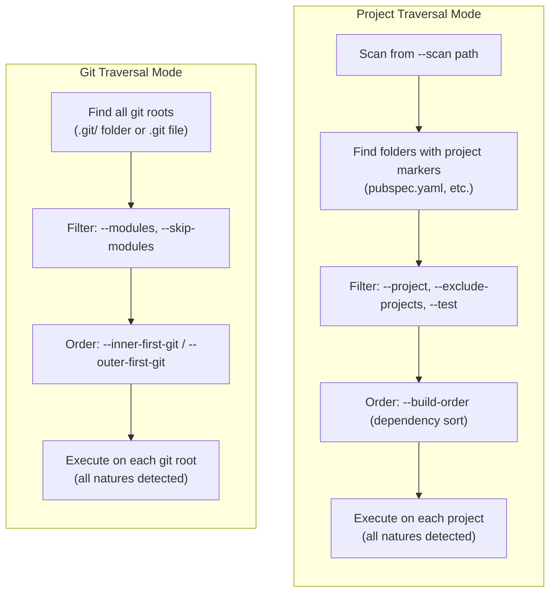

**Key points:**
- Project traversal scans from `--scan` path, respects `--recursive`, finds folders with project markers
- Git traversal finds all git repositories regardless of scanning options
- In both modes, **all folder natures are detected** (a git folder is also checked for pubspec.yaml, etc.)
- Commands that support both modes can use either, depending on user's choice

#### Command Nature Declarations

Commands declare their nature requirements using two properties:

| Property | Type | Meaning |
|----------|------|---------|
| `requiredNatures` | `Set<Type>?` | Folder **must have ALL** these natures. `null` = no requirement |
| `worksWithNatures` | `Set<Type>` | Natures the command can operate on. Command examines context |

**Examples:**

```dart
// Git-only command: Requires git folder, only works with git
final pushCommand = CommandDefinition(
  name: 'push',
  requiredNatures: {GitFolder},
  worksWithNatures: {GitFolder},
);

// Project-only command: Requires Dart project
final analyzeCommand = CommandDefinition(
  name: 'analyze',
  requiredNatures: {DartProjectFolder},
  worksWithNatures: {DartProjectFolder},
);

// Flexible command: Works with git folders AND projects
// The command decides what to do based on available natures
final statusCommand = CommandDefinition(
  name: 'status',
  requiredNatures: null,  // No requirement — runs on any folder
  worksWithNatures: {GitFolder, DartProjectFolder},
);

// Dual-mode command: Requires git but can do more if it's also a project
final infoCommand = CommandDefinition(
  name: 'info',
  requiredNatures: {GitFolder},  // Must be a git folder
  worksWithNatures: {GitFolder, DartProjectFolder},  // Can use project info if available
);
```

#### Flexible Command Behavior

Commands with multiple `worksWithNatures` can examine the context and behave differently:

```dart
class StatusCommand extends Command {
  @override
  Future<bool> execute(CommandContext ctx) async {
    // Check what natures are available
    final hasGit = ctx.hasNature<GitFolder>();
    final hasProject = ctx.hasNature<DartProjectFolder>();
    
    if (hasGit) {
      final git = ctx.getNature<GitFolder>();
      print('Git: ${git.currentBranch}');
      if (git.hasUncommittedChanges) print('  uncommitted changes');
    }
    
    if (hasProject) {
      final project = ctx.getNature<DartProjectFolder>();
      print('Project: ${project.projectName} v${project.version}');
    }
    
    return true;
  }
}
```

#### Traversal Info Types

The framework provides separate traversal info types for different traversal modes. Each mode has its own set of options, plus common options that apply to both.

**Common Options (both modes):**

| Option | Abbr | Description |
|--------|------|-------------|
| `--exclude` | `-x` | Path patterns to exclude (glob patterns) |
| `--test` | | Include zom_* test projects in results |
| `--test-only` | | ONLY process zom_* test projects |
| `--execution-root` | `-R` | Workspace root path |

**Project Traversal Options:**

| Option | Abbr | Description |
|--------|------|-------------|
| `--scan` | `-s` | Starting path for scan (default: `.`) |
| `--recursive` | `-r` | Recurse into subdirectories |
| `--not-recursive` | | Do not recurse (overrides -r) |
| `--recursion-exclude` | | Patterns to skip during descent |
| `--project` | `-p` | Project names/IDs to include (glob patterns) |
| `--exclude-projects` | | Project names to exclude |
| `--build-order` | `-b` | Sort by dependency order |

**Git Traversal Options:**

| Option | Abbr | Description |
|--------|------|-------------|
| `--modules` | `-m` | Git submodules to include (by name) |
| `--skip-modules` | | Git submodules to exclude |
| `--inner-first-git` | `-i` | Process submodules before parent repos |
| `--outer-first-git` | `-o` | Process parent repos before submodules |

```bash
# Mixed command: Find all git repos and show project info if available
buildkit -s . -r --inner-first-git :status

# Filter: Only git repos that are also Dart projects matching 'tom_*'
buildkit -s . -r --inner-first-git --project=tom_* :info
```

#### Git Folder Detection

Git folders are detected by:

| Indicator | Meaning |
|-----------|---------|
| `.git/` directory | Standard git repository root |
| `.git` file | Git submodule (file contains path to actual git dir) |

```dart
bool _isGitFolder(String dirPath) {
  final gitDir = Directory(p.join(dirPath, '.git'));
  final gitFile = File(p.join(dirPath, '.git'));
  return gitDir.existsSync() || gitFile.existsSync();
}
```

#### Module Filters in Git Traversal

The `--modules` and `--skip-modules` options filter by **repository name or ID**:

```
workspace/
├── .git/                          # Main repo
├── xternal/
│   ├── tom_module_basics/
│   │   └── .git/                  # Submodule: basics (ID: BSC)
│   ├── tom_module_d4rt/
│   │   └── .git/                  # Submodule: d4rt (ID: D4)
│   └── tom_module_crypto/
│       └── .git/                  # Submodule: crypto (ID: CRPT)
```

**Global reference:** See `_copilot_guidelines/projects_and_repos.md` for the complete list of repository names and IDs.

```bash
# Filter by repository name (detected from folder/submodule config)
buildkit -s . -r --modules=basics,d4rt --inner-first-git :gitstatus

# Filter by repository ID (from projects_and_repos.md lookup)
buildkit -s . -r --modules=BSC,D4 --inner-first-git :gitstatus

# Process all except crypto (by name or ID)
buildkit -s . -r --skip-modules=crypto --inner-first-git :commit :push
buildkit -s . -r --skip-modules=CRPT --inner-first-git :commit :push
```

**Resolution hierarchy for `--modules` / `-m` and `--skip-modules`:**
1. Check if value matches a repository ID (from `projects_and_repos.md`)
2. Check if value matches a repository name (detected from folder/submodule)
3. Check if value is a path substring match (current behavior)

**Note:** Pattern matching is not supported for repository filters; use exact names or IDs.

#### Git Traversal Order

When using git traversal, the order option determines whether inner repos (submodules) or outer repos (containing repos) are processed first:

| Option | Effect |
|--------|--------|
| `--inner-first-git (-i)` | Process deepest git repos first (submodules before parent) |
| `--outer-first-git (-o)` | Process outermost git repos first (parent before submodules) |

**When to use each:**
- `--inner-first-git`: Commit operations (commit submodules first, then parent can record new commits)
- `--outer-first-git`: Status operations (see parent status first, then dive into details)
- `--outer-first-git`: Push operations where parent must be pushed after submodules

#### Command Examples

```dart
// Git-only: commit command that requires inner-first ordering
final commitCommand = CommandDefinition(
  name: 'commit',
  description: 'Commit changes across git repos',
  requiredNatures: {GitFolder},
  worksWithNatures: {GitFolder},
  defaultGitOrder: GitTraversalOrder.innerFirst,
  supportsGitTraversal: true,
  supportsProjectTraversal: false,
);

// Git-only: push command that suggests outer-first ordering  
final pushCommand = CommandDefinition(
  name: 'push',
  description: 'Push changes across git repos',
  requiredNatures: {GitFolder},
  worksWithNatures: {GitFolder},
  defaultGitOrder: GitTraversalOrder.outerFirst,
  supportsGitTraversal: true,
  supportsProjectTraversal: false,
);

// Flexible: status works on both git and project folders
final statusCommand = CommandDefinition(
  name: 'status',
  description: 'Show status of git repos and/or projects',
  requiredNatures: null,  // No requirements
  worksWithNatures: {GitFolder, DartProjectFolder},
  supportsGitTraversal: true,
  supportsProjectTraversal: true,
);

// Flexible: cleanup command that can clean git ignored files OR project build artifacts
final cleanupCommand = CommandDefinition(
  name: 'cleanup',
  description: 'Clean build artifacts and ignored files',
  requiredNatures: null,
  worksWithNatures: {GitFolder, DartProjectFolder, FlutterProjectFolder},
  supportsGitTraversal: true,
  supportsProjectTraversal: true,
);
```

---

## Folder Natures

### FsFolder and RunFolder

Two classes represent folders at different stages:

```dart
/// Filesystem folder during scanning (minimal info)
class FsFolder {
  final String path;
  String get name => p.basename(path);
  bool get exists => Directory(path).existsSync();
}

/// Folder during execution with detected capabilities
abstract class RunFolder {
  final FsFolder fsFolder;
  RunFolder(this.fsFolder);
  String get path => fsFolder.path;
  String get name => fsFolder.name;
}
```

### Nature Types

A folder can have multiple natures simultaneously:

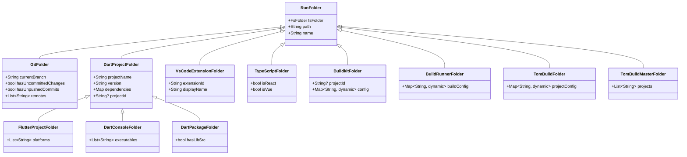

### Detection Rules

| Nature | Detection |
|--------|-----------|
| **Standard Natures** | |
| `GitFolder` | `.git/` directory or `.git` file exists |
| `DartProjectFolder` | `pubspec.yaml` exists |
| `FlutterProjectFolder` | `pubspec.yaml` contains `sdk: flutter` |
| `DartConsoleFolder` | `pubspec.yaml` exists AND `bin/` exists |
| `DartPackageFolder` | `pubspec.yaml` exists AND `lib/src/` exists |
| `VsCodeExtensionFolder` | `package.json` contains `engines.vscode` |
| `TypeScriptFolder` | `tsconfig.json` exists |
| `JavaFolder` | `pom.xml` or `build.gradle` exists |
| `PythonFolder` | `pyproject.toml`, `setup.py`, or `setup.cfg` exists |
| **Tom Framework Natures** | |
| `BuildkitFolder` | `buildkit.yaml` exists (also extracts `project-id`) |
| `BuildRunnerFolder` | `build.yaml` exists (Dart build_runner config) |
| `TomBuildFolder` | `tom_project.yaml` exists |
| `TomBuildMasterFolder` | `tom_master.yaml` exists |

**Note:** `buildkit_master.yaml` is treated as a skip marker during scan phase (see Phase 3), not as a nature. This prevents accidentally entering nested buildkit workspaces.

### CommandContext API

Commands receive a context with all detected natures:

```dart
class CommandContext {
  final FsFolder fsFolder;
  final List<RunFolder> natures;
  final String executionRoot;
  
  /// Folder path
  String get path => fsFolder.path;
  
  /// Folder name
  String get name => fsFolder.name;
  
  /// Relative path from execution root
  String get relativePath => p.relative(path, from: executionRoot);
  
  /// Check if folder has a specific nature.
  bool hasNature<T extends RunFolder>() {
    return natures.whereType<T>().isNotEmpty;
  }
  
  /// Get a specific nature (throws if not present).
  T getNature<T extends RunFolder>() {
    final matches = natures.whereType<T>();
    if (matches.isEmpty) {
      throw StateError('Folder $name does not have nature $T');
    }
    return matches.first;
  }
  
  /// Get a specific nature or null.
  T? tryGetNature<T extends RunFolder>() {
    final matches = natures.whereType<T>();
    return matches.isNotEmpty ? matches.first : null;
  }
  
  /// Check if this is a Dart project of any kind.
  bool get isDartProject => hasNature<DartProjectFolder>();
  
  /// Check if this is a git repository.
  bool get isGitRepo => hasNature<GitFolder>();
}
```

**Example usage:**

```dart
class GitStatusCommand extends Command {
  @override
  Set<Type> get requiredNatures => {GitFolder};
  
  @override
  Future<bool> execute(CommandContext ctx) async {
    final git = ctx.getNature<GitFolder>();
    
    print('Branch: ${git.currentBranch}');
    if (git.hasUncommittedChanges) {
      print('  Has uncommitted changes');
    }
    if (git.hasUnpushedCommits) {
      print('  Has unpushed commits');
    }
    
    return true;
  }
}
```

---

## Tool and Command Definitions

### ToolDefinition

```dart
class ToolDefinition {
  final String name;                               // Tool name ('buildkit', 'testkit')
  final String description;                        // Short description for help
  final String version;                            // Version (from version.versioner.dart)
  final ToolMode mode;                             // Tool mode
  final NavigationFeatures navigationFeatures;     // Global navigation options
  final List<OptionDefinition> globalOptions;      // Global non-navigation options
  final List<CommandDefinition> commands;          // Commands (multi-command tools)
  final bool supportsStdin;                        // Supports stdin mode
  final String? stdinHelp;                         // Stdin mode help text
  final List<String> usagePatterns;                // Usage patterns for help
  final List<String> blockedOptions;               // Reserved options ("not implemented")
}

enum ToolMode { simple, multiCommand, repl, tui }
```

### CommandDefinition

```dart
class CommandDefinition {
  final String name;                       // Command name (without : prefix)
  final String description;                // Short description
  final List<String> aliases;              // Aliases (e.g., 'ls' for 'list')
  final List<OptionDefinition> options;    // Command-specific options
  
  // Nature Requirements
  final Set<Type>? requiredNatures;        // Folder MUST have ALL (null = any folder)
  final Set<Type> worksWithNatures;        // Natures command can handle
  
  // Traversal Support
  final bool supportsProjectTraversal;     // Accepts --project, --exclude-projects, etc.
  final bool supportsGitTraversal;         // Accepts --modules, --skip-modules, etc.
  final GitTraversalOrder? defaultGitOrder;// Default git order (null = must specify)
  final bool supportsPerCommandFilter;     // Supports per-command --project/--exclude
  
  // Execution
  final bool requiresTraversal;            // Needs workspace traversal
  final List<String> examples;             // Usage examples
  final bool canRunStandalone;             // Can run as standalone binary
  final NavigationFeatures? standaloneNavigation; // Navigation when standalone
  
  List<OptionDefinition> get allOptions {
    final result = <OptionDefinition>[...options];
    if (supportsProjectTraversal) result.addAll(projectTraversalOptions);
    if (supportsGitTraversal) result.addAll(gitTraversalOptions);
    return result;
  }
}

enum GitTraversalOrder { innerFirst, outerFirst }
```

**Nature requirement examples:**

| Command | `requiredNatures` | `worksWithNatures` | Behavior |
|---------|------------------|-------------------|----------|
| `:push` | `{GitFolder}` | `{GitFolder}` | Only runs on git folders |
| `:analyze` | `{DartProjectFolder}` | `{DartProjectFolder}` | Only runs on Dart projects |
| `:status` | `null` | `{GitFolder, DartProjectFolder}` | Runs on any folder, examines available natures |
| `:info` | `{GitFolder}` | `{GitFolder, DartProjectFolder}` | Must be git folder, but can also use project info if available |

### OptionDefinition

```dart
class OptionDefinition {
  final String name;
  final String? abbr;
  final String description;
  final OptionType type;  // flag, option, multiOption
  final String? defaultValue;
  final List<String>? allowedValues;
  final bool mandatory;
  final bool negatable;  // for flags: --no-X
}

enum OptionType { flag, option, multiOption }
```

### Standalone Commands

A command can run as a standalone binary (separate executable). When standalone, all options are specified directly without the `:command` prefix.

```dart
// bin/cleanup.dart - standalone entry point
void main(List<String> args) async {
  final runner = StandaloneCommandRunner(
    definition: cleanupCommandDefinition,
    // When standaloneNavigation is null, use standard defaults
    navigationFeatures: cleanupCommandDefinition.standaloneNavigation 
        ?? NavigationFeatures.standard,
  );
  
  final exitCode = await runner.run(args);
  exit(exitCode);
}
```

**How standalone relates to tool:**
- A `CommandDefinition` has `canRunStandalone: true`
- When run standalone, there is NO parent tool — the command IS the entry point
- `standaloneNavigation` specifies which navigation features to enable
- If `standaloneNavigation` is null, uses `NavigationFeatures.standard` defaults
- The command gets its own `--help`, `--version` since it's the entry point
- Help text comes from `CommandDefinition`, not a parent `ToolDefinition`

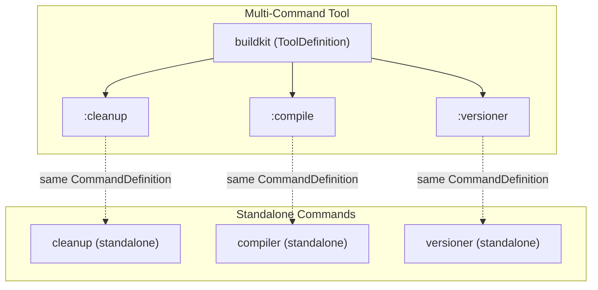

**Standalone vs multi-command execution:**

| Aspect | Multi-Command | Standalone |
|--------|---------------|------------|
| Entry point | `buildkit :cleanup` | `cleanup` |
| Help | `buildkit help :cleanup` | `cleanup --help` |
| Version | `buildkit version` | `cleanup --version` |
| Global options | From `ToolDefinition` | From `standaloneNavigation` |
| Per-command options | After `:command` | Directly |

---

## Standard CLI Features

### Version and Help

All tools support these variations:

**Version:**
```bash
mytool version
mytool --version
mytool -version
mytool -V
```

**Help:**
```bash
mytool help
mytool --help
mytool -help
mytool -h
mytool help :command    # Per-command help (multi-command tools)
mytool :command --help  # Same as above
```

### Standard Options

v2 provides these standard options automatically:

| Option | Abbr | Description |
|--------|------|-------------|
| `--verbose` | `-v` | Enable verbose output |
| `--dry-run` | `-n` | Show what would be done without doing it |
| `--list` | `-l` | List matching projects (no action) |
| `--help` | `-h` | Show help |
| `--config` | `-c` | Path to configuration file |
| `--dump-config` | | Print effective configuration |
| `--guide` | `-g` | Interactive guided mode |
| `--force` | `-f` | Skip confirmation prompts |

**Option blocking:**

If a tool doesn't support an option yet but wants to reserve it:

```dart
final tool = ToolDefinition(
  // ...
  blockedOptions: ['guide'],  // User sees "not yet implemented"
);
```

When user specifies a blocked option:
```
Error: --guide is not yet implemented for this tool.
```

### Positional Arguments

Non-option arguments after options but before `:commands`.

```bash
# REPL: positional args can be scripts or expressions
d4rt script.dart              # Execute file
d4rt "1 + 2"                  # Evaluate expression

# Simple tool: positional args are inputs
astgen source.dart            # Process specific file

# Multi-command: positional args before :commands
buildkit project.yaml :build  # Uses config file
```

**Parsing rules:**
1. Arguments before any `-` option or `:command` are positional
2. Arguments after `--` are always positional (standard convention)
3. Each tool's `ToolDefinition` specifies how many positional args it accepts

```dart
class ToolDefinition {
  /// Minimum positional arguments required
  final int minPositionalArgs;
  
  /// Maximum positional arguments allowed (-1 = unlimited)
  final int maxPositionalArgs;
  
  /// Description for positional args in help
  final String? positionalArgsHelp;
}
```

### Project Names and IDs

Short mnemonics and display names for projects, defined in `tom_project.yaml`:

```yaml
# In tom_build_base/tom_project.yaml
name: buildkit        # Lowercase display name
short-id: BK          # Short uppercase identifier

# In tom_d4rt_generator/tom_project.yaml
name: d4rt-gen
short-id: D4G
```

**Global reference:** See `_copilot_guidelines/projects_and_repos.md` for the complete list of project names and IDs.

**Usage:**
```bash
buildkit -p BK,D4G :compile     # Filter by project IDs
buildkit -p buildkit :compile   # Filter by project name
buildkit -p tom_* :compile      # Filter by folder name pattern (glob)
buildkit -x d4rt :cleanup       # Exclude by project name
```

**Resolution hierarchy for `--project` / `-p`:**
1. Check if value matches a project ID (from `tom_project.yaml` `short-id`)
2. Check if value matches a project name (from `tom_project.yaml` `name`)
3. Check if value matches a folder name pattern (glob on folder name)

**Note:** Pattern matching (with `*`, `?`, `**`) only works on folder names, not on project names or IDs.

### Test Project Modes

Control handling of `zom_*` test projects:

```bash
# Default: exclude zom_* projects
buildkit -s . -r :compile

# Include zom_* projects along with regular
buildkit -s . -r --test :compile

# Only process zom_* projects
buildkit -s . -r --test-only :compile
```

---

## API for Programmatic Use

### TraversalInfo Hierarchy

The traversal info types form a hierarchy based on traversal mode. Note that `scan`, `recursive`, and `recursionExclude` apply only to project traversal — git traversal finds all repositories regardless of scan path.

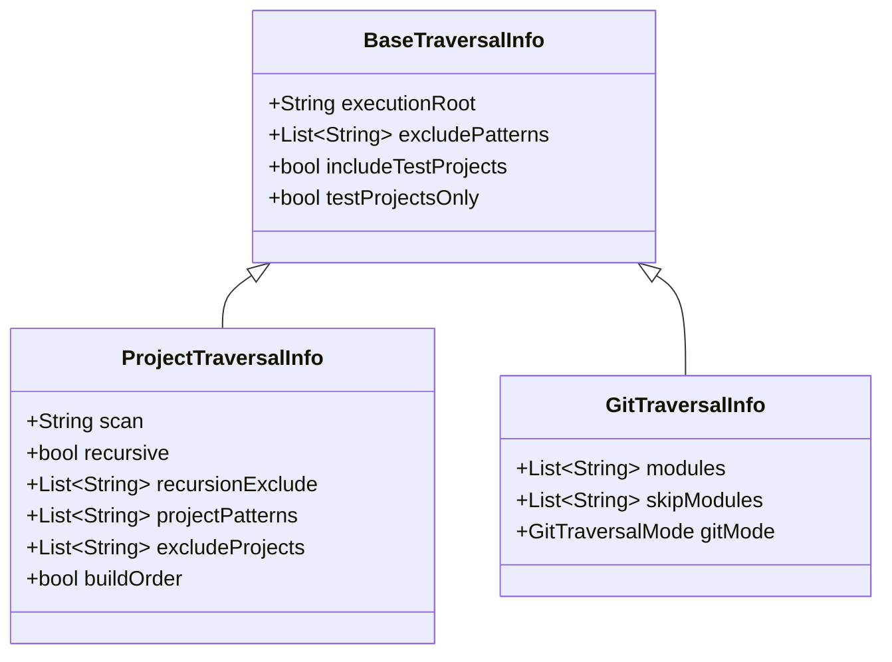

### BaseTraversalInfo

Common options shared by all traversal modes:

```dart
/// Base class for traversal configuration.
abstract class BaseTraversalInfo {
  final String executionRoot;           // Workspace root path
  final List<String> excludePatterns;   // Path patterns to exclude (glob)
  final bool includeTestProjects;       // Include zom_* test projects
  final bool testProjectsOnly;          // ONLY process zom_* test projects
  
  BaseTraversalInfo({
    required this.executionRoot,
    this.excludePatterns = const [],
    this.includeTestProjects = false,
    this.testProjectsOnly = false,
  });
}
```

### ProjectTraversalInfo

Project-focused traversal with project name filtering:

```dart
/// Configuration for project-based traversal.
class ProjectTraversalInfo extends BaseTraversalInfo {
  final String scan;                    // Starting path for scan (default: '.')
  final bool recursive;                 // Recurse into subdirectories
  final List<String> recursionExclude;  // Patterns to skip during descent
  final List<String> projectPatterns;   // Project names/IDs to include (glob, empty = all)
  final List<String> excludeProjects;   // Project names to exclude
  final bool buildOrder;                // Sort by dependency order
  
  ProjectTraversalInfo({
    required super.executionRoot, super.excludePatterns,
    super.includeTestProjects, super.testProjectsOnly,
    this.scan = '.', this.recursive = false, this.recursionExclude = const [],
    this.projectPatterns = const [], this.excludeProjects = const [],
    this.buildOrder = false,
  });
  
  factory ProjectTraversalInfo.fromCliArgs(CliArgs args) => ProjectTraversalInfo(
    executionRoot: args.executionRoot, excludePatterns: args.excludePatterns,
    includeTestProjects: args.includeTestProjects, testProjectsOnly: args.testProjectsOnly,
    scan: args.scan ?? '.', recursive: args.recursive && !args.notRecursive,
    recursionExclude: args.recursionExclude, projectPatterns: args.projectPatterns,
    excludeProjects: args.excludeProjects, buildOrder: args.buildOrder,
  );
}
```

### GitTraversalInfo

Git-focused traversal with submodule filtering. Git traversal finds all repositories regardless of scan path.

```dart
/// Configuration for git repository traversal.
class GitTraversalInfo extends BaseTraversalInfo {
  final List<String> modules;       // Git submodules to include (by name, empty = all)
  final List<String> skipModules;   // Git submodules to exclude (by name)
  final GitTraversalMode gitMode;   // innerFirst or outerFirst ordering
  
  GitTraversalInfo({
    required super.executionRoot, super.excludePatterns,
    super.includeTestProjects, super.testProjectsOnly,
    this.modules = const [], this.skipModules = const [],
    required this.gitMode,
  });
  
  factory GitTraversalInfo.fromCliArgs(CliArgs args) => GitTraversalInfo(
    executionRoot: args.executionRoot, excludePatterns: args.excludePatterns,
    includeTestProjects: args.includeTestProjects, testProjectsOnly: args.testProjectsOnly,
    modules: args.modules, skipModules: args.skipModules, gitMode: args.gitMode,
  );
}

enum GitTraversalMode { innerFirst, outerFirst }
```

### BuildBase.traverse() API

The main entry point for traversal. Accepts either `ProjectTraversalInfo` or `GitTraversalInfo`:

```dart
abstract class BuildBase {
  /// Traverse folders and execute callback on each.
  /// [info] - ProjectTraversalInfo or GitTraversalInfo
  /// [run] - Callback for each matching folder
  /// [requiredNatures] - Folder MUST have ALL (null = no requirement)
  /// [worksWithNatures] - Natures the callback can handle
  static Future<ProcessingResult> traverse({
    required BaseTraversalInfo info,
    required Future<bool> Function(CommandContext) run,
    Set<Type>? requiredNatures,
    Set<Type> worksWithNatures = const {},
  }) async {
    final detector = NatureDetector();
    final result = ProcessingResult();
    
    // Get folders based on traversal type
    final folders = switch (info) {
      ProjectTraversalInfo pi => await _scanProjects(pi),
      GitTraversalInfo gi => await _findGitRepos(gi),
      _ => <FsFolder>[],
    };
    
    // Detect natures + create contexts
    final contexts = <CommandContext>[];
    for (final folder in folders) {
      final natures = detector.detectNatures(folder);
      contexts.add(CommandContext(fsFolder: folder, natures: natures, 
          executionRoot: info.executionRoot));
    }
    
    // Apply ordering based on traversal type
    final ordered = switch (info) {
      GitTraversalInfo gi => _applyGitOrdering(contexts, gi.gitMode),
      ProjectTraversalInfo pi when pi.buildOrder => _applyBuildOrdering(contexts),
      _ => contexts,
    };
    
    // Execute
    for (final ctx in ordered) {
      if (requiredNatures != null && requiredNatures.isNotEmpty) {
        if (!requiredNatures.every((n) => ctx.hasNature(n))) continue;
      }
      try {
        final success = await run(ctx);
        success ? result.recordSuccess(ctx.path) : result.recordFailure(ctx.path);
      } catch (e) {
        result.recordError(ctx.path, e);
      }
    }
    return result;
  }
  
  /// Project traversal: scan from path, filter by patterns
  static Future<List<FsFolder>> _scanProjects(ProjectTraversalInfo info) async {
    final scanner = FolderScanner();
    final filter = FilterPipeline();
    final folders = await scanner.scan(info.scan, 
        recursive: info.recursive, recursionExclude: info.recursionExclude);
    return filter.applyProjectFilters(folders, info);
  }
  
  /// Git traversal: find all git repositories under executionRoot
  static Future<List<FsFolder>> _findGitRepos(GitTraversalInfo info) async {
    final finder = GitRepoFinder();
    final filter = FilterPipeline();
    final repos = await finder.findAll(info.executionRoot);
    return filter.applyGitFilters(repos, info);
  }
}
```

### D4rt Script Integration

Using build base from D4rt scripts requires bridging the gap between scripting convenience and full API access.

**Basic usage — project traversal:**

```dart
// In a .d4rt or .dcli script
import 'package:tom_build_base/tom_build_base_v2.dart';
import 'package:dcli/dcli.dart';

void main() async {
  // Project traversal with typed info
  await BuildBase.traverse(
    info: ProjectTraversalInfo(
      scan: '.',
      recursive: true,
      executionRoot: pwd,
      projectPatterns: ['tom_*'],
    ),
    requiredNatures: {DartProjectFolder},
    run: (ctx) async {
      print('Processing: ${ctx.relativePath}');
      
      if (ctx.isDartProject) {
        // Use dcli to run commands
        'dart analyze'.start(workingDirectory: ctx.path);
      }
      
      return true;
    },
  );
}
```

**Basic usage — git traversal:**

```dart
// Git traversal with typed info
await BuildBase.traverse(
  info: GitTraversalInfo(
    scan: '.',
    recursive: true,
    executionRoot: pwd,
    gitMode: GitTraversalMode.innerFirst,
  ),
  requiredNatures: {GitFolder},
  run: (ctx) async {
    final git = ctx.getNature<GitFolder>();
    print('${ctx.name}: ${git.currentBranch}');
    return true;
  },
);
```

**Convenience extensions for scripting:**

```dart
/// Extensions to make BuildBase easier to use in scripts.
extension BuildBaseScripting on BuildBase {
  /// Quick traversal with sensible defaults for scripts.
  /// 
  /// Example:
  /// ```dart
  /// await BuildBase.forEachDartProject((ctx) async {
  ///   print('${ctx.name}: ${ctx.getNature<DartProjectFolder>().version}');
  /// });
  /// ```
  static Future<ProcessingResult> forEachDartProject(
    Future<void> Function(CommandContext) action, {
    String scan = '.',
    bool recursive = true,
    List<String>? include,
    List<String>? exclude,
  }) async {
    return await BuildBase.traverse(
      info: ProjectTraversalInfo(
        scan: scan,
        recursive: recursive,
        projectPatterns: include ?? [],
        excludeProjects: exclude ?? [],
        executionRoot: Directory.current.path,
      ),
      requiredNatures: {DartProjectFolder},
      run: (ctx) async {
        await action(ctx);
        return true;
      },
    );
  }
  
  /// Quick traversal for git repositories.
  static Future<ProcessingResult> forEachGitRepo(
    Future<void> Function(CommandContext) action, {
    String scan = '.',
    bool innerFirst = true,
    List<String>? modules,
    List<String>? skipModules,
  }) async {
    return await BuildBase.traverse(
      info: GitTraversalInfo(
        scan: scan,
        recursive: true,
        executionRoot: Directory.current.path,
        gitMode: innerFirst 
            ? GitTraversalMode.innerFirst 
            : GitTraversalMode.outerFirst,
        modules: modules ?? [],
        skipModules: skipModules ?? [],
      ),
      requiredNatures: {GitFolder},
      run: (ctx) async {
        await action(ctx);
        return true;
      },
    );
  }
  
  /// Get list of projects without executing anything.
  static Future<List<CommandContext>> findProjects({
    String scan = '.', bool recursive = true, List<String>? include,
    List<String>? exclude, Set<Type>? requiredNatures,
  }) async {
    final info = ProjectTraversalInfo(
      scan: scan, recursive: recursive, executionRoot: Directory.current.path,
      projectPatterns: include ?? [], excludeProjects: exclude ?? [],
    );
    final folders = await FolderScanner().scan(info.scan, 
        recursive: info.recursive, recursionExclude: info.recursionExclude);
    final filtered = FilterPipeline().apply(folders, info);
    final detector = NatureDetector();
    return filtered.map((folder) {
      final natures = detector.detectNatures(folder);
      return CommandContext(fsFolder: folder, natures: natures, executionRoot: info.executionRoot);
    }).where((ctx) => requiredNatures == null || requiredNatures.every((n) => ctx.hasNature(n))).toList();
  }
}
```

**Script examples:**

```dart
// List all Dart projects with their versions
final projects = await BuildBase.findProjects(
  requiredNatures: {DartProjectFolder},
);
for (final ctx in projects) {
  final dart = ctx.getNature<DartProjectFolder>();
  print('${dart.projectName} v${dart.version}');
}

// Run dart analyze on selected projects
await BuildBase.forEachDartProject(
  (ctx) async {
    print('Analyzing ${ctx.name}...');
    final result = 'dart analyze'.start(
      workingDirectory: ctx.path,
      nothrow: true,
    );
    if (result.exitCode != 0) {
      print('  FAILED');
    }
  },
  include: ['tom_*'],
  exclude: ['tom_test_*'],
);

// Git status across all repos
await BuildBase.forEachGitRepo((ctx) async {
  final git = ctx.getNature<GitFolder>();
  if (git.hasUncommittedChanges) {
    print('${ctx.name}: uncommitted changes on ${git.currentBranch}');
  }
});
```

### TUI Integration

TUI applications construct `TraversalInfo` from user selections rather than command-line arguments.

**Pattern:**

```dart
class MyTuiApp {
  String _selectedPath = '.';
  bool _recursive = true;
  List<String> _selectedProjects = [];
  List<String> _excludedProjects = [];

  TraversalInfo get _currentTraversal => TraversalInfo(
    scan: _selectedPath, recursive: _recursive, projectPatterns: _selectedProjects,
    excludeProjects: _excludedProjects, executionRoot: _workspaceRoot,
  );

  void _onSettingsChanged() => _refreshProjectList();

  Future<void> _refreshProjectList() async {
    final contexts = await BuildBase.findProjects(
      scan: _selectedPath, recursive: _recursive,
      include: _selectedProjects.isEmpty ? null : _selectedProjects,
      exclude: _excludedProjects.isEmpty ? null : _excludedProjects,
    );
    _updateProjectListPanel(contexts);
  }

  Future<void> _runCommand(Command command) async {
    final result = await BuildBase.traverse(
      info: _currentTraversal, requiredNatures: command.requiredNatures,
      run: (ctx) async {
        _outputPanel.appendLine('Processing: ${ctx.relativePath}');
        return await command.execute(ctx);
      },
    );
    _showResultsSummary(result);
  }

  Future<void> _runOnSubset(List<String> specificProjects) async {
    final customInfo = _currentTraversal.copyWith(projectPatterns: specificProjects);
    await BuildBase.traverse(info: customInfo, run: (ctx) async { /* ... */ });
  }
}
```

**Key insight:** The TUI can:
1. Use `BuildBase.findProjects()` to preview what would be selected
2. Modify `TraversalInfo` based on user interaction
3. Call `BuildBase.traverse()` multiple times with different settings
4. Use `copyWith()` to create variations of the current config

---

## Library Integration

### Core Dependencies

| Package | Purpose | Integration |
|---------|---------|-------------|
| **args** | Argument parsing | Foundation of `CliArgParser` |
| **path** | Path manipulation | Used throughout |
| **glob** | Pattern matching | Filter implementation |
| **yaml** | Config loading | `buildkit.yaml` parsing |

These are direct dependencies of tom_build_base.

### Interactive Libraries

| Package | Purpose | Current Usage | Integration |
|---------|---------|---------------|-------------|
| **interact** | Terminal prompts | Guide mode in buildkit git tools | Shared `GuidedMode` wrapper |
| **utopia_tui** | Full-screen TUI | testkit `--tui` | TUI support utilities |
| **dcli** | Shell scripting | D4rt scripts, shell commands | Script convenience methods |

**interact integration (guide mode):**

```dart
class GuidedMode {
  int menu(String prompt, List<String> options, {int defaultIndex = 0}); // Returns index, -1 if cancelled
  List<int> multiSelect(String prompt, List<String> options);            // Returns selected indices
  bool confirm(String prompt, {bool defaultYes = true});                 // Yes/no
  String input(String prompt, {String? defaultValue});                   // Text input
  String password(String prompt);                                        // Hidden input
  Future<T> withSpinner<T>(String message, Future<T> Function() action); // Spinner wrapper
}
```

```dart
// Tools can use GuidedMode when --guide is active:
if (args.guide) {
  final guided = GuidedMode();
  final projectIndex = guided.menu('Select project:', availableProjects.map((p) => p.name).toList());
  if (projectIndex < 0) { print('Cancelled'); return; }
}
```

**utopia_tui integration:**

TUI applications use utopia_tui directly. tom_build_base provides:
- `TraversalInfo` and `BuildBase` APIs that work from TUI context
- No additional wrapper needed — utopia_tui handles rendering

### Output and Formatting

| Package | Purpose | Current Usage |
|---------|---------|---------------|
| **console_markdown** | ANSI markdown rendering | REPL help/output, CLI help |
| **marked** | Markdown parsing | Document processing |

**console_markdown for help text:**

```dart
void printHelp() {
  final help = '''
**MyTool** - Does useful things

<cyan>**Usage**</cyan>
  mytool [options]

<yellow>**Options**</yellow>
  -v, --verbose    Enable verbose output
  -g, --guide      Interactive guided mode
''';
  
  // Renders markdown with ANSI colors
  print(ConsoleMarkdown.render(help));
}
```

tom_build_base can provide:
- `HelpGenerator` that uses console_markdown for consistent formatting
- Standard help templates with markdown styling

### Shell Completion

Shell completion enables **tab-completion** in your terminal when typing commands. When you press Tab, the shell suggests possible completions for what you're typing.

| Package | Purpose | Status |
|---------|---------|--------|
| **completion** | Shell completions | Planned integration |

#### What Tab-Completion Provides

When installed, shell completion enables pressing `<Tab>` to auto-complete:

1. **Command names** — Type `buildkit :cl<Tab>` → completes to `buildkit :cleanup`
2. **Option names** — Type `buildkit --ver<Tab>` → completes to `buildkit --verbose`
3. **Option values** — Type `buildkit --config <Tab>` → shows `.yaml` files
4. **Project names/IDs** — Type `buildkit -p tom_<Tab>` → shows matching projects
5. **File/directory paths** — Type `buildkit -s ./ex<Tab>` → completes paths

**Example session:**

```bash
$ buildkit :c<Tab>
:cleanup    :compile    :commit

$ buildkit :compile --<Tab>
--config           --dry-run          --exclude
--force            --guide            --help
--project          --recursive        --verbose

$ buildkit -p <Tab>
BB          D4G         tom_build_base    tom_d4rt    tom_test_kit

$ buildkit -s ./ext<Tab>
$ buildkit -s ./xternal/
```

#### Installation

Shell completions require a one-time setup per tool. The tool generates a completion script that you install in your shell's completion directory:

```bash
# Bash (most Linux systems)
mytool --completion bash > ~/.bash_completion.d/mytool
# Or for systems using /etc/bash_completion.d/
sudo mytool --completion bash > /etc/bash_completion.d/mytool

# Zsh (macOS default, many Linux)
mytool --completion zsh > ~/.zsh/completions/_mytool
# Make sure your .zshrc includes: fpath=(~/.zsh/completions $fpath)

# Fish shell
mytool --completion fish > ~/.config/fish/completions/mytool.fish
```

After installation, **restart your shell** or source the completion script:
```bash
source ~/.bash_completion.d/mytool   # Bash
source ~/.zsh/completions/_mytool    # Zsh
```

#### How It Works

When you press `<Tab>`, the shell runs your tool with a special environment variable asking "what completions are available for this input?" The tool returns possible completions based on:

1. **Static completions** — Command names and options from `ToolDefinition`
2. **Dynamic completions** — Project names/IDs discovered by scanning the workspace

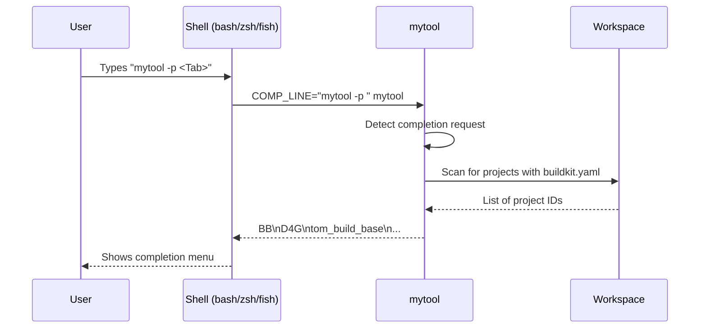

#### Implementation

```dart
class CompletionGenerator {
  final ToolDefinition tool;
  String generate(Shell shell) => switch (shell) {
    Shell.bash => _generateBash(), Shell.zsh => _generateZsh(), Shell.fish => _generateFish(),
  };
  String _generateBash() { /* Generate bash script from ToolDefinition (commands, options, custom functions) */ }
}

class CompletionHandler {
  List<String> getCompletions(String partialInput, int cursorPosition) {
    final words = partialInput.split(' ');
    final currentWord = _getCurrentWord(words, cursorPosition);
    if (currentWord.startsWith(':')) return _matchCommands(currentWord);
    if (currentWord.startsWith('-')) return _matchOptions(currentWord);
    if (_isPreviousOptionWithValue(words)) return _matchOptionValue(words);
    return _matchPaths(currentWord);
  }
  List<String> _matchProjects(String partial) { /* Scan workspace for buildkit.yaml projects */ }
}
```

**Dynamic project completion:**

For `-p` / `--project` options, the completion handler scans the workspace to find projects with `buildkit.yaml` files and returns both project names and project IDs as completion candidates.

---

## Migration Strategy

### v2 Source Structure

v2 code lives alongside v1 to allow gradual migration:

```
tom_build_base/
├── lib/
│   ├── tom_build_base.dart           # v1 barrel (unchanged)
│   ├── tom_build_base_v2.dart        # v2 barrel (new)
│   └── src/
│       ├── build_config.dart         # v1
│       ├── project_navigator.dart    # v1
│       ├── ... (other v1 files)
│       │
│       └── v2/
│           ├── core/
│           │   ├── tool_definition.dart
│           │   ├── command_definition.dart
│           │   ├── option_definition.dart
│           │   └── cli_args.dart
│           ├── traversal/
│           │   ├── traversal_info.dart
│           │   ├── build_base.dart
│           │   ├── folder_scanner.dart
│           │   ├── filter_pipeline.dart
│           │   └── nature_detector.dart
│           ├── folder/
│           │   ├── fs_folder.dart
│           │   ├── run_folder.dart
│           │   ├── command_context.dart
│           │   └── natures/
│           │       ├── git_folder.dart
│           │       ├── dart_project_folder.dart
│           │       └── ...
│           ├── runner/
│           │   ├── tool_runner.dart
│           │   ├── command_executor.dart
│           │   └── help_generator.dart
│           ├── interactive/
│           │   ├── guided_mode.dart
│           │   └── completion_generator.dart
│           └── scripting/
│               └── build_base_extensions.dart
```

### Migration Path

| Phase | Duration | Deliverables |
|-------|----------|--------------|
| **Phase 1** | 1 week | `TraversalInfo`, `BuildBase.traverse()`, `FsFolder`/`RunFolder` |
| **Phase 2** | 1 week | `ToolDefinition`, `CommandDefinition`, help generation |
| **Phase 3** | 2 days | Migrate `cleanup` tool as proof of concept |
| **Phase 4** | 1 week | Migrate `testkit`, including TUI updates |
| **Phase 5** | 3 days | D4rt scripting extensions, documentation |
| **Phase 6** | Ongoing | Migrate remaining tools, shell completion |

### Backward Compatibility

- v1 API remains fully functional
- Tools can mix v1 and v2 imports during migration
- v2 classes can wrap v1 utilities where needed
- No breaking changes to existing tools

---

## Implementation Phases

### Phase 1: Core Infrastructure

**Goal:** Enable basic programmatic traversal.

**Deliverables:**
- `TraversalInfo` class with all configuration
- `FsFolder` and `RunFolder` base classes
- `FolderScanner` for filesystem walking
- `FilterPipeline` for applying filters
- `NatureDetector` for detecting folder types
- `BuildBase.traverse()` static method
- Core nature classes: `GitFolder`, `DartProjectFolder`, subclasses

### Phase 2: Tool Framework

**Goal:** Enable declarative tool definitions.

**Deliverables:**
- `ToolDefinition`, `CommandDefinition`, `OptionDefinition`
- `CliArgParser` for argument parsing
- `HelpGenerator` for automatic help text
- `ToolRunner` for executing tools
- `CommandExecutor` for executing commands

### Phase 3: Proof of Concept

**Goal:** Validate v2 works in practice.

**Deliverables:**
- Migrate `cleanup` tool to v2
- Document any issues or API adjustments
- Performance comparison with v1

### Phase 4: Multi-Command Migration

**Goal:** Support complex tools.

**Deliverables:**
- Migrate `testkit` including TUI mode
- Validate per-command filtering
- Validate TUI integration with `BuildBase`

### Phase 5: Scripting Support

**Goal:** Enable D4rt script usage.

**Deliverables:**
- `BuildBase.forEachDartProject()` convenience method
- `BuildBase.forEachGitRepo()` convenience method
- `BuildBase.findProjects()` for listing
- Documentation and examples

### Phase 6: Polish

**Goal:** Complete the ecosystem.

**Deliverables:**
- Shell completion generation
- Migrate remaining tools
- Performance optimization
- Comprehensive test suite

---

## Summary

tom_build_base v2 provides:

1. **Unified CLI patterns** — All tools share the same argument parsing, help generation, and option handling via `ToolDefinition` and `CommandDefinition`.

2. **Configuration-free traversal** — Comprehensive folder scanning detects project types without explicit configuration. The `NatureDetector` examines key files to determine folder types.

3. **Reusable API** — `BuildBase.traverse()` works from CLI, TUI, REPL, and D4rt scripts with the same `TraversalInfo` abstraction. The API doesn't know where its configuration came from.

4. **Flexible filtering** — Global filters, per-command filters, and nature-based filtering combine predictably. Filter order is well-defined and documented.

5. **Rich context** — Commands receive `CommandContext` with all detected folder natures, enabling type-safe access to project metadata.

6. **Gradual migration** — Separate source tree (`src/v2/`) allows tool-by-tool adoption without disruption to existing tools.

The key insight is **separating argument parsing from traversal execution**. This enables the same traversal logic to serve command-line tools, interactive TUIs, and scripted automation — with configuration coming from whichever source is appropriate for the context.

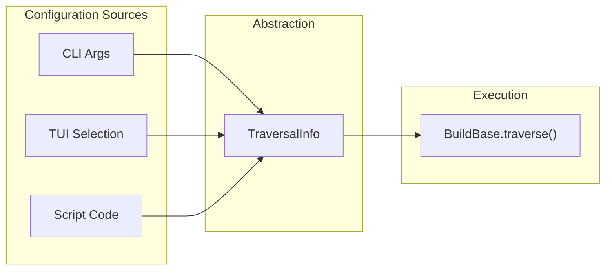
