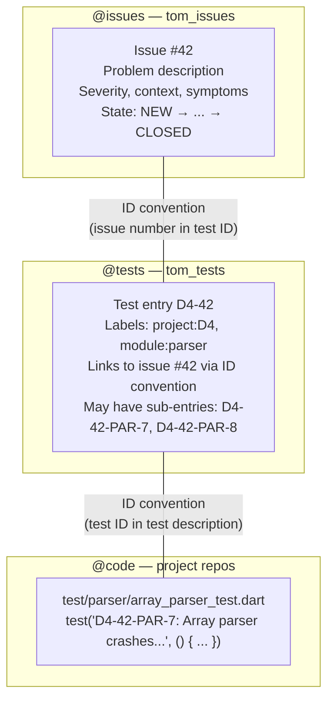
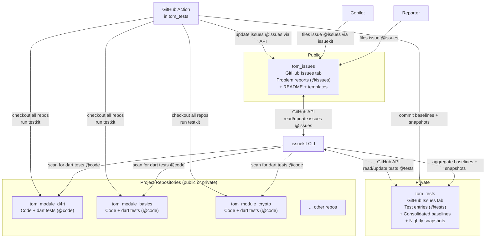
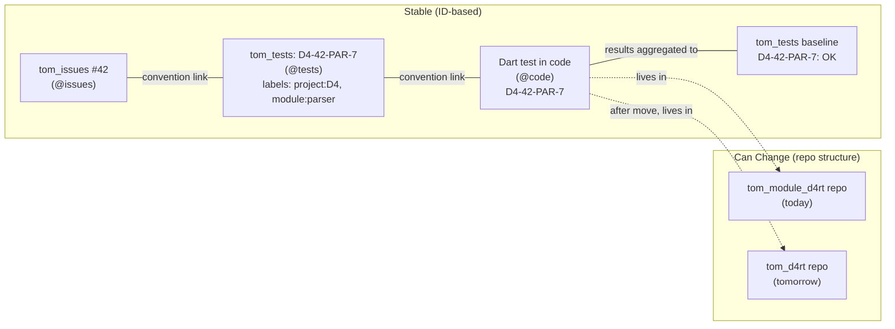
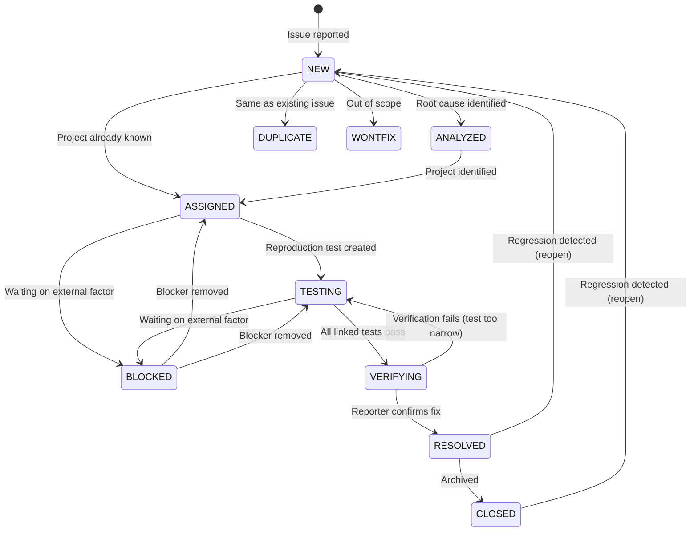
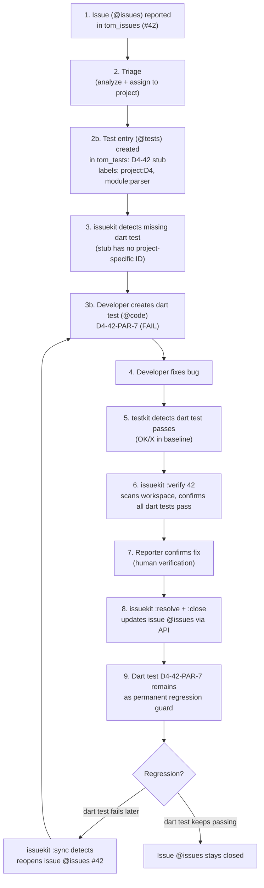
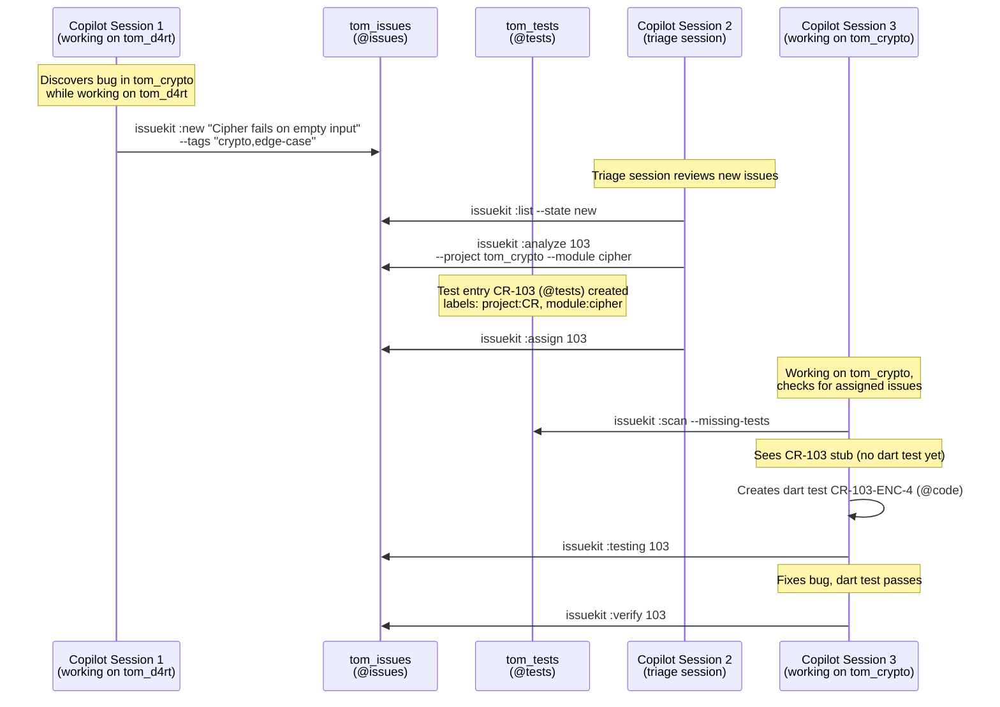
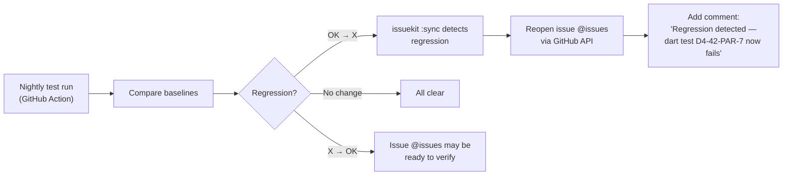
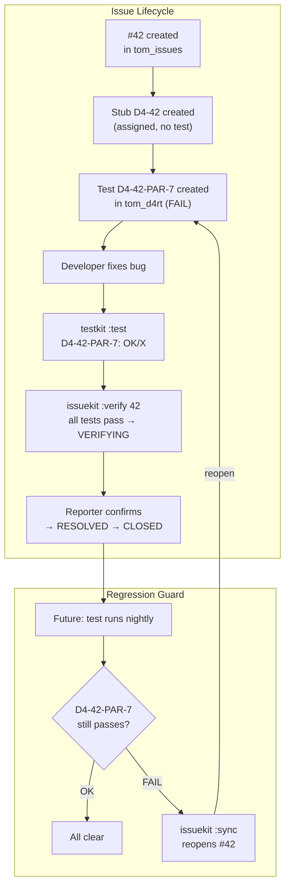
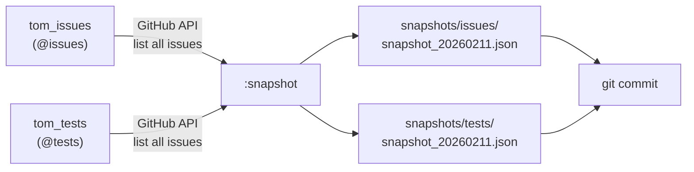
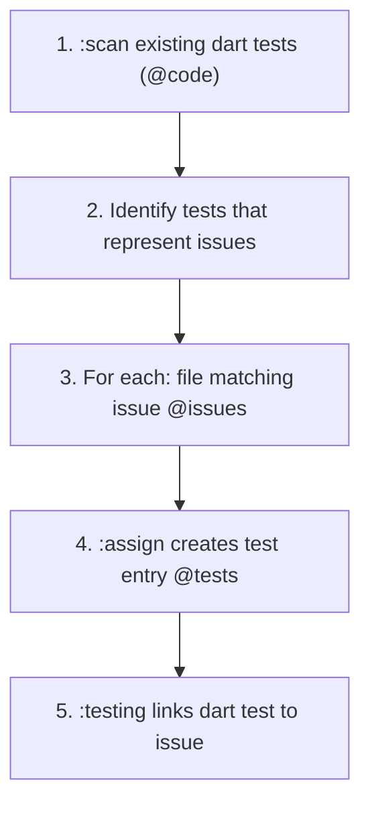

# Issue Tracking — Concept and Workflow

This document defines the issue tracking process supported by Tom Issue Kit's `issuekit` CLI. It describes the architecture of three interconnected GitHub repositories, the lifecycle of an issue from discovery through verified resolution, the ID conventions that link issues to reproduction tests via codebase scanning, automated Copilot-driven issue filing, and the commands that orchestrate the workflow.

---

## Table of Contents

1. [Overview](#overview)
2. [Terminology](#terminology)
3. [The Problem](#the-problem)
4. [Architecture](#architecture)
5. [Design Principles](#design-principles)
6. [ID Scheme](#id-scheme)
7. [Issue Lifecycle](#issue-lifecycle)
8. [The Issue-to-Resolution Pipeline](#the-issue-to-resolution-pipeline)
9. [Convention-Based Test Linking](#convention-based-test-linking)
10. [Copilot-Driven Issue Reporting](#copilot-driven-issue-reporting)
11. [Consolidated Test Tracking](#consolidated-test-tracking)
12. [Regression Detection and Automated Reopening](#regression-detection-and-automated-reopening)
13. [Command Reference](#command-reference)
14. [Integration with Testkit and Buildkit](#integration-with-testkit-and-buildkit)
15. [GitHub Actions — Automated Test Runs](#github-actions--automated-test-runs)
16. [Nightly Backup and Versioning](#nightly-backup-and-versioning)
17. [Initial Setup from Existing Codebase](#initial-setup-from-existing-codebase)
18. [Configuration](#configuration)
19. [Project Traversal](#project-traversal)

---

## Overview

`issuekit` bridges the gap between **discovering a problem** and **confirming it is fixed**. It orchestrates issue tracking across a multi-repository workspace by using GitHub Issues as the database, convention-based test linking for traceability, and automated scanning for synchronization.

The tool operates across three GitHub repositories and any number of project repositories:

| Repository | Visibility | Purpose |
|------------|-----------|---------|
| **`tom_issues`** | Public | External issue (@issues) intake — reporters file issues here |
| **`tom_tests`** | Private | Test entries (@tests) as GitHub Issues — project/module metadata, consolidated baselines, regression tracking, nightly snapshots |
| **Project repos** | Public or private | Contain the actual code and dart tests (@code) |

Tom Issue Kit fills the space that neither `testkit` nor `buildkit` covers:

| Tool | Scope |
|------|-------|
| **testkit** | Runs dart tests (@code), tracks test results over time, detects regressions |
| **buildkit** | Builds, analyzes, and manages projects |
| **issuekit** | Records discovered problems (@issues), tracks them as test entries (@tests), orchestrates their lifecycle across GitHub repos, and synchronizes states with dart test results (@code) |

`testkit` tells you _what_ failed. `issuekit` tells you _why_ it matters, _where_ it belongs, _what_ to do about it, and — critically — **whether the fix actually resolved the original problem**.

---

## Terminology

This document uses precise terminology to distinguish three different concepts that all relate to "issues" and "tests." Every occurrence is annotated with **@issues**, **@tests**, or **@code** to avoid ambiguity.

| Term | Annotation | Definition |
|------|-----------|------------|
| **Issue** | @issues | An entry in the GitHub Issue tracker of `tom_issues`. Represents a discovered problem — filed by a reporter or Copilot. |
| **Test** (GitHub) | @tests | An entry in the GitHub Issue tracker of `tom_tests`. Represents the test tracking side of a problem — may or may not yet have a corresponding dart test in code. Contains project/module metadata via labels. |
| **Dart test** | @code | An actual `test()` call in source code that exercises the behavior described by an issue (@issues). Lives in project `test/` directories. |

### The Three Layers



### Source of Truth Rules

| Information | Source of Truth | NOT stored in |
|-------------|----------------|---------------|
| Problem description, severity, symptoms | @issues (`tom_issues`) | @tests, @code |
| Project assignment, module | @tests (`tom_tests`) labels | @issues |
| Dart test implementation | @code (project `test/` dirs) | @issues, @tests |
| Test results (pass/fail) | @code via testkit baselines | @issues, @tests (derived) |
| Issue-to-test links | ID convention (scanned, not stored) | — |

**Key rule**: Adding a second dart test (@code) for an issue (@issues) is done by simply creating a test with a corresponding ID (e.g., `D4-42-PAR-8`). issuekit discovers it automatically by scanning. There are no link records to maintain — the codebase IS the link.

---

## The Problem

In a multi-project workspace, problems surface in many ways:

- A test fails during development and the cause isn't immediately clear
- A consumer of a component reports unexpected behavior
- A developer notices incorrect output while working on something else
- Copilot discovers a bug while working on an unrelated task in another project
- A code review reveals a latent bug
- An edge case is discovered that no test covers

In all these cases, the person (or AI) who discovers the problem may not have time to fix it right now, may not know which project owns the bug, or may not be the right person to fix it. Without a lightweight way to record the issue, it gets lost — mentioned in a chat message, a mental note, or a TODO comment buried in code.

**The core requirement:** Record the issue immediately with enough context to act on it later, then track it through a defined pipeline until resolution is **verified** — not just "fixed" but confirmed that the original problem no longer occurs.

**The structural challenge:** Projects move between repositories, repositories get split or merged, but issue tracking must remain stable. The tracking system cannot be coupled to repository structure.

---

## Architecture

### The Three Repositories



### `tom_issues` — Public Issue Intake (@issues)

- **Contains:** README, issue templates, possibly a `CONTRIBUTING.md` explaining how to report issues.
- **The Issues tab is the primary artifact.** Each GitHub Issue is a tracked problem report (@issues).
- **Anyone can file an issue (@issues).** This is the public-facing intake point.
- **Issue labels** map to lifecycle states (`new`, `analyzed`, `assigned`, `testing`, `verifying`, `resolved`) and severity (`severity:critical`, `severity:high`, etc.).
- **No project or module labels.** Project and module information is stored on test entries (@tests) in `tom_tests`. To find which project(s) an issue relates to, query `tom_tests` for test entries with the matching issue number in their ID.
- **Reporters can see** their issue's (@issues) status and any cross-reference comments linking to internal work, but they cannot see test entries (@tests) or internal project details.
- **File attachments** (screenshots, logs, repro scripts) are attached directly to the GitHub Issue — no need for separate storage.

### `tom_tests` — Test Entries and Consolidated View (@tests)

`tom_tests` serves two purposes: it is both a **GitHub Issue tracker** (for test entries) and a **file repository** (for baselines and snapshots).

**As a GitHub Issue tracker (@tests):**

- Each test entry is a GitHub Issue in `tom_tests`. It represents one tracked test — linked to an issue (@issues) via the ID convention.
- **Labels carry the metadata:** `project:<ID>` (e.g., `project:D4`), `module:<name>` (e.g., `module:parser`), and state labels mirroring the issue lifecycle.
- A test entry (@tests) may or may not yet have a corresponding dart test (@code). When an issue (@issues) is assigned to a project, a **stub** test entry is created in `tom_tests` (e.g., `D4-42`). Once a developer writes the dart test (@code), the test entry is updated to a full ID (e.g., `D4-42-PAR-7`).
- **This is the single source of truth for project and module assignment.** To find which project owns issue #42, query `tom_tests` for test entries with `42` in the ID and read their `project:` labels.

**As a file repository:**

- **Baselines:** Aggregated baseline CSVs from all projects.
- **Snapshots:** Nightly JSON exports of all issues (@issues) and test entries (@tests) for backup and versioning.
- **Reports:** Regression reports, issue-to-test mapping.

**No dart test code.** Dart tests (@code) live in their respective project repositories.

```
tom_tests/
├── baselines/
│   ├── consolidated_0211_0800.csv
│   ├── consolidated_0212_0800.csv
│   └── ...
├── snapshots/
│   ├── issues/                        # Nightly export of all @issues
│   │   ├── snapshot_20260211.json
│   │   └── snapshot_20260212.json
│   └── tests/                         # Nightly export of all @tests entries
│       ├── snapshot_20260211.json
│       └── snapshot_20260212.json
├── reports/
│   ├── regression_report.md
│   └── issue_status.md
├── config/
│   └── workspace.yaml                 # Repository list, Project ID mappings
└── README.md
```

### Project Repositories (@code)

- **Contain:** The actual code and the dart tests (@code) linked to issues via IDs.
- **Dart tests (@code) use the `<PROJECT_ID>-<issue-number>-<project-specific-ids>` naming convention** in test descriptions to link back to issues (@issues).
- **Issue trackers on project repos are for internal use only.** On public repos, Issues can be disabled or gated to collaborators.
- **Projects are identified by Project ID**, not by repository. When a project moves between repos, its dart tests (@code) and Project ID move with it. The consolidated view in `tom_tests` remains valid.

### Why This Separation Matters

The Project ID is the stable anchor — not the repository path. If `tom_d4rt` moves from `tom_module_d4rt` to its own repo, the dart test (@code) `D4-42-PAR-7` still has the same ID. The test entry (@tests) in `tom_tests` doesn't break because it references the Project ID, not the repo. The issue (@issues) doesn't need updating at all — it never stored project information.



---

## Design Principles

### 1. GitHub as the Database — Two Issue Trackers

Issues (@issues) are stored as GitHub Issues in `tom_issues`. Test entries (@tests) are stored as GitHub Issues in `tom_tests`. There is no local database. This gives us:
- A web UI for free (GitHub Issues interface) — for both repos
- API access for automation (REST and GraphQL)
- Notifications, @mentions, cross-repo references
- File attachments on issues (@issues) for screenshots, logs
- Visibility control: `tom_issues` is public, `tom_tests` is private
- Labels as structured metadata — states, severity, project, module

### 2. Codebase as Source of Truth for Test Linking

The primary linking mechanism between issues (@issues) and dart tests (@code) is the **test description in source code**, not a database. By embedding the issue number in the test ID using a naming convention, we can **scan the codebase** to discover all dart tests (@code) related to any issue — across all projects and repositories.

This eliminates synchronization problems: there is no link record that can get out of date. The dart test code IS the link.

### 3. Convention Over Configuration

Issue-to-test linking works through ID conventions, not explicit registration. When a developer writes a dart test (@code) with the correct ID format, issuekit can discover it automatically. Adding a second dart test for an issue is simply creating another test with a matching ID — no metadata updates needed.

### 4. One Source of Truth — No Duplication

Each piece of information has exactly one authoritative location:

| Information | Source of Truth |
|-------------|----------------|
| Problem description, severity, symptoms | @issues (`tom_issues`) |
| Project assignment, module | @tests (`tom_tests`) labels |
| Dart test implementation | @code (project `test/` dirs) |
| Test results (pass/fail) | @code via testkit baselines |

Project and module are stored **only** on test entries (@tests) in `tom_tests`, never on issues (@issues) in `tom_issues`. This avoids sync issues — when a project assignment changes, it changes in one place only.

### 5. Verified Resolution

An issue (@issues) is not resolved just because someone says "I fixed it." Resolution requires **proof**: the dart test (@code) must pass. And the issue is not closed until the original reporter or a reviewer confirms that the fix addresses the **original symptom**, not just the test case.

### 6. Repository-Independent Tracking

Issues (@issues) are tracked by Project ID, not by repository path. Projects can move between repositories, repositories can be split or merged, and the tracking remains intact. The `tom_tests` consolidated view never references repository paths — only Project IDs and test IDs.

### 7. Every Issue Has a Test

Every issue (@issues) in a project MUST have an associated dart test (@code), even if it starts as a symbolic stub. An issue assigned to a project IS always also a test entry (@tests). This ensures that every issue is machine-scannable and that verification can be automated.

---

## ID Scheme

The ID scheme creates a globally unique, scannable connection between issues, projects, and tests. It extends the existing test ID convention to optionally include a `tom_issues` issue number.

### Project ID

Each project in the workspace has a short unique prefix, defined in the project's `tom_project.yaml`. Project IDs should be **as short as possible** while remaining unique and easy to remember:

| Project | Project ID |
|---------|-----------|
| `tom_d4rt` | `D4` |
| `tom_d4rt_generator` | `D4G` |
| `tom_d4rt_dcli` | `D4D` |
| `tom_build_kit` | `BK` |
| `tom_test_kit` | `TK` |
| `tom_issue_kit` | `IK` |
| `tom_crypto` | `CR` |
| `tom_basics` | `BA` |

Project IDs are uppercase, 2–4 characters. They must be unique across the workspace. Each project declares its ID:

```yaml
# tom_project.yaml
project_id: D4
```

### Issue ID

Issues are GitHub Issues in `tom_issues`. Their number is their ID — no prefix, no padding:

```
#1, #2, ..., #42, #156
```

In issuekit commands, the issue is referenced by its number:

```bash
issuekit :show 42
issuekit :verify 156
```

### Test IDs

Test IDs follow a unified convention with two forms: **issue-linked** and **regular**.

#### Regular Test IDs (no issue)

Tests created during normal development — for new features, examples, refactoring — use the existing convention:

```
<PROJECT_ID>-<project-specific-ids>
```

The `<project-specific-ids>` part is project-defined and free-form, typically using category codes and numbers. It must be **unique within the project**.

**Examples:**

```
D4-PAR-15          → tom_d4rt, parser test 15
D4-INT-GLOB-43     → tom_d4rt, integration / globals test 43
BK-BLD-3           → tom_build_kit, build test 3
CR-ENC-7           → tom_crypto, encryption test 7
```

```dart
test('D4-PAR-15: Parser handles nested objects [2026-01-15 10:00]', () { ... });
test('BK-BLD-3: Build with missing pubspec fails gracefully [2026-01-20 09:00]', () { ... });
```

#### Issue-Linked Test IDs

Tests linked to a `tom_issues` issue embed the issue number between the Project ID and the project-specific part:

```
<PROJECT_ID>-<issue-number>-<project-specific-ids>
```

| Component | Description |
|-----------|-------------|
| `<PROJECT_ID>` | Project prefix (e.g., `D4`, `BK`) |
| `<issue-number>` | The GitHub issue number from `tom_issues` |
| `<project-specific-ids>` | Project-defined test identifier — must be unique within the project |

**Examples:**

```
D4-42-PAR-7        → tom_d4rt, issue #42, parser test 7
D4-42-PAR-8        → tom_d4rt, issue #42, parser test 8
BK-42-BLD-3        → tom_build_kit, issue #42, build test 3
D4-156-INT-GLOB-43 → tom_d4rt, issue #156, integration / globals test 43
```

```dart
test('D4-42-PAR-7: Array parser crashes on empty arrays [2026-02-10 14:00] (FAIL)', () {
  final result = parseArray('[]');
  expect(result, isEmpty);
});
```

#### Test ID Promotion

A regular test can be **promoted** to an issue-linked test by inserting the issue number. Since the project-specific part is unique within the project, the test retains its identity:

```
D4-PAR-15              → regular test (no issue)
D4-42-PAR-15           → promoted: now linked to issue #42
```

This is useful when a test that was written for a feature turns out to be relevant to a reported issue. The project-specific ID (`PAR-15`) remains the same — only the issue number is inserted.

#### Issue Stub IDs

When an issue is first assigned to a project during triage, an initial stub is created with just the Project ID and issue number:

```
D4-42                  → stub: issue #42 assigned to tom_d4rt, no test yet
```

This stub has no project-specific part. issuekit detects this as a "test missing" state — the issue is assigned but no reproduction test has been created yet. During test creation, the ID is promoted:

```
D4-42                  → stub (detected as "needs test")
D4-42-PAR-7            → test created (stub promoted to full test ID)
```

#### Uniqueness Rules

- The `<project-specific-ids>` part must be **unique within the project**, regardless of whether an issue number is present.
- `D4-PAR-15` and `D4-42-PAR-15` refer to the same conceptual test (PAR-15 in D4) — one is just issue-linked. They should not both exist simultaneously; promotion replaces the old ID.
- issuekit provides a `:validate` command to check test ID uniqueness across the workspace.

### Why This Matters

Given issue `#42`, we can find **every reproduction test in the entire workspace** by scanning test files for the pattern `<PROJECT_ID>-42-` in test descriptions:

```
tom_d4rt/test/parser/array_parser_test.dart       → D4-42-PAR-7
tom_d4rt/test/parser/array_null_test.dart          → D4-42-PAR-8
tom_build_kit/test/build/edge_cases_test.dart      → BK-42-BLD-3
```

No database. No link records. The codebase is the source of truth.

---

## Issue Lifecycle

An issue moves through the following lifecycle:



### States

| State | Meaning | Entry Condition | Exit Criteria |
|-------|---------|-----------------|---------------|
| **NEW** | Issue discovered and recorded in `tom_issues` | Issue filed (by reporter or Copilot) | Symptom and context provided |
| **ANALYZED** | Root cause identified or narrowed down | Root cause determined | Affected project identified |
| **ASSIGNED** | Ownership clear — belongs to a specific project. Stub test ID (`D4-42`) generated. | Project identified | Developer can act on it |
| **TESTING** | Full reproduction test exists in the target project (stub promoted to `D4-42-PAR-7`) | Test created with `(FAIL)` expectation | Developer works on fix |
| **VERIFYING** | Fix applied — reproduction test now passes | All linked tests pass | Original reporter confirms fix addresses the symptom |
| **RESOLVED** | Original issue confirmed fixed | Reporter confirms the original symptom is gone | Awaiting archival |
| **CLOSED** | Archived | Issue closed after resolution | N/A |

**Key distinction between VERIFYING and RESOLVED:**

- **VERIFYING** = "The test passes" — the code fix works. But does it actually solve the original problem as the reporter experienced it? The reproduction test may be too narrow, or the fix may only address part of the issue.
- **RESOLVED** = "The original problem is gone" — confirmed by the reporter, reviewer, or by passing a broader acceptance test.

### Additional States

| State | Meaning |
|-------|---------|
| **BLOCKED** | Cannot proceed — waiting on external factor (dependency, information, decision) |
| **DUPLICATE** | Same root cause as another issue — linked to original |
| **WONTFIX** | Intentional behavior or out of scope — documented and closed |

---

## The Issue-to-Resolution Pipeline

This is the complete workflow from problem discovery to confirmed resolution.



### Step 1: Record the Issue (→ NEW)

Someone discovers a problem. They file it in `tom_issues` (via GitHub UI) or via issuekit:

```bash
issuekit :new "JSON parser crashes on empty arrays" \
  --severity high \
  --context "Discovered while running tom_d4rt tests, test D4-PAR-12 fails with RangeError" \
  --expected "Empty arrays should parse to an empty list" \
  --tags "parser,json,crash"
```

issuekit creates issue (@issues) `#42` in `tom_issues` via the API, applying state and severity labels.

### Step 2: Triage — Analyze and Assign (→ ANALYZED → ASSIGNED)

Triage determines the root cause and which project owns it:

```bash
issuekit :analyze 42 \
  --root-cause "Array parser does not handle length-0 case in _parseArrayElements()" \
  --project tom_d4rt \
  --module parser
```

When the issue (@issues) is assigned to a project, issuekit creates a **test entry (@tests)** in `tom_tests` as a GitHub Issue with the stub ID and project/module labels:

```
D4-42    → test entry (@tests) in tom_tests
           labels: project:D4, module:parser
```

issuekit updates the issue (@issues) in `tom_issues` with the `assigned` state label and adds a comment with the analysis. The project and module are stored **only** on the test entry (@tests) in `tom_tests` — not on the issue (@issues).

### Step 3: Detect Missing Dart Test and Create Reproduction Test (→ TESTING)

issuekit can detect issues (@issues) that are assigned but have no dart test (@code) yet — test entries (@tests) without a project-specific part (stubs):

```bash
issuekit :scan --missing-tests
```

Output:
```
Issues with missing dart tests:

Issue   Project   Stub ID   State      Title
------  --------  --------  ---------  -----
#42     D4        D4-42     ASSIGNED   Array parser crashes on empty arrays
#103    CR        CR-103    ASSIGNED   Cipher fails on empty input
```

The developer (or Copilot) creates a dart test (@code) in the target project, promoting the stub to a full test ID:

```dart
test('D4-42-PAR-7: Array parser crashes on empty arrays [2026-02-10 14:00] (FAIL)', () {
  final result = parseArray('[]');
  expect(result, isEmpty);
});
```

The issue (@issues) transitions to `TESTING` when issuekit detects a dart test (@code) matching issue #42 in the codebase:

```bash
issuekit :testing 42
```

issuekit verifies that a full test ID (not just a stub) exists as a dart test (@code), updates the issue (@issues) label to `testing`, and adds a comment noting which dart tests were found.

**Multiple dart tests per issue:** One issue (@issues) can spawn multiple dart tests (@code), potentially across projects:

```dart
// In tom_d4rt — tests the parser directly (@code)
test('D4-42-PAR-7: Array parser crashes on empty arrays [2026-02-10 14:00] (FAIL)', ...);

// In tom_d4rt — tests a related edge case (@code)
test('D4-42-PAR-8: Array parser crashes on null elements [2026-02-10 14:00] (FAIL)', ...);

// In tom_build_kit — tests that build handles the parser error gracefully (@code)
test('BK-42-BLD-12: Build recovers from parser crash on empty arrays [2026-02-10 15:00] (FAIL)', ...);
```

All three are discoverable by scanning for `-42-` in test IDs prefixed by a known Project ID.

### Step 4: Fix the Bug

The developer fixes the bug in the target project:

```bash
testkit :test -c "fixed empty array parsing"
```

If the dart test (@code) now passes, testkit shows it as `OK/X` (passed unexpectedly — progress!).

### Step 5: Verify the Fix (→ VERIFYING)

```bash
issuekit :verify 42
```

The `:verify` command:
1. Scans the workspace for all dart tests (@code) linked to issue (@issues) `#42`
2. Checks testkit baselines in each relevant project
3. If **all pass**, updates the issue (@issues) label to `verifying`
4. If any dart test still fails, reports which ones

### Step 6: Confirm Resolution (→ RESOLVED)

Once the reporter or reviewer confirms the fix:

```bash
issuekit :resolve 42 --fix "Added empty check in ArrayParser._parseArrayElements()"
```

The developer updates the dart test (@code) expectation from `(FAIL)` to `(PASS)` or removes it:

```dart
test('D4-42-PAR-7: Array parser crashes on empty arrays [2026-02-10 14:00]', ...);
```

Now testkit tracks it as `OK/OK` — a healthy dart test. Any future regression will show as `X/OK`.

### Step 7: Close the Issue (→ CLOSED)

```bash
issuekit :close 42
```

issuekit closes the issue (@issues) via the GitHub API and adds a resolution summary comment. The dart test (@code) **remains in the codebase permanently** as a regression guard.

---

## Convention-Based Test Linking

This is the key mechanism that connects issues (@issues) to dart tests (@code) without maintaining a database of links.

### How It Works

1. **Assign an issue (@issues)** to a project → issuekit creates a test entry (@tests) in `tom_tests` with the stub ID (`D4-42`) and project/module labels
2. **Create the dart test (@code)** with an issue-linked ID: `D4-42-PAR-7`
3. **issuekit discovers it** by scanning `test/` directories across the workspace for `<PROJECT_ID>-<issue-number>-` patterns in test descriptions
4. **testkit tracks it** as a normal dart test — the ID format is transparent to testkit
5. **issuekit reads testkit baselines** to check if linked dart tests pass or fail
6. **issuekit updates the issue (@issues)** in `tom_issues` based on dart test results

### Scanning

The `:scan` command discovers all dart tests (@code) for an issue (@issues):

```bash
issuekit :scan 42
```

Output:
```
Dart tests for issue #42 (@issues):

Project       Test ID         File                                    Line  Status
-----------   -------------   ------------------------------------    ----  ------
tom_d4rt      D4-42-PAR-7     test/parser/array_parser_test.dart      45    FAIL
tom_d4rt      D4-42-PAR-8     test/parser/array_null_test.dart        12    FAIL
tom_build_kit BK-42-BLD-12    test/build/edge_cases_test.dart         88    PASS
```

Other scanning modes:

```bash
issuekit :scan                         # All issue-linked dart tests
issuekit :scan --project tom_d4rt      # Only in tom_d4rt
issuekit :scan --state testing         # Only for issues in TESTING state
issuekit :scan --missing-tests         # Issues assigned but without dart tests
```

### Test Promotion

Existing dart tests (@code) can be promoted to issue-linked tests when a connection is discovered:

```bash
issuekit :promote D4-PAR-15 --issue 42
```

This renames the test ID from `D4-PAR-15` to `D4-42-PAR-15` in the source file. The project-specific part (`PAR-15`) stays the same, preserving the dart test's identity in testkit baselines.

### Why Not a Database?

A database approach (stored link records) has synchronization problems:

| Problem | Database approach | Convention approach |
|---------|-------------------|---------------------|
| Dart test renamed/moved | Database out of date | Scan finds it wherever it is |
| Dart test deleted | Stale reference | Scan finds nothing — clear signal |
| New dart test added | Must run re-registration | Scan discovers it automatically |
| Dart test in wrong project | Reference to wrong location | ID prefix makes project clear |
| Multiple dart tests per issue | Must register each one | All discovered automatically |
| Project moves to new repo | Links break | Project ID goes with the project |

---

## Copilot-Driven Issue Reporting

### The Problem: Cross-Project Bug Discovery

Copilot often works on one project and discovers a bug in another. It cannot fix the bug immediately — it's working on something else. The bug must be recorded so it doesn't get lost.

### The Flow



### How Copilot Files an Issue

When Copilot discovers a bug in another project, it runs:

```bash
issuekit :new "Cipher fails on empty input" \
  --severity high \
  --context "Discovered while implementing D4RT bridge encryption. CipherEngine.encrypt('') throws ArgumentError instead of returning empty ciphertext." \
  --expected "Empty input should produce empty output" \
  --tags "crypto,cipher,edge-case" \
  --reporter copilot
```

This creates an issue (@issues) `#103` in `tom_issues` with the `new` label and `reporter:copilot` label.

### Triage Session

A separate Copilot session (or the developer manually) reviews new issues (@issues):

1. **List unprocessed issues:** `issuekit :list --state new`
2. **Analyze each one:** Determine root cause, identify the target project
3. **Assign:** `issuekit :assign 103 --project tom_crypto`
4. Test entry (@tests) `CR-103` is created in `tom_tests` with labels (`project:CR`, `module:cipher`). The issue (@issues) gets the `assigned` label.

### Detection by the Project Copilot

When Copilot starts working on a project, it checks for work:

```bash
issuekit :scan --missing-tests --project tom_crypto
```

This reveals issues (@issues) assigned to `tom_crypto` that still have only stub IDs (no dart test @code). Copilot can then:

1. Read the issue (@issues) details (symptom, context, expected behavior)
2. Investigate the bug
3. Create a dart test (@code): `CR-103-ENC-4` (promoting the stub)
4. Fix the bug
5. Verify: `issuekit :verify 103`

### Issues Without Dart Tests

When an issue (@issues) is first filed, it has no dart test (@code). At `ASSIGNED`, a stub test entry (@tests) exists (`CR-103`) but no project-specific dart test. The rule **every issue must have a dart test** applies at the transition to `TESTING` — issuekit requires at least one full test ID (not just a stub) as a dart test (@code) before allowing the transition.

---

## Consolidated Test Tracking

### How `tom_tests` Works

`tom_tests` is a private repository that serves two purposes:

1. **Issue tracker for test entries (@tests)** — each test entry is a GitHub Issue with project/module labels
2. **File repository for baselines and snapshots** — aggregated results, nightly exports

```
tom_tests/
├── baselines/
│   ├── consolidated_0211_0800.csv    # Full workspace baseline from Feb 11, 08:00
│   ├── consolidated_0212_0800.csv    # Full workspace baseline from Feb 12, 08:00
│   └── ...
├── snapshots/
│   ├── issues/                       # Nightly export of all @issues from tom_issues
│   │   ├── snapshot_20260211.json
│   │   └── snapshot_20260212.json
│   └── tests/                        # Nightly export of all @tests from tom_tests
│       ├── snapshot_20260211.json
│       └── snapshot_20260212.json
├── reports/
│   ├── regression_report.md          # Current regression status
│   └── issue_status.md               # Current issue-to-test mapping
├── config/
│   └── workspace.yaml                # Repository list, Project ID mappings
└── README.md
```

### Test Entries (@tests) as GitHub Issues

Each test entry (@tests) is stored as a GitHub Issue in `tom_tests`. This provides:

- **Labels for metadata**: `project:D4`, `module:parser`, state labels
- **Searchable**: Query via GitHub API or UI
- **Comments**: Audit trail for state changes
- **No local database**: All data is in GitHub

When an issue (@issues) is assigned to a project, a test entry (@tests) is created:

```
Issue (tom_tests #15):
  Title: D4-42 — Array parser crashes on empty arrays
  Labels: project:D4, module:parser, testing
  Body: Links to tom_issues #42
```

### Consolidated Baselines

A consolidated baseline merges testkit baselines from all projects into a single CSV:

```csv
Project,Test ID,Description,0211_0800,0212_0800
D4,D4-42-PAR-7,Array parser crashes on empty arrays,X,OK
D4,D4-42-PAR-8,Array parser crashes on null elements,X,OK
BK,BK-42-BLD-12,Build recovers from parser crash,OK,OK
CR,CR-103-ENC-4,Cipher fails on empty input,X,X
```

This gives a single-file view of every issue's dart test (@code) status across the entire workspace, with history.

### Regression Detection

By comparing consecutive baselines, regressions are immediately visible:

```
D4-42-PAR-7:  OK → X   ← REGRESSION (was fixed, now broken again)
CR-103-ENC-4: X → OK   ← FIX (was broken, now passing)
```

---

## Regression Detection and Automated Reopening

### The Regression Loop



### How `:sync` Works

The `:sync` command cross-references issues (@issues) in `tom_issues` with dart test (@code) results:

1. For issues in `ASSIGNED` state: scans for matching dart tests. If a full dart test (not just stub) is found, suggests `→ TESTING`.
2. For issues in `TESTING` state: checks if all dart tests pass. If so, suggests `→ VERIFYING`.
3. For issues in `RESOLVED` or `CLOSED` state: checks for regressions. If a linked dart test (@code) fails, **reopens the issue (@issues)** with a comment explaining which dart test regressed.

This creates a fully automated feedback loop: fix a bug → dart test passes → issue resolves. Bug reappears → dart test fails → issue reopens. No manual tracking required.

---

## Command Reference

For the complete command reference with detailed use cases, diagrams, and examples, see [issuekit — Command Reference](issuekit_command_reference.md).

### Quick Reference

#### Issue Management

| Command | Description |
|---------|-------------|
| `:new` | Create a new issue in `tom_issues` via GitHub API |
| `:edit` | Edit an existing issue's fields |
| `:analyze` | Record analysis results (root cause, affected project) |
| `:assign` | Assign an issue to a project (creates stub test ID) |
| `:testing` | Mark that a reproduction test has been created |
| `:verify` | Check if linked tests pass — move to VERIFYING if all pass |
| `:resolve` | Confirm the original issue is fixed after verification |
| `:close` | Close and archive a resolved issue |
| `:reopen` | Reopen a closed or resolved issue |

### Discovery and Querying

| Command | Description |
|---------|-------------|
| `:list` | List issues with filtering and sorting |
| `:show` | Show full details of one issue |
| `:search` | Full-text search across all issues |
| `:scan` | Scan workspace for tests linked to issues via ID convention |
| `:summary` | Dashboard: counts by state, severity, project |

### Test Management

| Command | Description |
|---------|-------------|
| `:promote` | Promote a regular test to issue-linked (insert issue number) |
| `:validate` | Check test ID uniqueness across the workspace |

### Workflow Integration

| Command | Description |
|---------|-------------|
| `:sync` | Sync issue states with test results — detect fixes and regressions |
| `:aggregate` | Aggregate testkit baselines into `tom_tests` consolidated view |
| `:link` | Explicitly link a test to an issue (override for non-standard IDs) |
| `:export` | Export issues as CSV, JSON, or Markdown |
| `:import` | Import issues from a file |
| `:init` | Initialize a project repo for issue tracking (set up templates, labels) |

---

## Integration with Testkit and Buildkit

### The Complete Chain



### How Scanning Connects the Dots

| Question | Answer from scanning |
|----------|---------------------|
| "What tests exist for issue #42?" | Scan `test/` dirs for `<PROJECT_ID>-42-` in test descriptions |
| "Do those tests pass?" | Check testkit baselines in the corresponding projects |
| "Which project has tests for this issue?" | The Project ID prefix (e.g., `D4-`) |
| "Does this issue have a full test yet?" | Check if any match has a project-specific part beyond the stub |
| "Is this issue still a problem?" | `:verify` — if all tests pass, the fix works |
| "Did a fix regress?" | `:sync` — checks resolved/closed issues against test results |

### Testkit Baseline Cross-Reference

`:verify` and `:sync` read testkit's `doc/baseline_*.csv` files to check test status. They look for the test ID in the baseline's ID column and read the latest result.

If testkit hasn't been run recently, `:verify` will report `NOT RUN`.

### Buildkit Integration

- **Project discovery:** Uses the same detection as buildkit (`pubspec.yaml`)
- **Project IDs:** Defined in `tom_project.yaml`, used by both buildkit and issuekit
- **Workspace navigation:** Shares the standard tom_build_base navigation options

---

## GitHub Actions — Automated Test Runs

A GitHub Action in the `tom_tests` repository provides automated, nightly testing of the full workspace.

### Why `tom_tests`?

The Action runs from `tom_tests` (private) because:
- The full repository list stays hidden (workflow YAML is not public)
- Test results stay private
- The PAT (Personal Access Token) is stored in a private repo's secrets

### The Workflow

```yaml
# tom_tests/.github/workflows/nightly_tests.yml
name: Nightly Test Run

on:
  schedule:
    - cron: '0 8 * * *'    # Daily at 08:00 UTC
  workflow_dispatch:         # Manual trigger

jobs:
  test:
    runs-on: ubuntu-latest
    steps:
      - name: Checkout tom_tests
        uses: actions/checkout@v4

      - name: Checkout workspace repos
        run: |
          repos=(
            "tom_module_basics:xternal/tom_module_basics"
            "tom_module_d4rt:xternal/tom_module_d4rt"
            "tom_module_crypto:xternal/tom_module_crypto"
            # ... all project repos
          )
          for entry in "${repos[@]}"; do
            IFS=: read -r repo path <<< "$entry"
            git clone "https://x-access-token:${{ secrets.MULTI_REPO_PAT }}@github.com/al-the-bear/${repo}.git" "$path"
          done

      - name: Setup Dart
        uses: dart-lang/setup-dart@v1

      - name: Run tests across all projects
        run: |
          # Run testkit :baseline in each project

      - name: Aggregate results
        run: |
          # issuekit :aggregate

      - name: Sync issue states
        run: |
          # issuekit :sync --auto
        env:
          GITHUB_TOKEN: ${{ secrets.MULTI_REPO_PAT }}

      - name: Export snapshots for backup
        run: |
          # issuekit :snapshot
        env:
          GITHUB_TOKEN: ${{ secrets.MULTI_REPO_PAT }}

      - name: Commit results
        run: |
          git add baselines/ snapshots/ reports/
          git commit -m "chore: nightly test run $(date +%Y-%m-%d)"
          git push
```

### Multi-Repo Access

A **fine-grained PAT** scoped to the organization's repos provides access to both public and private repositories.

### Triggering from issuekit

```bash
issuekit :run-tests
```

Sends a `workflow_dispatch` event to `tom_tests` via the GitHub API.

---

## Nightly Backup and Versioning

### Why Backup?

GitHub Issues are durable, but having a local, versioned copy provides:
- **Disaster recovery**: If GitHub loses data or an account is compromised
- **Audit trail**: Git history shows how issues and tests evolved over time
- **Offline access**: Query the JSON files without API calls
- **Migration**: Data is portable to another issue tracker if needed

### The Snapshot Mechanism

The `:snapshot` command exports all issues (@issues) and test entries (@tests) to JSON files in `tom_tests`:



Each snapshot captures:
- All issues/test entries (open and closed)
- Title, body, labels, comments
- Creation and update timestamps
- State history (from labels)

### Storage Format

```
tom_tests/snapshots/
├── issues/
│   ├── snapshot_20260211.json    # All @issues on Feb 11
│   ├── snapshot_20260212.json    # All @issues on Feb 12
│   └── ...
└── tests/
    ├── snapshot_20260211.json    # All @tests on Feb 11
    ├── snapshot_20260212.json    # All @tests on Feb 12
    └── ...
```

Each JSON file contains an array of issue objects:

```json
{
  "exported_at": "2026-02-11T08:00:00Z",
  "source": "tom_issues",
  "issues": [
    {
      "number": 42,
      "title": "Array parser crashes on empty arrays",
      "state": "open",
      "labels": ["testing", "severity:high"],
      "body": "...",
      "comments": [...],
      "created_at": "2026-02-10T10:00:00Z",
      "updated_at": "2026-02-11T07:30:00Z"
    },
    ...
  ]
}
```

### Recovery from Snapshot

If issues are lost, `:import` can recreate them:

```bash
issuekit :import tom_tests/snapshots/issues/snapshot_20260211.json --target tom_issues
issuekit :import tom_tests/snapshots/tests/snapshot_20260211.json --target tom_tests
```

### GitHub API Considerations

- **Rate limits**: 5000 requests/hour with PAT. Exporting 100 issues with comments is ~200 requests — well within limits for nightly runs.
- **Pagination**: The API returns 100 issues per page. `:snapshot` handles pagination automatically.
- **Comments**: Each issue's comments are fetched separately (1 request per issue with comments).

### On-Demand Snapshots

Besides the nightly run, `:snapshot` can be triggered manually:

```bash
issuekit :snapshot                    # Export both @issues and @tests
issuekit :snapshot --issues-only      # Export only tom_issues
issuekit :snapshot --tests-only       # Export only tom_tests test entries
```

---

## Initial Setup from Existing Codebase

When adopting issuekit in a codebase that already has dart tests (@code), you need to:
1. Scan existing tests for IDs
2. Decide which tests should be linked to issues
3. Create the initial test entries (@tests) in `tom_tests`

### Scanning Existing Tests

```bash
testkit :list                         # List all tests with their IDs
issuekit :scan                        # List all issue-linked tests (those with issue numbers in IDs)
```

### Initial Import Workflow



For a codebase with many existing tests:

```bash
# Step 1: Export existing tests to CSV
testkit :list --output=csv:existing_tests.csv

# Step 2: Review and annotate (offline)
# Mark which tests should be issue-linked

# Step 3: Bulk create issues
issuekit :import annotated_tests.csv --create-issues

# Step 4: Bulk assign to projects
# (issuekit infers project from test ID prefix)
issuekit :assign --bulk annotated_tests.csv
```

### Test Result Storage

Dart test (@code) results are stored in testkit baselines (per-project) and aggregated to consolidated baselines (in tom_tests). The storage structure:

**Per-project (in each project repo):**
```
tom_d4rt/doc/
├── baseline_0211_0800.csv
├── baseline_0212_0800.csv
└── last_testrun.json
```

**Consolidated (in tom_tests):**
```
tom_tests/baselines/
├── consolidated_0211_0800.csv
├── consolidated_0212_0800.csv
└── ...
```

Naming convention: `baseline_MMDD_HHMM.csv` for per-project, `consolidated_MMDD_HHMM.csv` for aggregated.

---

## Configuration

issuekit reads configuration from `tom_workspace.yaml` (workspace level) and `tom_project.yaml` (project level).

### Workspace Configuration

```yaml
# tom_workspace.yaml (issue tracking section)
issue_tracking:
  issues_repo: al-the-bear/tom_issues
  tests_repo: al-the-bear/tom_tests
  default_severity: normal
  default_reporter: alexis
```

### Project Configuration

```yaml
# tom_project.yaml
project_id: D4
```

### GitHub Authentication

```bash
export GITHUB_TOKEN=ghp_...
# or
issuekit :auth --token ghp_...   # Stores in keychain
```

### Label Mapping

Labels are split between the two issue trackers to maintain the one-source-of-truth principle.

**tom_issues labels (@issues)** — created by `:init --repo tom_issues`:

| Label | Color | Purpose |
|-------|-------|---------|
| `new` | blue | Issue just filed |
| `analyzed` | purple | Root cause identified |
| `assigned` | yellow | Assigned to a project |
| `testing` | orange | Reproduction dart test exists |
| `verifying` | cyan | Dart tests pass, awaiting confirmation |
| `resolved` | green | Fix confirmed |
| `blocked` | red | Waiting on external factor |
| `duplicate` | gray | Duplicate of another issue |
| `wontfix` | gray | Out of scope |
| `severity:critical` | red | Critical severity |
| `severity:high` | orange | High severity |
| `severity:normal` | blue | Normal severity |
| `severity:low` | gray | Low severity |
| `reporter:copilot` | purple | Filed by Copilot |

**Note:** `tom_issues` does NOT have `project:` or `module:` labels. Project and module are stored on test entries (@tests) in `tom_tests`.

**tom_tests labels (@tests)** — created by `:init --repo tom_tests`:

| Label | Color | Purpose |
|-------|-------|---------|
| `project:<ID>` | varies | Project assignment (e.g., `project:D4`) |
| `module:<name>` | varies | Module assignment (e.g., `module:parser`) |
| `stub` | yellow | Test entry created, no dart test yet |
| `has-tests` | green | At least one dart test exists |
| `all-pass` | green | All linked dart tests pass |
| `some-fail` | red | At least one dart test fails |

To find which project owns issue #42, query `tom_tests` for issues with `D4-42` or `*-42-*` in the title.

---

## Project Traversal

issuekit uses the same navigation system as testkit and buildkit for workspace scanning:

| Option | Description |
|--------|-------------|
| `-R, --root[=<path>]` | Workspace mode: detect or specify workspace root |
| `-s, --scan=<path>` | Scan a specific directory for projects |
| `-r, --recursive` | Recurse into subdirectories |
| `-p, --project=<pattern>` | Filter by project name pattern |
| `-i, --include=<pattern>` | Include only matching projects |
| `-o, --exclude=<pattern>` | Exclude matching projects |
| `-l, --list` | List projects that would be processed |

These options apply to `:scan`, `:verify`, `:sync`, `:validate`, and `:aggregate` commands.

Issue management commands (`:new`, `:edit`, `:list`, etc.) operate via the GitHub API and don't need project traversal.

---

## Related Documentation

- [Test Tracking — Concept and Workflow](../../tom_test_kit/doc/test_tracking.md) — Testkit workflow and commands
- [CLI Tools Navigation Guide](../../tom_build_base/doc/cli_tools_navigation.md) — Standard navigation options
- [Build Base User Guide](../../tom_build_base/doc/build_base_user_guide.md) — Configuration and project discovery

