# issuekit — Command Reference

Complete command reference for the `issuekit` CLI. Each command includes options, a use-case summary, detailed workflow explanation with diagrams, and usage examples for different scenarios.

For the underlying concepts, architecture, and design principles, see [Issue Tracking — Concept and Workflow](issue_tracking.md).

**Terminology:** This document uses `@issues` for entries in `tom_issues`, `@tests` for test entries in `tom_tests`, and `@code` for dart tests in project source code. See [Terminology](issue_tracking.md#terminology) for full definitions.

---

## Table of Contents

1. [Introduction](#introduction)
   - [Architecture Overview](#architecture-overview)
   - [ID Scheme](#id-scheme)
   - [Issue Lifecycle](#issue-lifecycle)
   - [The Pipeline](#the-pipeline)
   - [Convention-Based Test Linking](#convention-based-test-linking)
   - [Project Traversal Options](#project-traversal-options)
2. [Commands](#commands)
   - [:aggregate](#aggregate)
   - [:analyze](#analyze)
   - [:assign](#assign)
   - [:close](#close)
   - [:edit](#edit)
   - [:export](#export)
   - [:import](#import)
   - [:init](#init)
   - [:link](#link)
   - [:list](#list)
   - [:new](#new)
   - [:promote](#promote)
   - [:reopen](#reopen)
   - [:resolve](#resolve)
   - [:run-tests](#run-tests)
   - [:scan](#scan)
   - [:search](#search)
   - [:show](#show)
   - [:snapshot](#snapshot)
   - [:summary](#summary)
   - [:sync](#sync)
   - [:testing](#testing)
   - [:validate](#validate)
   - [:verify](#verify)

---

## Introduction

`issuekit` is the issue tracking CLI for the Tom Framework. It bridges the gap between discovering a problem and confirming it is fixed — across a multi-repository workspace, using GitHub Issues as the database and convention-based test linking for traceability.

This reference documents every command in detail. The introduction recaps the essential architecture and conventions; for the full conceptual discussion see [Issue Tracking — Concept and Workflow](issue_tracking.md).

### Architecture Overview

issuekit operates across three GitHub repositories and any number of project repositories. It uses **two GitHub Issue trackers** — `tom_issues` for problem reports (@issues) and `tom_tests` for test entries (@tests).

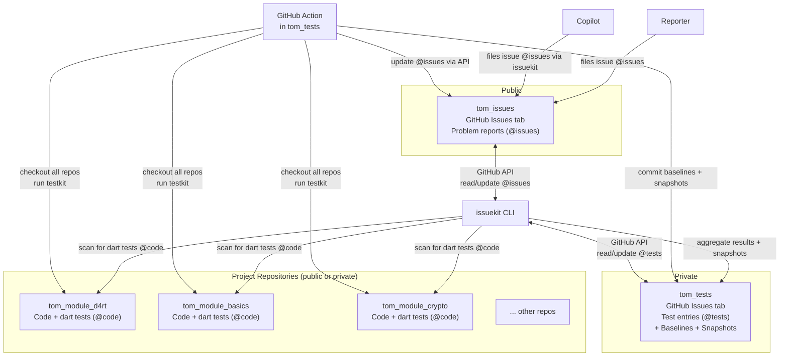

| Repository | Visibility | Purpose |
|------------|-----------|---------|
| **`tom_issues`** | Public | External issue intake (@issues) — reporters file issues here |
| **`tom_tests`** | Private | Test entries (@tests) as GitHub Issues — project/module metadata, consolidated baselines, nightly snapshots |
| **Project repos** | Public or private | Contain the actual code and dart tests (@code) |

### Key Actors

| Actor | Role |
|-------|------|
| **Reporter** | Files an issue (@issues) in `tom_issues` (human or Copilot) |
| **Triage** | Analyzes root cause, assigns to project, creates test entry @tests (`:analyze`, `:assign`) |
| **Developer / Copilot** | Creates dart test (@code), fixes bug, verifies |
| **issuekit** | Orchestrates lifecycle, scans dart tests, syncs state |
| **testkit** | Runs dart tests (@code), tracks baselines, detects pass/fail changes |
| **GitHub Actions** | Nightly automated test runs from `tom_tests` |

### ID Scheme

Every entity in the system is identified by a short, scannable ID:

**Project IDs** — 2–4 uppercase characters, declared in `tom_project.yaml`:

| Project | ID |
|---------|---|
| `tom_d4rt` | `D4` |
| `tom_d4rt_generator` | `D4G` |
| `tom_d4rt_dcli` | `D4D` |
| `tom_build_kit` | `BK` |
| `tom_test_kit` | `TK` |
| `tom_issue_kit` | `IK` |
| `tom_crypto` | `CR` |
| `tom_basics` | `BA` |

**Issue IDs** (@issues) — just the GitHub Issue number in `tom_issues`: `#42`, `#103`.

**Test IDs** (@tests and @code) — two forms:

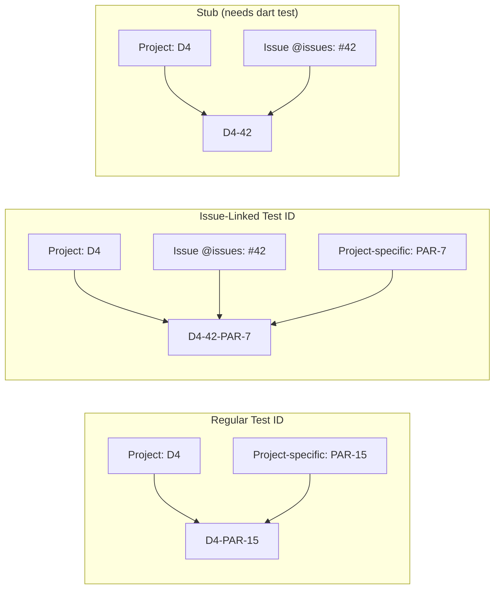

| Form | Format | Example | When |
|------|--------|---------|------|
| Regular | `<PROJECT_ID>-<project-specific>` | `D4-PAR-15` | Normal development |
| Issue-linked | `<PROJECT_ID>-<issue>-<project-specific>` | `D4-42-PAR-7` | Linked to an issue @issues |
| Stub | `<PROJECT_ID>-<issue>` | `D4-42` | Issue assigned, no dart test @code yet |

**Promotion**: `D4-PAR-15` → `D4-42-PAR-15` (insert issue number; project-specific part stays the same).

**Uniqueness**: The `<project-specific>` part must be unique within the project. issuekit `:validate` checks this.

### Issue Lifecycle

Issues (@issues) move through a defined state machine, with each transition driven by an issuekit command:

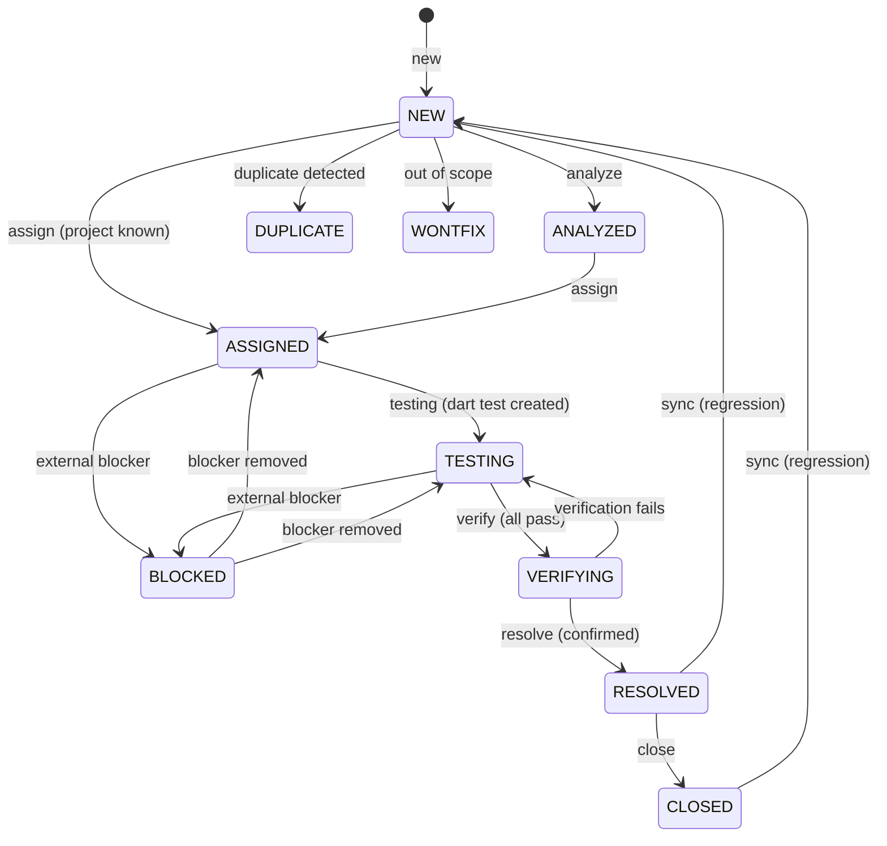

| State | issuekit command | What happens |
|-------|-----------------|--------------|
| → NEW | `:new` | Issue @issues created in `tom_issues` via API |
| → ANALYZED | `:analyze` | Root cause recorded, comment added |
| → ASSIGNED | `:assign` | Project identified, test entry @tests created in `tom_tests` with stub ID, labels updated |
| → TESTING | `:testing` | Full dart test @code verified (not just stub), label updated |
| → VERIFYING | `:verify` | All linked dart tests @code pass, label updated |
| → RESOLVED | `:resolve` | Fix confirmed by reporter, label updated |
| → CLOSED | `:close` | Issue @issues closed via API |
| → NEW (reopen) | `:sync` / `:reopen` | Regression detected or manual reopen |

### The Pipeline

The complete issue-to-resolution flow, showing which commands drive each step:

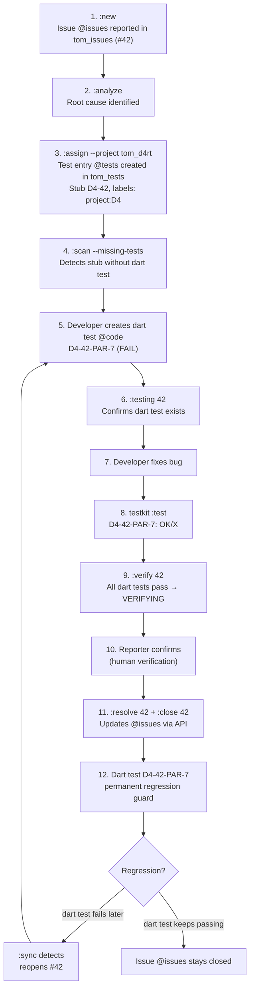

### Copilot Cross-Project Issue Reporting

Copilot sessions can file issues (@issues) against other projects and pick them up later:

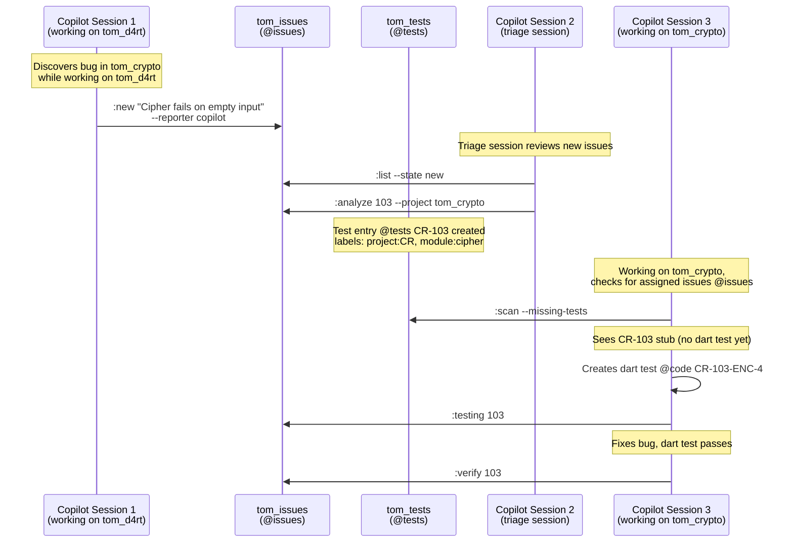

### Convention-Based Test Linking

The mechanism that connects issues (@issues) to dart tests (@code) without a database:

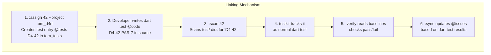

| What | How |
|------|-----|
| Find all dart tests for issue #42 | Scan `test/` dirs for `<PROJECT_ID>-42-` in descriptions |
| Find which project owns issue #42 | Query `tom_tests` for test entries with `42` in ID, read `project:` label |
| Check dart test status | Read testkit `doc/baseline_*.csv` |
| Detect missing dart tests | Look for stubs (`D4-42`) without project-specific parts |
| Detect regressions | Compare baselines: `OK → X` = regression |

### Project Traversal Options

Commands that scan the workspace (`:scan`, `:verify`, `:sync`, `:validate`, `:aggregate`) support these options:

| Option | Description |
|--------|-------------|
| `-R, --root[=<path>]` | Workspace mode: detect or specify workspace root |
| `-s, --scan=<path>` | Scan a specific directory for projects |
| `-r, --recursive` | Recurse into subdirectories |
| `-p, --project=<pattern>` | Filter by project name pattern |
| `-i, --include=<pattern>` | Include only matching projects |
| `-o, --exclude=<pattern>` | Exclude matching projects |
| `-l, --list` | List projects that would be processed |

API-based commands (`:new`, `:edit`, `:list`, `:show`, `:search`, `:close`, `:reopen`, `:resolve`) operate via GitHub API and don't need traversal.

[TOC](#table-of-contents) | [Intro](#introduction) | [Commands](#commands)

---

## Commands

### :aggregate

#### Options

```
issuekit :aggregate
```

| Option | Description |
|--------|-------------|
| `--output=<spec>` | Output format: `plain` (default), `csv`, `json`, `md`, or `<format>:<file>` |
| `-R, --root[=<path>]` | Workspace root |
| `-s, --scan=<path>` | Scan directory |
| `-r, --recursive` | Recurse into subdirectories |
| `-p, --project=<pattern>` | Filter projects |
| `-i, --include=<pattern>` | Include pattern |
| `-o, --exclude=<pattern>` | Exclude pattern |

#### Summary

Merges testkit baselines from all projects into a consolidated CSV in `tom_tests`. This gives a single-file, cross-project view of every issue-linked test with result history. Typically run nightly by a GitHub Action, but can also be triggered manually after a test run.

#### Use Case

In a multi-project workspace, each project has its own testkit baselines in `doc/baseline_*.csv`. These show test results over time — but only for that one project. When tracking issues that span multiple projects, or when looking at the overall health of the workspace, you need a unified view.

`:aggregate` solves this by traversing all projects, reading their most recent baselines, and merging them into a single CSV in the `tom_tests` repository:

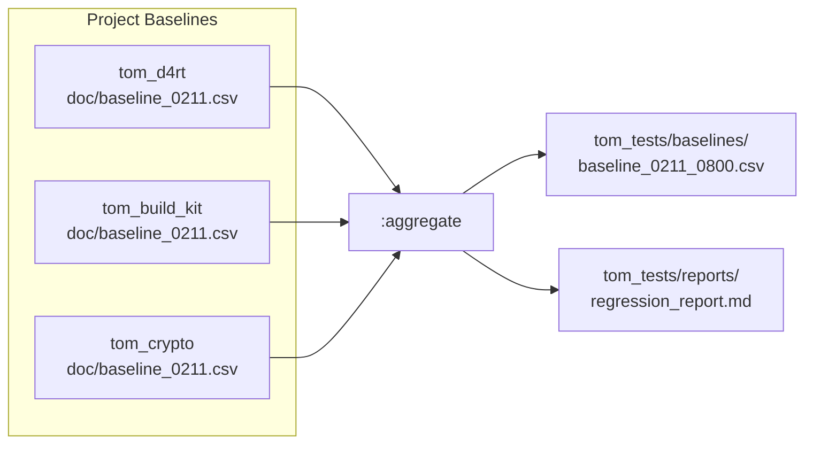

The consolidated baseline looks like:

```csv
Project,Test ID,Description,0210_0800,0211_0800
D4,D4-42-PAR-7,Array parser crashes on empty arrays,X,OK
D4,D4-42-PAR-8,Array parser crashes on null elements,X,OK
BK,BK-42-BLD-12,Build recovers from parser crash,OK,OK
CR,CR-103-ENC-4,Cipher fails on empty input,X,X
```

The `:aggregate` command also generates a regression report highlighting changes: `OK → X` (regression), `X → OK` (fix), `-- → X` (new failure).

This consolidated view is what `:sync` reads to detect regressions and state changes across the full workspace. It is also the artifact committed by the nightly GitHub Action.

#### Examples

```bash
# Aggregate all projects in the workspace
issuekit :aggregate

# Aggregate only tom_d4rt and tom_crypto
issuekit :aggregate -i "tom_d4rt" -i "tom_crypto"

# Aggregate and write a JSON report
issuekit :aggregate --output=json:tom_tests/reports/latest.json

# Dry-run: list which projects would be included
issuekit :aggregate -l
```

[TOC](#table-of-contents) | [Intro](#introduction) | [Commands](#commands) | :aggregate: [Summary](#summary-1) | [Use Case](#use-case-1) | [Examples](#examples-1) — [:analyze](#analyze) | [:verify](#verify)

---

### :analyze

#### Options

```
issuekit :analyze <issue-number> [options]
```

| Option | Description |
|--------|-------------|
| `--root-cause=<text>` | Explanation of the root cause |
| `--project=<name>` | Identified target project (also triggers assignment + test entry creation @tests) |
| `--module=<name>` | Identified target module within the project |
| `--note=<text>` | Additional analysis notes |

#### Summary

Records analysis findings for an issue @issues — root cause, affected project, and module. Adds a structured comment to the GitHub Issue in tom_issues. If `--project` is provided, also assigns the issue and creates a test entry @tests (stub) in tom_tests, combining the `:analyze` and `:assign` steps.

#### Use Case

After an issue @issues is filed (`:new`), someone must investigate it: what's the root cause, and which project owns the fix? This is the triage step.

`:analyze` records the findings directly on the issue @issues as a structured comment. This creates an audit trail — future readers can see the reasoning behind the project assignment.

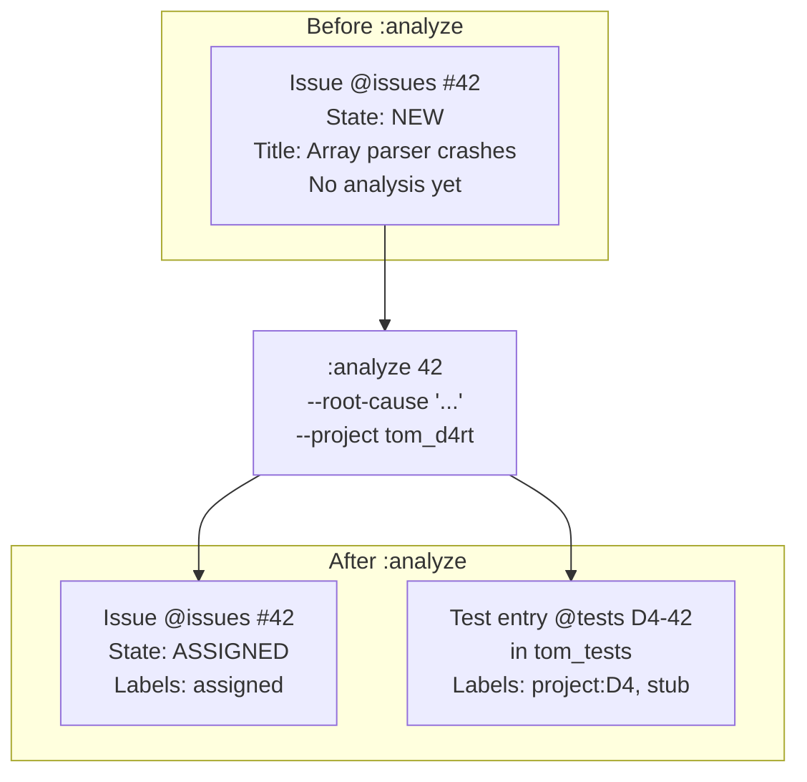

When `--project` is provided, `:analyze` is a two-in-one command: it records the analysis AND assigns the issue. Without `--project`, it only records the analysis and moves the issue to `ANALYZED`.

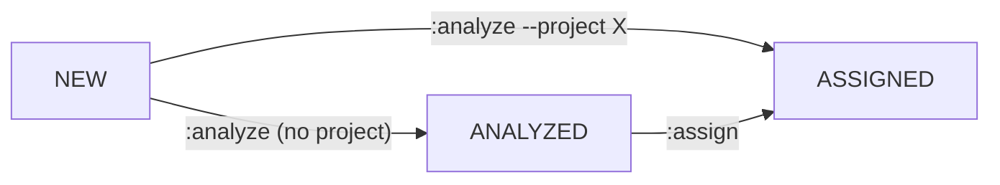

The analysis comment on the issue @issues includes:
- Root cause explanation
- Target project and module (if identified)
- Additional notes
- Timestamp and analyst identity

This information helps the developer who later creates the dart test @code understand what to test and where to look.

#### Examples

```bash
# Analyze with root cause and project (combines analyze + assign)
issuekit :analyze 42 \
  --root-cause "Array parser does not handle length-0 case in _parseArrayElements()" \
  --project tom_d4rt \
  --module parser

# Analyze without assigning (root cause unclear, needs more investigation)
issuekit :analyze 42 \
  --note "Likely a parser issue, but could also be in the tokenizer. Need to check both."

# Analyze with project but no module
issuekit :analyze 103 \
  --root-cause "CipherEngine.encrypt does not guard against empty input" \
  --project tom_crypto
```

[TOC](#table-of-contents) | [Intro](#introduction) | [Commands](#commands) | :analyze: [Summary](#summary-2) | [Use Case](#use-case-2) | [Examples](#examples-2) — [:aggregate](#aggregate) | [:assign](#assign)

---

### :assign

#### Options

```
issuekit :assign <issue-number> --project=<name> [options]
```

| Option | Description |
|--------|-------------|
| `--project=<name>` | Target project (required) |
| `--module=<name>` | Target module within the project |
| `--assignee=<name>` | Person or entity responsible for the fix |

#### Summary

Assigns an issue @issues to a specific project by creating a test entry @tests (stub) in tom_tests with the appropriate project label. Updates the issue @issues labels to `assigned`. This is the step that establishes ownership — after assignment, the issue belongs to a project and appears in that project's scan results.

#### Use Case

Once the root cause is identified (via `:analyze` or direct knowledge), the issue @issues must be assigned to the project that owns the fix. `:assign` does three things:

1. Creates a **test entry @tests** (stub `D4-42`) in tom_tests — this is the initial link between the issue and the project
2. Updates the test entry **labels** in tom_tests to `project:<PROJECT_ID>`, `stub`, and optionally `module:<MODULE_ID>`
3. Updates the issue @issues **labels** in tom_issues to `assigned`
4. Adds a **comment** to the issue @issues noting the assignment

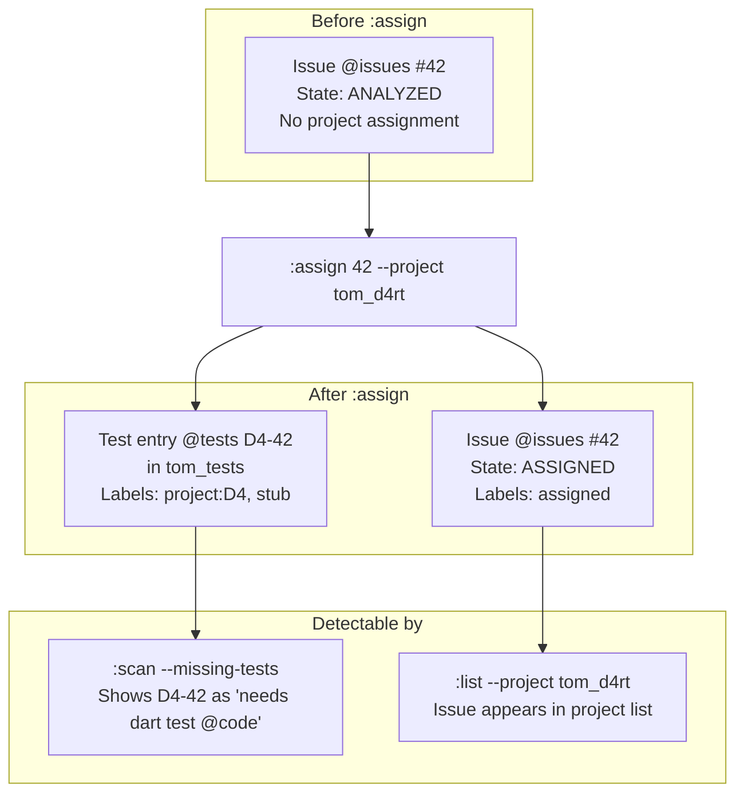

The stub test entry `D4-42` is critical: it signals to `:scan --missing-tests` that this issue is assigned but has no dart test @code yet. This drives the next step — dart test creation.

If the target project is already known at filing time, `:new --project tom_d4rt` can skip the `:analyze` / `:assign` steps entirely.

#### Examples

```bash
# Assign to a project
issuekit :assign 42 --project tom_d4rt

# Assign with module and person
issuekit :assign 42 --project tom_d4rt --module parser --assignee alexis

# Assign a cross-project issue to tom_crypto
issuekit :assign 103 --project tom_crypto --module cipher
```

[TOC](#table-of-contents) | [Intro](#introduction) | [Commands](#commands) | :assign: [Summary](#summary-3) | [Use Case](#use-case-3) | [Examples](#examples-3) — [:analyze](#analyze) | [:close](#close)

---

### :close

#### Options

```
issuekit :close <issue-number>
```

No additional options. The issue @issues must be in `RESOLVED` state.

#### Summary

Closes a resolved issue @issues via the GitHub API. Adds a resolution summary comment and closes the issue. The linked dart tests @code remain in the codebase permanently as regression guards.

#### Use Case

`:close` is the final step in the issue lifecycle. After the fix has been verified (`:verify`) and the resolution confirmed (`:resolve`), `:close` archives the issue @issues.

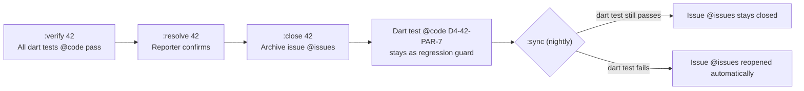

The issue @issues is closed via the GitHub API. A summary comment is added listing:
- All linked dart test @code IDs and their final status
- The fix description (from `:resolve`)
- Closure timestamp

Closing an issue does NOT delete anything — the dart test @code remains, the issue @issues remains accessible in GitHub, and `:sync` continues to monitor it for regressions. If a linked dart test ever fails again, `:sync` will automatically reopen the issue @issues.

#### Examples

```bash
# Close a resolved issue
issuekit :close 42

# Close after verifying and resolving
issuekit :verify 42    # → VERIFYING
issuekit :resolve 42 --fix "Added empty check"  # → RESOLVED
issuekit :close 42     # → CLOSED
```

[TOC](#table-of-contents) | [Intro](#introduction) | [Commands](#commands) | :close: [Summary](#summary-4) | [Use Case](#use-case-4) | [Examples](#examples-4) — [:assign](#assign) | [:edit](#edit)

---

### :edit

#### Options

```
issuekit :edit <issue-number> [field options]
```

| Option | Description |
|--------|-------------|
| `--title=<text>` | Update issue title |
| `--severity=<level>` | Update severity: `critical`, `high`, `normal`, `low` |
| `--context=<text>` | Update discovery context |
| `--expected=<text>` | Update expected behavior |
| `--symptom=<text>` | Update observable symptoms |
| `--tags=<t1,t2,...>` | Replace tags (comma-separated) |
| `--project=<name>` | Reassign to a different project (updates test entry @tests) |
| `--module=<name>` | Update module (updates test entry @tests) |
| `--assignee=<name>` | Update assignee |

#### Summary

Modifies fields on an existing issue @issues via the GitHub API. Any field can be updated independently. If `--project` changes the project assignment, the test entry @tests in tom_tests is updated accordingly with new project labels.

#### Use Case

Issues @issues evolve as understanding improves. Initial reports may have the wrong severity, unclear descriptions, or need reassignment to a different project after deeper analysis.

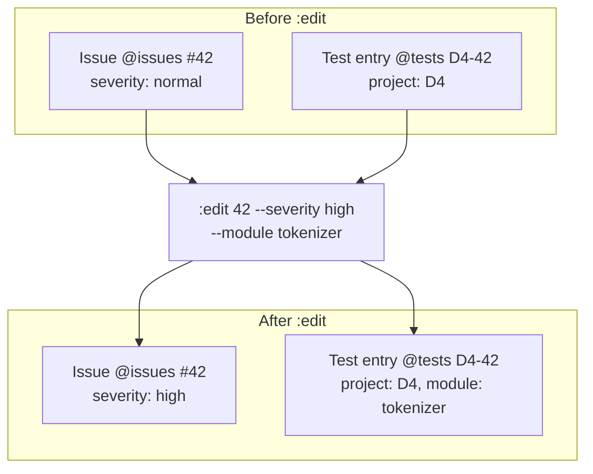

When reassigning to a different project (`--project`), the test entry @tests is updated with new labels:

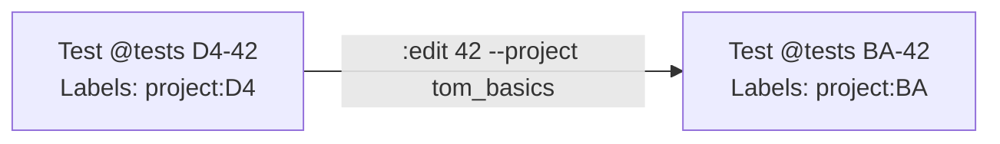

Note: if dart tests @code already exist with the old project ID (`D4-42-PAR-7`), they must be manually renamed — `:edit` does not rewrite test source files. It only updates the test entry @tests in tom_tests.

#### Examples

```bash
# Update severity
issuekit :edit 42 --severity critical

# Update title after better understanding
issuekit :edit 42 --title "Array parser crashes on empty AND null arrays"

# Reassign to different project
issuekit :edit 42 --project tom_basics --module collections

# Add tags
issuekit :edit 42 --tags "parser,regression,critical"
```

[TOC](#table-of-contents) | [Intro](#introduction) | [Commands](#commands) | :edit: [Summary](#summary-5) | [Use Case](#use-case-5) | [Examples](#examples-5) — [:close](#close) | [:export](#export)

---

### :export

#### Options

```
issuekit :export [filters] --output=<spec>
```

| Option | Description |
|--------|-------------|
| `--output=<spec>` | Output format: `csv`, `json`, `md`, or `<format>:<file>` (required) |
| `--state=<state>` | Filter by state |
| `--severity=<level>` | Filter by severity |
| `--project=<name>` | Filter by project |
| `--tags=<t1,t2>` | Filter by tags |
| `--all` | Include closed issues |
| `--repo=<issues\|tests>` | Which tracker to export from (default: `issues`) |

#### Summary

Exports entries from `tom_issues` (@issues) or `tom_tests` (@tests) to a file for offline processing, reporting, or migration. Supports CSV, JSON, and Markdown formats. Same filtering options as `:list`.

#### Use Case

There are scenarios where you need data outside of GitHub:

- **Reporting**: Generate a CSV of all open issues @issues for a stakeholder review
- **Migration**: Export all issues @issues before moving to a different system
- **Backup**: Export test entries @tests for snapshot/backup purposes
- **Offline analysis**: Pull down data for batch processing or metrics

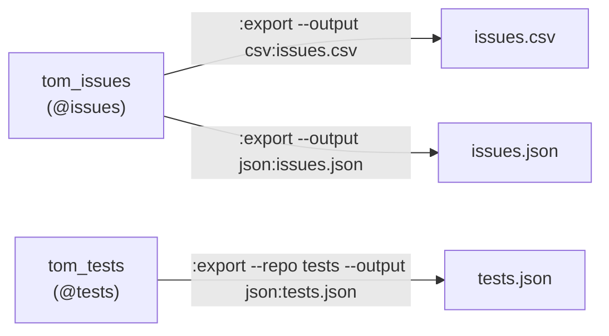

#### Examples

```bash
# Export all open issues @issues as CSV
issuekit :export --output=csv:open_issues.csv

# Export critical issues @issues as Markdown
issuekit :export --severity critical --output=md:critical_issues.md

# Export all issues @issues (including closed) as JSON
issuekit :export --all --output=json:all_issues.json

# Export tom_d4rt issues @issues
issuekit :export --project tom_d4rt --output=csv:d4rt_issues.csv

# Export all test entries @tests from tom_tests
issuekit :export --repo tests --output=json:all_tests.json
```

[TOC](#table-of-contents) | [Intro](#introduction) | [Commands](#commands) | :export: [Summary](#summary-6) | [Use Case](#use-case-6) | [Examples](#examples-6) — [:edit](#edit) | [:import](#import)

---

### :import

#### Options

```
issuekit :import <file>
```

| Option | Description |
|--------|-------------|
| `<file>` | Path to JSON or CSV file with entries to import (required) |
| `--dry-run` | Show what would be created without actually creating |
| `--repo=<issues\|tests>` | Which tracker to import into (default: `issues`) |

#### Summary

Imports entries from a file into `tom_issues` (@issues) or `tom_tests` (@tests). Useful for migration from another system, recovery from backup, or bulk-creating entries from a structured file. Each record becomes a new GitHub Issue in the respective tracker.

#### Use Case

When migrating from another issue tracker, recovering from a snapshot, or when a batch of entries has been collected offline (e.g., from a test audit), `:import` creates them all at once.

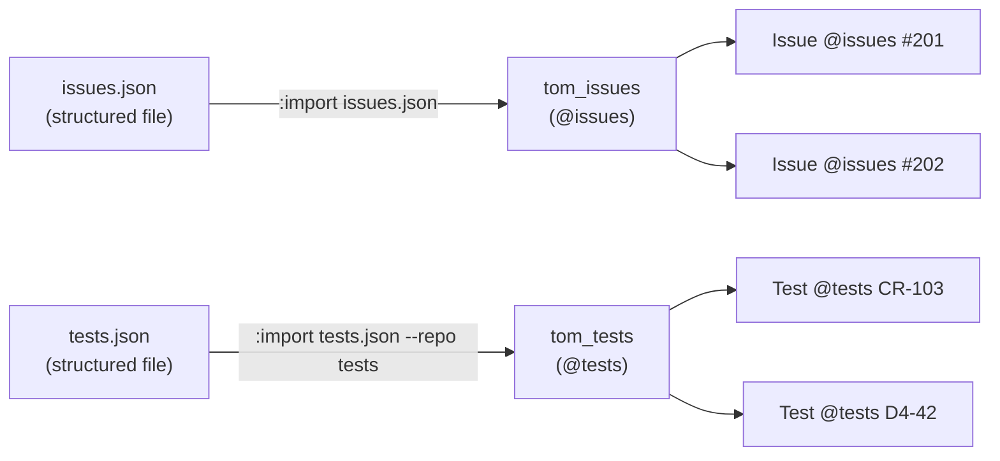

The import file follows the same schema as `:export` output — so a roundtrip is possible: export from one system, edit, re-import.

#### Examples

```bash
# Import issues @issues from a JSON file
issuekit :import collected_issues.json

# Dry-run to preview what would be created
issuekit :import audit_findings.csv --dry-run

# Import test entries @tests from a backup
issuekit :import tests_backup.json --repo tests
```

[TOC](#table-of-contents) | [Intro](#introduction) | [Commands](#commands) | :import: [Summary](#summary-7) | [Use Case](#use-case-7) | [Examples](#examples-7) — [:export](#export) | [:init](#init)

---

### :init

#### Options

```
issuekit :init [options]
```

| Option | Description |
|--------|-------------|
| `--repo=<issues\|tests\|both>` | Which tracker(s) to initialize (default: `both`) |
| `--force` | Overwrite existing labels and templates |

#### Summary

Initializes GitHub repositories for issue tracking integration. Sets up labels matching issuekit states and severities in tom_issues (@issues), creates project/module labels in tom_tests (@tests), and optionally adds issue templates and gating Actions.

#### Use Case

Before issuekit can manage entries in a repository, the repository needs the correct labels. `:init` creates them in one step for both trackers:

```mermaid
graph TB
    INIT[":init"]

    subgraph "tom_issues Labels (@issues)"
        L1["new (blue)"]
        L2["analyzed (purple)"]
        L3["assigned (yellow)"]
        L4["testing (orange)"]
        L5["verifying (cyan)"]
        L6["resolved (green)"]
        L7["blocked (red)"]
        L8["severity:critical (red)"]
        L9["severity:high (orange)"]
        L10["severity:normal (blue)"]
        L11["severity:low (gray)"]
        L12["reporter:copilot (purple)"]
    end

    subgraph "tom_tests Labels (@tests)"
        T1["project:D4 (varies)"]
        T2["project:BK (varies)"]
        T3["project:CR (varies)"]
        T4["module:parser (gray)"]
        T5["module:cipher (gray)"]
        T6["stub (yellow)"]
        T7["has-tests (green)"]
        T8["all-pass (green)"]
        T9["some-fail (red)"]
    end

    subgraph "Templates Created"
        TP1[".github/ISSUE_TEMPLATE/<br/>bug_report.md"]
        TP2[".github/ISSUE_TEMPLATE/<br/>config.yml"]
    end

    INIT --> L1 & L2 & L3 & L4 & L5 & L6 & L7 & L8 & L9 & L10 & L11 & L12
    INIT --> T1 & T2 & T3 & T4 & T5 & T6 & T7 & T8 & T9
    INIT --> TP1 & TP2
```

**tom_issues label mapping (@issues):**

| Label | Color | Purpose |
|-------|-------|---------|
| `new` | blue | Issue just filed |
| `analyzed` | purple | Root cause identified |
| `assigned` | yellow | Assigned to a project |
| `testing` | orange | Dart test @code exists |
| `verifying` | cyan | Dart tests pass, awaiting confirmation |
| `resolved` | green | Fix confirmed |
| `blocked` | red | Waiting on external factor |
| `duplicate` | gray | Duplicate of another issue |
| `wontfix` | gray | Out of scope |
| `severity:critical` | red | Critical severity |
| `severity:high` | orange | High severity |
| `severity:normal` | blue | Normal severity |
| `severity:low` | gray | Low severity |
| `reporter:copilot` | purple | Filed by Copilot |

**tom_tests label mapping (@tests):**

| Label | Color | Purpose |
|-------|-------|---------|
| `project:<ID>` | varies | Project ownership (e.g., `project:D4`) |
| `module:<ID>` | gray | Module within project (e.g., `module:parser`) |
| `stub` | yellow | Test entry exists but no dart test @code yet |
| `has-tests` | green | At least one dart test @code exists |
| `all-pass` | green | All linked dart tests pass |
| `some-fail` | red | At least one linked dart test fails |

#### Examples

```bash
# Initialize both tom_issues and tom_tests with standard labels
issuekit :init

# Initialize only tom_issues
issuekit :init --repo issues

# Initialize only tom_tests
issuekit :init --repo tests

# Force-recreate labels (fix colors, add missing ones)
issuekit :init --force
```

[TOC](#table-of-contents) | [Intro](#introduction) | [Commands](#commands) | :init: [Summary](#summary-8) | [Use Case](#use-case-8) | [Examples](#examples-8) — [:import](#import) | [:link](#link)

---

### :link

#### Options

```
issuekit :link <issue-number> --test-id=<id> [options]
```

| Option | Description |
|--------|-------------|
| `--test-id=<id>` | The dart test @code ID to link (required) |
| `--test-file=<path>` | Path to the test file (optional, for non-standard locations) |
| `--note=<text>` | Reason for the explicit link |

#### Summary

Explicitly links a dart test @code to an issue @issues as an override for non-standard IDs. Normally, issuekit discovers issue-test links by scanning for the `<PROJECT_ID>-<issue>-` pattern. `:link` handles cases where a dart test doesn't follow the convention but is still relevant.

#### Use Case

Most test linking happens automatically via the ID convention. But there are edge cases:

- A dart test was written before the convention was established
- A dart test covers multiple issues and the ID can only encode one
- A third-party test or integration test doesn't follow the naming scheme

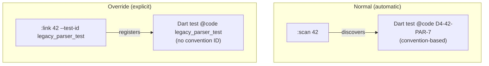

Explicit links are stored as comments on the issue @issues and are also checked by `:verify` and `:sync`.

#### Examples

```bash
# Link a legacy dart test
issuekit :link 42 --test-id "legacy_parser_empty_array" \
  --test-file "test/legacy/parser_test.dart" \
  --note "Pre-convention test, still relevant"

# Link a dart test that covers multiple issues
issuekit :link 103 --test-id "D4-42-PAR-7" \
  --note "This dart test also exercises the cipher bug path"
```

[TOC](#table-of-contents) | [Intro](#introduction) | [Commands](#commands) | :link: [Summary](#summary-9) | [Use Case](#use-case-9) | [Examples](#examples-9) — [:init](#init) | [:list](#list)

---

### :list

#### Options

```
issuekit :list [filters]
```

| Option | Description |
|--------|-------------|
| `--state=<state>` | Filter by state label (`new`, `analyzed`, `assigned`, `testing`, `verifying`, `resolved`) |
| `--severity=<level>` | Filter by severity (`critical`, `high`, `normal`, `low`) |
| `--project=<name>` | Filter by assigned project |
| `--tags=<t1,t2>` | Filter by tags/labels |
| `--reporter=<name>` | Filter by reporter (e.g., `copilot`) |
| `--all` | Include closed issues (default: only open) |
| `--sort=<field>` | Sort by: `created`, `severity`, `state`, `project` |
| `--output=<spec>` | Output format: `plain` (default), `csv`, `json`, `md`, or `<format>:<file>` |
| `--repo=<issues\|tests>` | Which tracker to list from (default: `issues`) |

#### Summary

Lists entries from `tom_issues` (@issues) or `tom_tests` (@tests) with filtering and sorting. The primary discovery command for finding issues by state, severity, project, or tags. Used during triage sessions to review new issues and by developers to check their project's workload.

#### Use Case

`:list` is the workhorse for issue discovery. Different stakeholders use it differently:

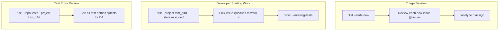

Output example (plain format):

```
#42  [HIGH]     D4    TESTING    Array parser crashes on empty arrays
#56  [NORMAL]   BK    ASSIGNED   Build fails on Windows with spaces in path
#78  [LOW]      CR    NEW        Cipher documentation typo in example
#103 [HIGH]     CR    ASSIGNED   Cipher fails on empty input
```

#### Examples

```bash
# All new issues @issues (triage queue)
issuekit :list --state new

# All issues @issues assigned to tom_d4rt
issuekit :list --project tom_d4rt

# Critical issues @issues across all projects
issuekit :list --severity critical

# Issues @issues filed by Copilot
issuekit :list --reporter copilot

# All issues @issues including closed, sorted by creation date
issuekit :list --all --sort created

# Export the list as CSV
issuekit :list --state testing --output=csv:testing_issues.csv

# Combine filters
issuekit :list --project tom_crypto --severity high --state assigned

# List all test entries @tests for a project
issuekit :list --repo tests --project tom_d4rt

# List test entries @tests that are stubs (no dart test yet)
issuekit :list --repo tests --tags stub
```

[TOC](#table-of-contents) | [Intro](#introduction) | [Commands](#commands) | :list: [Summary](#summary-10) | [Use Case](#use-case-10) | [Examples](#examples-10) — [:link](#link) | [:new](#new)

---

### :new

#### Options

```
issuekit :new "<title>" [options]
```

| Option | Description |
|--------|-------------|
| `--severity=<level>` | Severity: `critical`, `high`, `normal` (default), `low` |
| `--context=<text>` | Where/how the problem was discovered |
| `--expected=<text>` | Expected behavior |
| `--symptom=<text>` | Observable symptoms (defaults to title if not set) |
| `--tags=<t1,t2,...>` | Comma-separated tags (mapped to GitHub labels) |
| `--project=<name>` | Pre-assign to a project (skips NEW → goes directly to ASSIGNED, creates test entry @tests) |
| `--reporter=<name>` | Reporter name (default: configured user, or `copilot` for AI sessions) |

#### Summary

Creates a new issue @issues in the `tom_issues` GitHub repository via the API. This is the entry point for all issues — the first step in the pipeline. If `--project` is provided, the issue skips the NEW state and goes directly to ASSIGNED with a test entry @tests (stub) created in tom_tests.

#### Use Case

`:new` is used whenever someone (human or Copilot) discovers a problem. The command captures enough context to act on the issue later, even if the filer doesn't have time to investigate now.

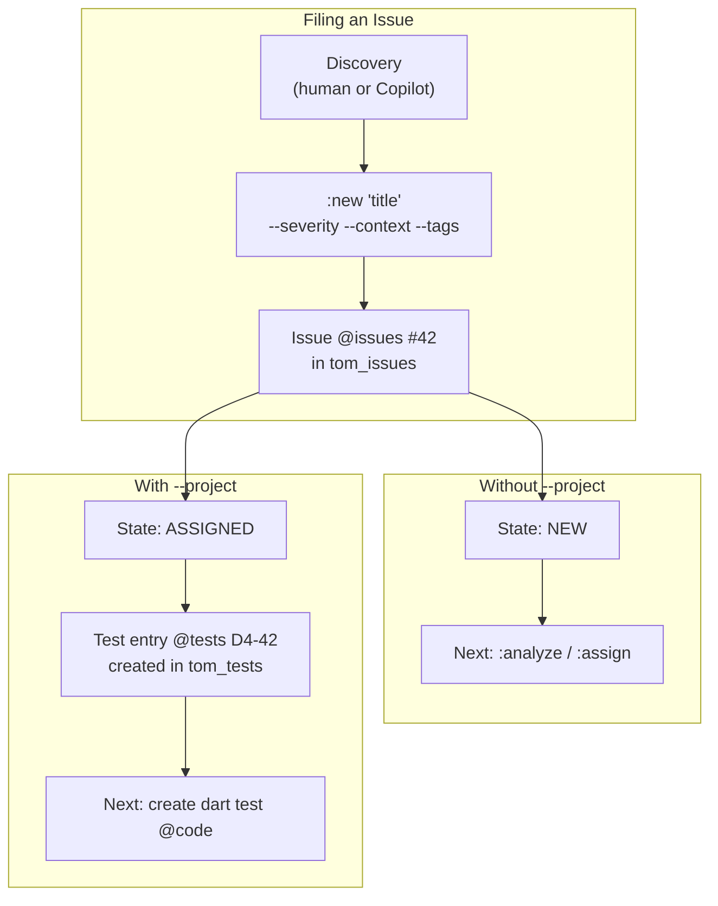

**Copilot cross-project filing**: When Copilot discovers a bug in project B while working on project A, it files the issue immediately with `--reporter copilot`. The triage session picks it up later.

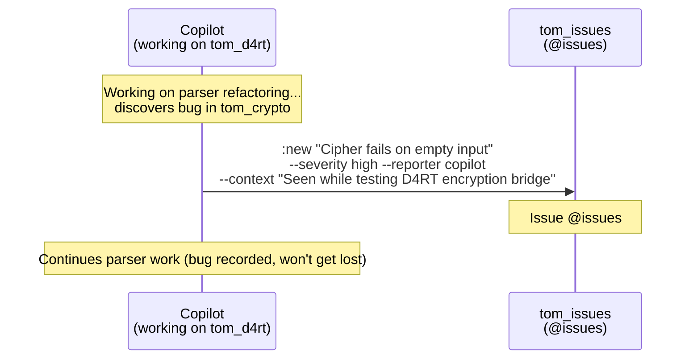

The issue captures:
- **Title**: Brief problem description
- **Severity**: How urgent (affects triage priority)
- **Context**: Where/how discovered (helps reproduction)
- **Expected behavior**: What should happen instead
- **Tags**: Categorization for filtering

#### Examples

```bash
# Minimal — just a title
issuekit :new "Memory leak in long-running server"

# With severity and tags
issuekit :new "Incorrect UTF-8 decoding" --severity high --tags "encoding,parser"

# Pre-assigned to a project (skips triage)
issuekit :new "Timeout on large files" --project tom_d4rt \
  --context "Seen during stress test with 500MB JSON"

# Copilot filing a cross-project bug
issuekit :new "Cipher fails on empty input" \
  --severity high \
  --reporter copilot \
  --context "Discovered while implementing D4RT bridge encryption" \
  --expected "Empty input should produce empty output" \
  --tags "crypto,cipher,edge-case"

# Full details upfront
issuekit :new "Build output missing on Windows" \
  --severity normal \
  --symptom "buildkit :build produces no output files on Windows with spaces in path" \
  --expected "Output files should be generated regardless of path characters" \
  --context "Reported by CI runner on windows-latest" \
  --tags "build,windows,path" \
  --project tom_build_kit
```

[TOC](#table-of-contents) | [Intro](#introduction) | [Commands](#commands) | :new: [Summary](#summary-11) | [Use Case](#use-case-11) | [Examples](#examples-11) — [:list](#list) | [:promote](#promote)

---

### :promote

#### Options

```
issuekit :promote <test-id> --issue <issue-number>
```

| Option | Description |
|--------|-------------|
| `<test-id>` | Current dart test @code ID (regular format, e.g., `D4-PAR-15`) (required) |
| `--issue <number>` | Issue @issues number to link to (required) |
| `--dry-run` | Show what would change without modifying files |

#### Summary

Promotes a regular dart test @code to an issue-linked dart test by inserting the issue number into the ID. The project-specific part stays the same, preserving the test's identity. The source file is modified in-place.

#### Use Case

Sometimes a dart test that was written for a feature turns out to be relevant to a reported issue @issues. Instead of creating a duplicate dart test, the existing one can be promoted:

```mermaid
graph TB
    subgraph "Before :promote"
        T1["D4-PAR-15<br/>Regular dart test @code — no issue link<br/>test('D4-PAR-15: Parser handles nested...']"]
    end

    P[":promote D4-PAR-15 --issue 42"]

    subgraph "After :promote"
        T2["D4-42-PAR-15<br/>Issue-linked dart test @code<br/>test('D4-42-PAR-15: Parser handles nested...']"]
    end

    T1 --> P --> T2

    subgraph "What stays the same"
        S1["Project-specific ID: PAR-15"]
        S2["Dart test logic unchanged"]
        S3["testkit baseline tracks the rename"]
    end
```

The promotion:
1. **Scans** the workspace for the dart test ID in test descriptions
2. **Renames** the ID in the source file: `D4-PAR-15` → `D4-42-PAR-15`
3. **Preserves** the project-specific part (`PAR-15`) — this is the stable identity
4. **Updates** the test entry @tests in tom_tests (if one exists) to mark it as linked
5. **Records** the rename in a comment for testkit baseline tracking

Since the uniqueness rule says `D4-PAR-15` and `D4-42-PAR-15` refer to the same conceptual dart test, they should not both exist. Promotion replaces the old ID.

#### Examples

```bash
# Promote a dart test to link to issue #42
issuekit :promote D4-PAR-15 --issue 42

# Preview the change without modifying
issuekit :promote BK-BLD-3 --issue 56 --dry-run

# Promote a crypto dart test
issuekit :promote CR-ENC-7 --issue 103
```

[TOC](#table-of-contents) | [Intro](#introduction) | [Commands](#commands) | :promote: [Summary](#summary-12) | [Use Case](#use-case-12) | [Examples](#examples-12) — [:new](#new) | [:reopen](#reopen)

---

### :reopen

#### Options

```
issuekit :reopen <issue-number> [options]
```

| Option | Description |
|--------|-------------|
| `--note=<text>` | Reason for reopening |

#### Summary

Reopens a closed or resolved issue @issues. Used when a regression is detected manually or when the original fix is found to be incomplete. Adds a comment with the reason and resets the state to NEW.

#### Use Case

There are two paths to reopening:

```mermaid
graph TB
    subgraph "Automatic (via :sync)"
        SY[":sync detects regression<br/>Dart test @code D4-42-PAR-7: OK → X"]
        SY --> AR["Automatically reopens issue @issues #42<br/>Comment: 'Regression detected'"]
    end

    subgraph "Manual (via :reopen)"
        HU["Developer/reporter discovers<br/>fix was incomplete"]
        HU --> MR[":reopen 42<br/>--note 'Fix only handles arrays, not objects'"]
    end

    AR --> NEW["Issue @issues #42<br/>State: NEW<br/>(cycle restarts)"]
    MR --> NEW
```

`:sync` handles automatic reopening for regressions detected by dart test failures. `:reopen` handles the manual case — when someone realizes the fix was incomplete or a new aspect of the same problem surfaces.

After reopening, the issue @issues restarts the lifecycle at NEW. The existing dart tests @code remain and new ones can be added.

#### Examples

```bash
# Manual reopen with explanation
issuekit :reopen 42 --note "Fix only addressed empty arrays, not null elements"

# Reopen after user report
issuekit :reopen 103 --note "Reporter still sees the issue in production"

# Simple reopen
issuekit :reopen 56
```

[TOC](#table-of-contents) | [Intro](#introduction) | [Commands](#commands) | :reopen: [Summary](#summary-13) | [Use Case](#use-case-13) | [Examples](#examples-13) — [:promote](#promote) | [:resolve](#resolve)

---

### :resolve

#### Options

```
issuekit :resolve <issue-number> [options]
```

| Option | Description |
|--------|-------------|
| `--fix=<text>` | Short description of the fix applied |
| `--note=<text>` | Additional notes |

#### Summary

Confirms that the fix addresses the original issue @issues. Requires the issue to be in `VERIFYING` state (all dart tests @code pass). This is the human confirmation step — the reporter or reviewer confirms the original symptom is gone.

#### Use Case

`:verify` checks that dart tests pass (machine verification). `:resolve` is the **human confirmation** that the original problem is actually solved.

```mermaid
graph TB
    subgraph "Machine Verification"
        V[":verify 42"]
        V --> CHK{"All dart tests @code pass?"}
        CHK -->|"Yes"| VER["State: VERIFYING<br/>'The dart tests pass'"]
        CHK -->|"No"| FAIL["Stay in TESTING<br/>Report failing dart tests"]
    end

    subgraph "Human Verification"
        R[":resolve 42"]
        Q{"Does the original<br/>problem still occur?"}
        Q -->|"No — it's fixed"| RES["State: RESOLVED<br/>'The problem is gone'"]
        Q -->|"Yes — dart test too narrow"| BACK["Back to TESTING<br/>Need better dart test"]
    end

    VER --> Q
```

**Why two steps?** A reproduction dart test might be too narrow. The dart test passes, but the original problem still occurs under different conditions. `:resolve` is the checkpoint where a human confirms the fix actually works from the reporter's perspective.

The developer also updates the dart test expectation at this point — removing `(FAIL)` from the test description since the dart test now represents expected behavior:

```dart
// Before resolve:
test('D4-42-PAR-7: Array parser crashes on empty arrays [2026-02-10 14:00] (FAIL)', ...);

// After resolve:
test('D4-42-PAR-7: Array parser crashes on empty arrays [2026-02-10 14:00]', ...);
```

#### Examples

```bash
# Resolve with fix description
issuekit :resolve 42 --fix "Added empty check in ArrayParser._parseArrayElements()"

# Resolve with additional notes
issuekit :resolve 103 --fix "Guard clause for empty input" \
  --note "Also added documentation for edge cases"

# Simple resolve
issuekit :resolve 56
```

[TOC](#table-of-contents) | [Intro](#introduction) | [Commands](#commands) | :resolve: [Summary](#summary-14) | [Use Case](#use-case-14) | [Examples](#examples-14) — [:reopen](#reopen) | [:run-tests](#run-tests)

---

### :run-tests

#### Options

```
issuekit :run-tests [options]
```

| Option | Description |
|--------|-------------|
| `--wait` | Wait for the workflow to complete (polls status) |

#### Summary

Triggers the nightly test workflow in `tom_tests` via a GitHub API `workflow_dispatch` event. This runs all dart tests @code across all projects, aggregates results, and syncs issue states — the same process that runs on schedule, but triggered on demand.

#### Use Case

The nightly GitHub Action in `tom_tests` checks out all repos, runs testkit, aggregates baselines, and runs `:sync`. Sometimes you need this immediately — after a major fix, before a release, or during a triage session.

```mermaid
graph TB
    RT[":run-tests"]
    RT -->|"workflow_dispatch"| GA["GitHub Action<br/>in tom_tests"]
    GA --> CO["Checkout all repos"]
    CO --> TK["Run testkit :baseline<br/>in each project"]
    TK --> AG[":aggregate<br/>Merge baselines"]
    AG --> SY[":sync --auto<br/>Update issue @issues states"]
    SY --> CM["Commit results<br/>to tom_tests"]
```

#### Examples

```bash
# Trigger the nightly workflow immediately
issuekit :run-tests

# Trigger and wait for completion
issuekit :run-tests --wait
```

[TOC](#table-of-contents) | [Intro](#introduction) | [Commands](#commands) | :run-tests: [Summary](#summary-15) | [Use Case](#use-case-15) | [Examples](#examples-15) — [:resolve](#resolve) | [:scan](#scan)

---

### :scan

#### Options

```
issuekit :scan [<issue-number>] [options]
```

| Option | Description |
|--------|-------------|
| `<issue-number>` | Scan for a specific issue's dart tests @code (optional) |
| `--project=<name>` | Only scan within a specific project |
| `--state=<state>` | Only scan for issues in a specific state |
| `--missing-tests` | Show issues that have only stub test entries @tests (no dart test @code yet) |
| `--output=<spec>` | Output format: `plain`, `csv`, `json`, `md` |
| `-R, --root[=<path>]` | Workspace root |
| `-s, --scan=<path>` | Scan directory |
| `-r, --recursive` | Recurse |
| `-p, --project=<pattern>` | Filter projects |
| `-i, --include=<pattern>` | Include pattern |
| `-o, --exclude=<pattern>` | Exclude pattern |

#### Summary

Scans the workspace for dart tests @code linked to issues @issues via the ID convention. This is the core discovery mechanism — it finds all `<PROJECT_ID>-<issue-number>-<project-specific>` patterns in test descriptions across `test/` directories. Can also detect stubs (assigned issues with test entries @tests but no dart tests @code).

#### Use Case

`:scan` is the bridge between the GitHub Issue world and the codebase world. It answers questions that no other tool can:

```mermaid
graph TB
    subgraph "Questions :scan Answers"
        Q1["What dart tests @code exist for issue #42?"]
        Q2["Which projects have dart tests for #42?"]
        Q3["Which issues @issues have no dart tests yet?"]
        Q4["What's the dart test coverage for all issues?"]
    end

    SC[":scan"]

    subgraph "How It Works"
        S1["Traverse project test/ dirs"]
        S2["Regex match: PROJECT_ID-ISSUE-"]
        S3["Read testkit baselines"]
        S4["Report results"]
    end

    Q1 & Q2 & Q3 & Q4 --> SC --> S1 --> S2 --> S3 --> S4
```

**Scanning for a specific issue:**

```
issuekit :scan 42

Dart tests @code for issue #42 (tom_issues):

Project       Test ID         File                                    Line  Status
-----------   -------------   ------------------------------------    ----  ------
tom_d4rt      D4-42-PAR-7     test/parser/array_parser_test.dart      45    FAIL
tom_d4rt      D4-42-PAR-8     test/parser/array_null_test.dart        12    FAIL
tom_build_kit BK-42-BLD-12    test/build/edge_cases_test.dart         88    PASS
```

**Detecting missing dart tests:**

```mermaid
graph LR
    STUB["Test entry @tests D4-42<br/>(stub — no dart test @code)"]
    FULL["Dart test @code D4-42-PAR-7<br/>(full test ID)"]

    SC[":scan --missing-tests"]
    SC -->|"detects"| STUB
    SC -->|"does NOT flag"| FULL
```

```
issuekit :scan --missing-tests

Issues @issues with missing dart tests @code:

Issue   Project   Stub ID   State      Title
------  --------  --------  ---------  -----
#42     D4        D4-42     ASSIGNED   Array parser crashes on empty arrays
#103    CR        CR-103    ASSIGNED   Cipher fails on empty input
```

This is the signal that drives dart test creation — Copilot or a developer sees which issues need reproduction tests.

#### Examples

```bash
# Scan for all dart tests @code linked to issue #42
issuekit :scan 42

# Scan all issue-linked dart tests across the workspace
issuekit :scan

# Only scan tom_d4rt
issuekit :scan --project tom_d4rt

# Find issues with only stub test entries (no dart test @code)
issuekit :scan --missing-tests

# Find missing dart tests in one project
issuekit :scan --missing-tests --project tom_crypto

# Only scan issues in TESTING state
issuekit :scan --state testing

# Export scan results as CSV
issuekit :scan --output=csv:scan_results.csv
```

[TOC](#table-of-contents) | [Intro](#introduction) | [Commands](#commands) | :scan: [Summary](#summary-16) | [Use Case](#use-case-16) | [Examples](#examples-16) — [:run-tests](#run-tests) | [:search](#search)

---

### :search

#### Options

```
issuekit :search "<query>" [options]
```

| Option | Description |
|--------|-------------|
| `<query>` | Search text (required) |
| `--output=<spec>` | Output format |
| `--repo=<issues\|tests>` | Which tracker to search (default: `issues`) |

#### Summary

Full-text search across all entries in `tom_issues` (@issues) or `tom_tests` (@tests). Uses the GitHub Issues search API to find entries by content, including titles, descriptions, and comments.

#### Use Case

When you need to find issues @issues by keyword — a specific error message, a component name, or a symptom — `:search` queries the GitHub search API. It searches across titles, descriptions, and all comments.

```mermaid
graph LR
    Q[":search 'RangeError'"]
    Q --> API["GitHub Search API"]
    API --> R1["Issue @issues #42: Array parser crashes..."]
    API --> R2["Issue @issues #89: Map indexer RangeError..."]
```

Unlike `:list` (which filters by structured fields), `:search` is a free-text search — useful when you don't know the exact state, project, or tags but remember a keyword.

#### Examples

```bash
# Search issues @issues by error message
issuekit :search "RangeError"

# Search issues @issues by component
issuekit :search "ArrayParser"

# Search issues @issues by symptom
issuekit :search "empty input"

# Search test entries @tests
issuekit :search "parser" --repo tests
```

[TOC](#table-of-contents) | [Intro](#introduction) | [Commands](#commands) | :search: [Summary](#summary-17) | [Use Case](#use-case-17) | [Examples](#examples-17) — [:scan](#scan) | [:show](#show)

---

### :show

#### Options

```
issuekit :show <issue-number>
```

No additional options. Shows all available information for the issue @issues.

#### Summary

Displays full details of a single issue @issues — GitHub Issue fields, analysis comments, linked dart tests @code (via workspace scan), and current test status from testkit baselines. This is the single-issue deep dive.

#### Use Case

`:show` combines data from three sources: the issue @issues in tom_issues (metadata, comments, labels), the test entry @tests in tom_tests (project, module, stub status), and the workspace (linked dart tests @code, test status). It's the command to run before starting work on an issue.

```mermaid
graph TB
    SH[":show 42"]

    subgraph "From tom_issues API (@issues)"
        G1["Title, description, labels"]
        G2["Analysis comments"]
        G3["State history"]
        G4["Reporter, assignee"]
    end

    subgraph "From tom_tests API (@tests)"
        T1["Test entry D4-42"]
        T2["Project: D4, Module: parser"]
        T3["Stub status"]
    end

    subgraph "From Workspace Scan (@code)"
        W1["Linked dart tests: D4-42-PAR-7, D4-42-PAR-8"]
        W2["Test files and line numbers"]
        W3["Pass/fail from baseline"]
    end

    SH --> G1 & G2 & G3 & G4
    SH --> T1 & T2 & T3
    SH --> W1 & W2 & W3

    subgraph "Combined Output"
        O["Issue @issues #42 — Array parser crashes on empty arrays<br/>State: TESTING | Severity: HIGH | Project: D4<br/>...<br/>Dart tests @code:<br/>  D4-42-PAR-7  FAIL  test/parser/array_parser_test.dart:45<br/>  D4-42-PAR-8  FAIL  test/parser/array_null_test.dart:12"]
    end

    G1 & T1 & W1 --> O
```

#### Examples

```bash
# Show full details for issue #42
issuekit :show 42

# Show a newly filed issue (no tests yet)
issuekit :show 103
```

[TOC](#table-of-contents) | [Intro](#introduction) | [Commands](#commands) | :show: [Summary](#summary-18) | [Use Case](#use-case-18) | [Examples](#examples-18) — [:search](#search) | [:snapshot](#snapshot)

---

### :snapshot

#### Options

```
issuekit :snapshot [options]
```

| Option | Description |
|--------|-------------|
| `--issues-only` | Only snapshot issues @issues from tom_issues |
| `--tests-only` | Only snapshot test entries @tests from tom_tests |
| `--output=<dir>` | Output directory (default: `tom_tests/snapshots/`) |

#### Summary

Exports all issues @issues from tom_issues and all test entries @tests from tom_tests to timestamped JSON files. These snapshots provide versioned backup and enable recovery. Designed to be run nightly by a GitHub Action, with results committed to tom_tests for git-based versioning.

#### Use Case

The nightly backup mechanism ensures that all issue tracking data is preserved and versioned. `:snapshot` exports the complete state of both GitHub Issue trackers:

```mermaid
graph TB
    SN[":snapshot"]

    subgraph "tom_issues (@issues)"
        I1["Issue #42"]
        I2["Issue #56"]
        I3["Issue #103"]
    end

    subgraph "tom_tests (@tests)"
        T1["Test entry D4-42"]
        T2["Test entry BK-56"]
        T3["Test entry CR-103"]
    end

    subgraph "Snapshot Files"
        F1["tom_tests/snapshots/issues/<br/>snapshot_20260211.json"]
        F2["tom_tests/snapshots/tests/<br/>snapshot_20260211.json"]
    end

    I1 & I2 & I3 --> SN --> F1
    T1 & T2 & T3 --> SN --> F2
```

The snapshot workflow is typically run by a nightly GitHub Action:

```mermaid
sequenceDiagram
    participant GA as GitHub Action<br/>(nightly)
    participant GH1 as tom_issues<br/>(@issues)
    participant GH2 as tom_tests<br/>(@tests)
    participant FS as tom_tests<br/>(file system)
    participant GIT as Git

    Note over GA: Nightly at 3:00 AM
    GA->>GH1: Fetch all issues via API
    GA->>GH2: Fetch all test entries via API
    GA->>FS: Write snapshots/issues/snapshot_YYYYMMDD.json
    GA->>FS: Write snapshots/tests/snapshot_YYYYMMDD.json
    GA->>GIT: git add snapshots/
    GA->>GIT: git commit -m "Nightly snapshot YYYY-MM-DD"
    Note over GIT: Versioning via git history
```

**Recovery scenarios:**

| Scenario | Recovery Command |
|----------|-----------------|
| Accidental issue deletion | `issuekit :import snapshots/issues/snapshot_20260210.json` |
| Test entry corruption | `issuekit :import snapshots/tests/snapshot_20260210.json --repo tests` |
| Full disaster recovery | Import both snapshots from previous date |
| Audit/history | `git log --oneline snapshots/` to see daily changes |

**Snapshot file format:**

```json
{
  "snapshot_date": "2026-02-11T03:00:00Z",
  "source": "tom_issues",
  "total_count": 47,
  "entries": [
    {
      "number": 42,
      "title": "Array parser crashes on empty arrays",
      "state": "testing",
      "severity": "high",
      "labels": ["testing", "severity:high"],
      "created_at": "2026-02-01T10:30:00Z",
      "comments_count": 5
    }
  ]
}
```

The snapshot files are read-only artifacts — they are not modified after creation. Each day's snapshot is a complete point-in-time export, enabling precise recovery to any date.

#### Examples

```bash
# Full snapshot (both issues and tests)
issuekit :snapshot

# Only snapshot issues @issues
issuekit :snapshot --issues-only

# Only snapshot test entries @tests
issuekit :snapshot --tests-only

# Custom output directory
issuekit :snapshot --output=backups/2026-02/

# Typical nightly Action usage
issuekit :snapshot && \
  git add snapshots/ && \
  git commit -m "Nightly snapshot $(date +%Y-%m-%d)"
```

[TOC](#table-of-contents) | [Intro](#introduction) | [Commands](#commands) | :snapshot: [Summary](#summary-19) | [Use Case](#use-case-19) | [Examples](#examples-19) — [:show](#show) | [:summary](#summary-cmd)

---

<a id="summary-cmd"></a>

### :summary

#### Options

```
issuekit :summary [options]
```

| Option | Description |
|--------|-------------|
| `--output=<spec>` | Output format: `plain` (default), `csv`, `json`, `md` |

#### Summary

Displays a dashboard overview of all issues @issues — counts by state, severity, and project. Highlights issues needing attention: missing dart tests @code, awaiting verification, Copilot-filed issues pending triage.

#### Use Case

`:summary` gives a bird's-eye view of the issue landscape. It's the first command to run at the start of a session or triage meeting.

```mermaid
graph TB
    SUM[":summary"]

    subgraph "Output Sections"
        S1["By State<br/>NEW: 3 | ASSIGNED: 5 | TESTING: 8<br/>VERIFYING: 2 | RESOLVED: 1"]
        S2["By Severity<br/>CRITICAL: 1 | HIGH: 4 | NORMAL: 10 | LOW: 4"]
        S3["By Project<br/>D4: 7 | BK: 3 | CR: 5 | BA: 2"]
        S4["Attention Needed<br/>Missing dart tests: 3 | Awaiting verify: 2<br/>Copilot unreviewed: 1"]
    end

    SUM --> S1 & S2 & S3 & S4
```

Output (plain format):
```
Issue Tracking Summary
======================

By State:
  NEW          3
  ANALYZED     1
  ASSIGNED     5
  TESTING      8
  VERIFYING    2
  RESOLVED     1
  BLOCKED      1

By Severity:
  CRITICAL     1    ⚠ Issue @issues #201: Server crash on startup
  HIGH         4
  NORMAL      10
  LOW          4

By Project:
  D4           7
  BK           3
  CR           5
  BA           2

Attention:
  Missing dart tests (stubs only):  3   → run :scan --missing-tests
  Awaiting verification:            2   → run :verify on each
  Copilot-filed, unreviewed:        1   → run :list --reporter copilot --state new
```

#### Examples

```bash
# Full dashboard
issuekit :summary

# Export as Markdown
issuekit :summary --output=md:summary.md
```

[TOC](#table-of-contents) | [Intro](#introduction) | [Commands](#commands) | :summary: [Summary](#summary-20) | [Use Case](#use-case-20) | [Examples](#examples-20) — [:snapshot](#snapshot) | [:sync](#sync)

---

### :sync

#### Options

```
issuekit :sync [options]
```

| Option | Description |
|--------|-------------|
| `--auto` | Automatically apply state transitions and reopens |
| `--project=<name>` | Only sync issues for a specific project |
| `--dry-run` | Show what would change without applying |
| `-R, --root[=<path>]` | Workspace root |
| `-s, --scan=<path>` | Scan directory |
| `-r, --recursive` | Recurse |
| `-p, --project=<pattern>` | Filter projects |
| `-i, --include=<pattern>` | Include pattern |
| `-o, --exclude=<pattern>` | Exclude pattern |

#### Summary

Synchronizes issue @issues states with dart test @code results across the workspace. Detects fixes (dart tests now pass), regressions (dart tests now fail), and missing tests. Can automatically apply state transitions and reopen issues @issues on regression. This is the automation backbone — run nightly by GitHub Actions.

#### Use Case

`:sync` is the command that closes the feedback loop. It cross-references every issue @issues in `tom_issues` with the actual dart test @code results in the codebase:

```mermaid
graph TB
    SY[":sync"]

    subgraph "For ASSIGNED Issues @issues"
        A1["Scan for full dart tests @code"]
        A2{"Full dart test found?"}
        A3["Suggest → TESTING"]
        A4["No change"]
        A1 --> A2
        A2 -->|"Yes"| A3
        A2 -->|"No (still stub)"| A4
    end

    subgraph "For TESTING Issues @issues"
        T1["Check dart test results"]
        T2{"All dart tests pass?"}
        T3["Suggest → VERIFYING"]
        T4["Report failing dart tests"]
        T1 --> T2
        T2 -->|"Yes"| T3
        T2 -->|"No"| T4
    end

    subgraph "For RESOLVED/CLOSED Issues @issues"
        R1["Check for regressions"]
        R2{"Any dart test fails?"}
        R3["REOPEN issue @issues<br/>Add regression comment"]
        R4["All clear"]
        R1 --> R2
        R2 -->|"Yes (OK → X)"| R3
        R2 -->|"No"| R4
    end

    SY --> A1 & T1 & R1
```

**The regression loop:**

```mermaid
graph LR
    FIX["Bug fixed<br/>dart test passes"] --> CLOSE["Issue @issues closed"]
    CLOSE --> NIGHT["Nightly :sync"]
    NIGHT --> CHK{"Dart test still passes?"}
    CHK -->|"OK"| CLOSE
    CHK -->|"FAIL"| REOPEN["Issue @issues reopened<br/>Comment: 'Regression in D4-42-PAR-7'"]
    REOPEN --> FIX
```

Without `--auto`, `:sync` reports suggested changes but doesn't apply them. With `--auto`, it applies transitions and reopens automatically — this is what the nightly GitHub Action uses.

Output (dry-run):
```
Sync Report
===========

Issue   Current     Suggested   Reason
------  ----------  ----------  ------
#42     ASSIGNED    → TESTING   Full dart test D4-42-PAR-7 found
#56     TESTING     → VERIFYING All 2 dart tests pass
#78     CLOSED      → NEW       Regression: CR-78-ENC-2 now fails (was OK)

Run with --auto to apply changes.
```

#### Examples

```bash
# Dry-run: show what would change
issuekit :sync --dry-run

# Apply all changes automatically
issuekit :sync --auto

# Sync only tom_d4rt issues
issuekit :sync --project tom_d4rt

# Sync without applying (default)
issuekit :sync

# Used in GitHub Action
issuekit :sync --auto
```

[TOC](#table-of-contents) | [Intro](#introduction) | [Commands](#commands) | :sync: [Summary](#summary-21) | [Use Case](#use-case-21) | [Examples](#examples-21) — [:summary](#summary-cmd) | [:testing](#testing)

---

### :testing

#### Options

```
issuekit :testing <issue-number>
```

No additional options. The issue @issues must be in `ASSIGNED` state.

#### Summary

Marks that a reproduction dart test @code has been created for an issue @issues. Verifies that at least one **full** test ID (not just a stub) matching the issue exists in the workspace, then updates the issue @issues label to `testing` and updates the test entry @tests in tom_tests to remove the `stub` label and add `has-tests`.

#### Use Case

After an issue @issues is assigned (`:assign`), someone creates a reproduction dart test @code. `:testing` is the confirmation step — it verifies the dart test actually exists before transitioning the issue:

```mermaid
graph TB
    subgraph "Before :testing"
        I1["Issue @issues #42<br/>State: ASSIGNED"]
        T1["Test entry @tests D4-42<br/>Labels: project:D4, stub"]
        C1["Developer created:<br/>dart test @code<br/>test('D4-42-PAR-7: ...') in source"]
    end

    TE[":testing 42"]

    subgraph ":testing checks"
        C2["Scan workspace for D4-42-*"]
        C3{"Full dart test @code found?<br/>(not just stub D4-42)"}
        C4["D4-42-PAR-7 ✓"]
        C5["Error: no full dart test found"]
    end

    subgraph "After :testing"
        I2["Issue @issues #42<br/>State: TESTING<br/>Label: testing"]
        T2["Test entry @tests D4-42<br/>Labels: project:D4, has-tests<br/>Comment: 'Dart test D4-42-PAR-7 found'"]
    end

    I1 --> TE --> C2 --> C3
    T1 --> TE
    C3 -->|"Yes"| C4 --> I2
    C4 --> T2
    C3 -->|"No"| C5
```

The distinction between a **stub test entry @tests** and a **full dart test @code**:

| ID | Type | Has project-specific part? | `:testing` accepts? |
|----|------|---------------------------|---------------------|
| `D4-42` | Stub (test entry @tests) | No | No |
| `D4-42-PAR-7` | Full dart test @code | Yes (`PAR-7`) | Yes |

`:testing` refuses to proceed if only a stub exists. This ensures that the issue has an actual reproduction dart test, not just an assignment marker.

#### Examples

```bash
# Mark that a dart test exists for issue #42
issuekit :testing 42

# After creating the test in source:
# test('D4-42-PAR-7: Array parser crashes on empty arrays [2026-02-10] (FAIL)', () { ... });
issuekit :testing 42
# → Success: Found D4-42-PAR-7 in tom_d4rt/test/parser/array_parser_test.dart:45
# → Issue #42 updated to TESTING
```

[TOC](#table-of-contents) | [Intro](#introduction) | [Commands](#commands) | :testing: [Summary](#summary-22) | [Use Case](#use-case-22) | [Examples](#examples-22) — [:sync](#sync) | [:validate](#validate)

---

### :validate

#### Options

```
issuekit :validate [options]
```

| Option | Description |
|--------|-------------|
| `--project=<name>` | Only validate a specific project |
| `--fix` | Automatically fix simple conflicts (e.g., remove duplicate regular IDs after promotion) |
| `-R, --root[=<path>]` | Workspace root |
| `-s, --scan=<path>` | Scan directory |
| `-r, --recursive` | Recurse |
| `-p, --project=<pattern>` | Filter projects |
| `-i, --include=<pattern>` | Include pattern |
| `-o, --exclude=<pattern>` | Exclude pattern |

#### Summary

Checks dart test @code ID uniqueness across the workspace. Ensures no duplicate project-specific IDs within a project, no conflicts between regular and promoted IDs, and that all issue numbers in test IDs reference existing issues @issues in tom_issues.

#### Use Case

The uniqueness rule says that `<project-specific-ids>` must be unique within a project. `:validate` enforces this:

```mermaid
graph TB
    VA[":validate"]

    subgraph "Check 1: Duplicate project-specific IDs"
        C1["Dart test @code D4-PAR-15 in parser_test.dart<br/>Dart test @code D4-PAR-15 in other_test.dart"]
        C1R["ERROR: Duplicate PAR-15 in D4"]
    end

    subgraph "Check 2: Regular + promoted conflict"
        C2["D4-PAR-15 exists<br/>D4-42-PAR-15 also exists"]
        C2R["ERROR: PAR-15 exists both as<br/>regular and promoted"]
    end

    subgraph "Check 3: Invalid issue references"
        C3["D4-999-PAR-7<br/>but issue @issues #999 doesn't exist"]
        C3R["WARNING: Issue #999 not found<br/>in tom_issues"]
    end

    VA --> C1 --> C1R
    VA --> C2 --> C2R
    VA --> C3 --> C3R
```

Output:
```
Validation Report
=================

Errors (must fix):
  D4  PAR-15    Duplicate: test/parser_test.dart:12 AND test/other_test.dart:45
  D4  PAR-15    Conflict: regular D4-PAR-15 AND promoted D4-42-PAR-15

Warnings:
  D4  D4-999-PAR-7    Issue @issues #999 not found in tom_issues

Summary: 2 errors, 1 warning across 47 dart tests in 8 projects
```

Run `:validate` after bulk promotions, imports, or test reorganizations to ensure the ID scheme is consistent.

#### Examples

```bash
# Validate the entire workspace
issuekit :validate

# Validate only tom_d4rt
issuekit :validate --project tom_d4rt

# Validate and auto-fix simple conflicts
issuekit :validate --fix
```

[TOC](#table-of-contents) | [Intro](#introduction) | [Commands](#commands) | :validate: [Summary](#summary-23) | [Use Case](#use-case-23) | [Examples](#examples-23) — [:testing](#testing) | [:verify](#verify)

---

### :verify

#### Options

```
issuekit :verify <issue-number> [options]
```

| Option | Description |
|--------|-------------|
| `-R, --root[=<path>]` | Workspace root |
| `-s, --scan=<path>` | Scan directory |
| `-r, --recursive` | Recurse |
| `-p, --project=<pattern>` | Filter projects |
| `-i, --include=<pattern>` | Include pattern |
| `-o, --exclude=<pattern>` | Exclude pattern |

#### Summary

Checks whether all reproduction dart tests @code for an issue @issues now pass. Scans the workspace for linked dart tests, reads testkit baselines, and if **all pass**, transitions the issue to VERIFYING and updates the test entry @tests labels in tom_tests. If any still fail, reports which ones. This is the machine verification step.

#### Use Case

After the developer fixes the bug and testkit shows the dart test passing (`OK/X`), `:verify` confirms this across all linked dart tests — potentially in multiple projects:

```mermaid
graph TB
    subgraph "Developer fixes bug"
        FIX["Fix applied in tom_d4rt"]
        TK["testkit :test<br/>D4-42-PAR-7: OK/X<br/>D4-42-PAR-8: OK/X"]
    end

    VE[":verify 42"]

    subgraph ":verify process"
        S1["1. Scan workspace for D4-42-*, BK-42-*, ..."]
        S2["2. Find dart tests @code: D4-42-PAR-7, D4-42-PAR-8, BK-42-BLD-12"]
        S3["3. Read testkit baselines for each project"]
        S4{"4. All pass?"}
        S5["→ VERIFYING<br/>Update issue @issues label<br/>Update test entry @tests: all-pass"]
        S6["Report failures:<br/>BK-42-BLD-12: still FAIL"]
    end

    FIX --> TK --> VE --> S1 --> S2 --> S3 --> S4
    S4 -->|"All pass"| S5
    S4 -->|"Some fail"| S6
```

`:verify` checks ALL linked dart tests @code, not just ones in the developer's project. An issue in `tom_d4rt` might also have dart tests in `tom_build_kit` — all must pass for verification.

```mermaid
graph LR
    subgraph "Issue @issues #42 dart tests @code"
        T1["D4-42-PAR-7  ✓ OK"]
        T2["D4-42-PAR-8  ✓ OK"]
        T3["BK-42-BLD-12  ✗ FAIL"]
    end

    VE{":verify 42"}
    VE --> R["NOT VERIFIED<br/>BK-42-BLD-12 still fails<br/>in tom_build_kit"]
```

Only when ALL linked dart tests pass does the issue @issues move to VERIFYING:

```
issuekit :verify 42

Verifying issue @issues #42: Array parser crashes on empty arrays

Dart tests @code found:
  D4-42-PAR-7   tom_d4rt       OK   ✓
  D4-42-PAR-8   tom_d4rt       OK   ✓
  BK-42-BLD-12  tom_build_kit  OK   ✓

All 3 dart tests pass. Issue @issues #42 → VERIFYING
Test entry @tests D4-42 → all-pass
```

If testkit hasn't been run recently, `:verify` reports `NOT RUN` for those dart tests.

#### Examples

```bash
# Verify issue #42
issuekit :verify 42

# Verify issue #103
issuekit :verify 103

# Verify scanning only specific projects
issuekit :verify 42 -i "tom_d4rt" -i "tom_build_kit"
```

[TOC](#table-of-contents) | [Intro](#introduction) | [Commands](#commands) | :verify: [Summary](#summary-24) | [Use Case](#use-case-24) | [Examples](#examples-24) — [:validate](#validate) | [:aggregate](#aggregate)

---

## Related Documentation

- [Issue Tracking — Concept and Workflow](issue_tracking.md) — Architecture, design principles, full conceptual documentation
- [Test Tracking — Concept and Workflow](../../tom_test_kit/doc/test_tracking.md) — Testkit workflow and commands
- [CLI Tools Navigation Guide](../../tom_build_base/doc/cli_tools_navigation.md) — Standard navigation options
- [Build Base User Guide](../../tom_build_base/doc/build_base_user_guide.md) — Configuration and project discovery

[TOC](#table-of-contents) | [Intro](#introduction) | [Commands](#commands)
